# RULES FOR CLASSIFICATION  

# Ships  

# Part 4 Systems and components Chapter 4 Rotating machinery – power transmission  

The content of this service document is the subject of intellectual property rights reserved by DNV AS $\left(^{\mathrm{w}}\mathsf{D N V}^{\prime\prime}\right)$ . The user accepts that it is prohibited by anyone else but DNV and/or its licensees to offer and/or perform classification, certification and/or verification services, including the issuance of certificates and/or declarations of conformity, wholly or partly, on the basis of and/or pursuant to this document whether free of charge or chargeable, without DNV’s prior written consent. DNV is not responsible for the consequences arising from any use of this document by others.  

# The PDF electronic version of this document available at the DNV website dnv.com is the official version. If there are any inconsistencies between the PDF version and any other available version, the PDF version shall prevail.  

DNV AS  

# FOREWORD  

DNV rules for classification contain procedural and technical requirements related to obtaining and retaining a class certificate. The rules represent all requirements adopted by the Society as basis for classification.  

# $\circleddash$ DNV AS July 2022  

# Any comments may be sent by e-mail to rules@dnv.com  

This service document has been prepared based on available knowledge, technology and/or information at the time of issuance of this document. The use of this document by other parties than DNV is at the user's sole risk. Unless otherwise stated in an applicable contract, or following from mandatory law, the liability of DNV AS, its parent companies and subsidiaries as well as their officers, directors and employees $\left(^{\mathrm{w}}\mathsf{D N V}^{\prime\prime}\right)$ for proved loss or damage arising from or in connection with any act or omission of DNV, whether in contract or in tort (including negligence), shall be limited to direct losses and under any circumstance be limited to 300,000 USD.  

# CHANGES – CURRENT  

This document supersedes the July 2021 edition of DNV-RU-SHIP Pt.4 Ch.4.   
The numbering and/or title of items containing changes is highlighted in red.  

# Changes July 2022, entering into force 1 January 2023  

<html><body><table><tr><td>Topic</td><td>Reference</td><td>Description</td></tr><tr><td>Generator shaft</td><td>Sec.1 [1.2.2]</td><td>Previously single bearing generator shafts have been subject to approval.Requirementhas nowbeen removed.</td></tr><tr><td rowspan="3">Documentation type</td><td>Sec.1 Table 1, Sec.2 Table 1</td><td>Updated document type in documentation requirement to align with DNV-CG-0550 as well as descriptive of the requesteddocumentation.</td></tr><tr><td>Sec.1 Table 2</td><td>Added tabulated documentationrequirementfor manufacturing verification for loacal handling.</td></tr><tr><td>Sec.4 Table 1, Sec.5 Table 1</td><td>NDT test report added as document required forlocal handling.</td></tr><tr><td rowspan="2">Location of compliance documentation</td><td>Sec.1 [1.5]</td><td>Table moved from [3] to [1.5]. Table 3 has been re- structured.</td></tr><tr><td>Sec.2 [1.3], Sec.3 [1.3], Sec.4 [1.3],</td><td>Table moved from [3] to [1.3].</td></tr><tr><td>Object requested to be type approved</td><td>Sec.1 Table 3</td><td>Updated table to list shaft coating,sterntube seal and synthetic bearing as components which shall be type approved.</td></tr><tr><td>Stern tube seal</td><td>Sec.1 [2.12]</td><td>Updated requirement for type approval from 'seal of standard design' to'seals exposed to deflection and dynamic movement'.</td></tr><tr><td>Control and monitoring</td><td>Sec.2 Table 1, Sec.2 Table 5</td><td>Added documentationrequirement and compliance documentation for control system.</td></tr><tr><td>Gearmesh manufacturing</td><td>Sec.2 [1.2.5], Sec.2 [1.3], Sec.2 [3.2]</td><td>Added summary of documentation of tests for gearmesh. Summary of requirements in Sec.2 [3.2].</td></tr><tr><td>gear, modified requested documentation</td><td>Sec.2 [1.2.5], Sec.2 [1.3], Sec.2 [3.2.6]</td><td>Changed from requesting product certificate (PC) for induction hardened gear to requesting measurement report as documentation of hardening, as well as PC for gear mesh.</td></tr><tr><td>Inspection and testing</td><td>Sec.2 [3.1.1]</td><td>Modified to state the general instructions of inspection and testing.</td></tr></table></body></html>  

<html><body><table><tr><td>Topic</td><td>Reference</td><td>Description</td></tr><tr><td>PC for pinion/wheel mandatory</td><td>Sec.2 Table 5</td><td>Changed to request PC for pinion/wheel.</td></tr><tr><td>PC for clutch mandatory</td><td>Sec.2 Table 5, Sec.3 Table 2</td><td>Changed to request PC for clutch.</td></tr><tr><td>Approval of manufacturer for heat treaters</td><td>Sec.2 [2.1.6], Sec.2 [3.2.2]</td><td>Approval of manufacturer for heat treatment is mandatory.</td></tr><tr><td>Lubrication system, redundancy</td><td>Sec.2 [2.9.3], Sec.2 [2.9.4], Sec.2 [2.9.6], Sec.3 Table 3, Sec.5 Table 3</td><td>Clarified requirements regarding filtering systems and plant designed.</td></tr><tr><td>NDT of gearmesh</td><td>Sec.2 [3.2.1]</td><td>Re-introduced ultrasonic testing of gear material.</td></tr><tr><td>Change of unit for surface structure test</td><td>Sec.2 [3.2.3]</td><td>Changed unit from 2 HRC to 40 HV (criteria unchanged).</td></tr><tr><td rowspan="2">Clarify meaning of shut down</td><td>Sec.1 Table 10, Sec.2 Table 10</td><td>Clarified shut down, either manual or automatic,with corresponding alarm.</td></tr><tr><td>Sec.2 Table 10, Sec.3 Table 3</td><td>Clarified declutching, engine idle or engine stop.</td></tr><tr><td>Emergency engagement of clutch</td><td>Sec.3 [2.3]</td><td>Open for alternative means of emergency engagement of clutch and outline failure conditions to be considered.</td></tr></table></body></html>  

# Editorial corrections  

In addition to the above stated changes, editorial corrections may have been made.  

# Changes – current..  

# Section 1 Shafting..  

# 1  General.. 10  

1.1  Scope.. . 10   
1.2  Application... 10   
1.3 Documentation of shafts and couplings... .10   
1.4 Documentation of shafting system and dynamics.. . 14   
1.5 Compliance documentation.. .14  

# 2  Design.  

2.1  General.. ..15   
2.2 Criteria for shaft dimensions. . 15   
2.3 Flange connections.... ..25   
2.4 Shrink fit connections. .28   
2.5 Keyed connections.. . 37   
2.6  Clamp  couplings.... 39   
2.7 Spline connections... 40   
2.8  Propeller  shaft  liners..... 40   
2.9 Shaft bearings, dimensions... 41   
2.10 Bearing design details.. 42   
2.11 Lubrication systems.... .42   
2.12 Shaft sealing arrangement. 43  

# 3 Inspection and testing. 43  

# 3.1 Assembling in workshop.. 43  

# 4 Workshop testing. 43  

4.1  General.  

# 5 Control and monitoring. 43  

5.1  General..   
5.2 Indications and alarms. 44  

# 6 Arrangement. 45  

6.1 Sealing and protection.. 45   
6.2 Shafting arrangement... 45   
6.3 Shaft bending moments.. 46  

# 7 Installation inspection.  

7.1  Application.. 4  
7.2  Assembly.. 4  

# 8 Shipboard testing. 48  

8.1  Bearings.. 48   
8.2 Measurements of vibration. . 48   
Section 2 Gear transmissions... .50   
1  General.. . 50   
1.1  Application... 50   
1.2 Documentation... . 50   
1.3 Compliance documentation.. .55   
2  Design........... ..56   
2.1  General... ..56   
2.2  Gearing..... ..58   
2.3 Welded gear designs.... . 59   
2.4 Shrink fitted pinions and wheels. . 59   
2.5 Bolted wheel bodies... . 61   
2.6  Shafts... ..62   
2.7  Bearings...... 62   
2.8  Casing...... . 63   
2.9  Lubrication  system...... . 63   
3 Inspection and testing. .64   
3.1  General... .64   
3.2 Testing of toothed parts in different heat treated conditions.. .65   
3.3 Welded gear designs..... .. 68   
3.4  Assembling... ...68   
4 Workshop testing....... .69   
4.1 Gear mesh checking..... .69   
4.2  Clutch  operation..... 70   
4.3  Ancillary  systems... 70   
5 Control and monitoring........ .71   
5.1  Summary..... . 71   
6 Arrangement..... .72   
6.1 Installation and foundation... 72   
7  Vibration... . 72   
7.1  General... ..72   
8 Installation inspection.. . 73   
8.1  Application.. 73   
8.2  Inspections..... .73   
9 Shipboard testing...... . 73   
9.1 Gear teeth inspections...... .73  

9.2 Gear noise detection.. 74  

9.3 Bearings and lubrication. 74   
Section 3 Clutches.. ..75   
1  General.. . 75   
1.1  Application..... . 75   
1.2 Documentation... . 75   
1.3 Compliance documentation... ...76   
2  Design..... ..76   
2.1  Torque  capacities.... . 76   
2.2 Strength and wear resistance. .77   
2.3 Emergency operation..... .77   
2.4  Type  testing...... 77   
2.5 Hydraulic/pneumatic system. .77   
3 Inspection and testing... ..77   
3.1  Ancillaries... . 77   
4 Workshop testing....... ...78   
4.1  Function  testing...... ..78   
5 Control, alarm and safety functions and indication..... ... 78   
5.1  Summary...... .. 78   
6 Arrangement... .. 80   
6.1 Clutch arrangement. ..80   
7  Vibration..... .. 80   
7.1 Engaging operation.. . 80   
8 Installation inspection...... .. 80   
8.1  Alignment... . 80   
9 Shipboard testing.... 80   
9.1 Operating of clutches..... . 80   
81  

# Section 4 Bending compliant couplings....  

# 1  General.. 8  

1.1  Application.. 81   
1.2 Documentation.. 81   
1.3 Compliance documentation.. ..82  

# 2  Design. 83  

2.1  General.. .83   
2.2 Criteria for dimensioning.. .83   
2.3  Type  testing...... . 83  

# 3 Inspection and testing. 83  

# 4 Workshop testing. 83  

4.1  Balancing... .. 83   
4.2  Stiffness  verification.. . 84   
5 Control, alarm, safety functions and indication...... ...84   
5.1  General.... ..84   
6 Arrangement........ .84   
6.1 Coupling arrangement..... . 84   
7  Vibration...... . 84   
7.1  General....... ..84   
8 Installation inspection..... . 84   
8.1  Alignment..... . 84   
9 Shipboard testing..... . 84   
9.1  General.. ..84   
Section 5 Torsionally elastic couplings.... . 85   
1  General... .. 85   
1.1  Application........ .. 85   
1.2 Documentation... . 85   
1.3 Compliance documentation.... ...89   
2  Design... .90   
2.1  General... ..90   
2.2 Criteria for dimensioning.. .90   
2.3  Type  testing...... . 92   
3 Inspection and testing....... ..94   
3.1 Required compliance documentation... .94   
3.2 Inspection and testing... .94   
4 Workshop testing.... .94   
4.1  Stiffness  verification... . 94   
4.2  Bonding  tests.. 94   
4.3  Balancing.. 95   
5 Control, alarm, safety functions and indication.. .95   
5.1  General.... ..95   
6 Arrangement..... .97   
6.1 Coupling arrangement..... 97   
7  Vibration... . 97   
7.1  General.. .97   
8 Installation inspection.... . 97   
8.1  Alignment... 97   
9 Shipboard testing...... . 97  

9.1  Elastic  elements. 9  

Changes – historic. 98  

# SECTION 1 SHAFTING  

# 1 General  

# 1.1 Scope  

# 1.1.1 Calculation methods  

The Society has several alternative advanced shaft design requirements in addition to the acceptance criteria based on IACS UR M68.  

This section of the rules contains the following calculation setups:  

— DNV method, simplified diameter formulae for plants with low torsional vibration such as geared plants or direct driven plants with elastic coupling [2.2.4]   
— DNV detailed method, DNV-CG-0038 Calculation of shafts in marine applications [2.2.5]   
— DNV method for stainless steel shafts, simplified diameter formulae with low torsional vibration subjected to sea water [2.2.6]   
— IACS UR M68, simplified calculation method for shafts in direct coupled plants [2.2.7].  

# 1.2 Application  

# 1.2.1 Shafting elements  

Shafting is defined as the following elements:  

— shafts   
— rigid couplings as flange couplings, shrink-fit couplings, keyed connections, clamp couplings, splines, etc. (compliant elements as tooth couplings, universal shafts, rubber couplings, etc. are dealt with in their respective sections)   
— shaft bearings   
— shaft seals. Shafts or couplings made of composite materials are subject to special consideration.   
This section also deals with the fitting of the propeller (and impeller for water jet).  

1.2.2  The rules in this section apply to shafting for the purposes in Ch.2 Sec.1. However, not applicable for generator shafts. Technical requirements are applicable to shafts made of forged or hot rolled steel. Shafts made of other materials will be considered on the basis of equivalence with these rules. For shafts made of composite material, see DNV-CP-0093.  

# 1.2.3 General requirements  

Ch.2 describes all general requirements for rotating machinery, and forms the basis for all sections in Ch.3, Ch.4 and Ch.5.  

# 1.2.4 Standard design  

Standard design is components which a manufacturer has in their standard product description and manufactured continuously or in batches in order to deliver for general marked supply.  

# 1.3 Documentation of shafts and couplings  

# 1.3.1 Documentation  

Documentation shall be submitted as required by Table 1.  

Table 1 Documentation requirements   

<html><body><table><tr><td>Object</td><td>Documentation type</td><td>Additionaldescription</td><td>Info</td></tr><tr><td rowspan="5">Shafting</td><td>Z030 - Arrangement plan</td><td>Drawings of the complete shafting arrangement shall be submitted. Type designation of: prime mover gear elastic couplings driven unit stern tube with bearing details shaft seals. The drawings shall show all main dimensions as diameters and bearing spans, bearing supports and any supported elements as e.g. oil distribution boxes.</td><td>AP</td></tr><tr><td>C030 -Detailed drawing</td><td>Position and way of electrical grounding shall be indicated. Drawings of the shafts, liners and rigid couplings. The drawings shall show clearly all details, such as: fillets keyways radial holes slots surface roughness shrinkage amounts contact between tapered parts pull up on taper bolt pretension protection against corrosion.</td><td>AP</td></tr><tr><td>M040 - Coating specification</td><td>Documentation of propeller shaft coating, see DNV-CP-0428. Applicable load data shall be given. The load data or the load limitations shall</td><td>AP, TA</td></tr><tr><td>Z100 - Specification</td><td>be sufficient to carry out design calculations as described in [2], see also Ch.2 Sec.1 [2.1.1]. This means as a minimum: P ：maximum continuous power (kw) To = maximum continuos torque (Nm) no = r.p.m.at maximum continuous power. The relevant application factors shall be given: KA applicationfactorfor continuous operationhowever, not tobe taken less than 1.1, in order to cover for load fluctuations KAP = application factor for non-frequent peak loads(e.g.clutching-in shockloads or electricmotorswithstar-deltaswitch) KAP = application factor due to ice shock loads, see Pt.6 Ch.6</td><td>AP</td></tr></table></body></html>  

<html><body><table><tr><td>Object</td><td>Documentation type</td><td>Additionaldescription</td><td>Info</td></tr><tr><td rowspan="3"></td><td>M010 - Material specification, metals</td><td>Material types, mechanical properties, cleanliness (if required, see [2.2.3]). For shafts with a maximum diameter >250 mm (flanges not considered) that shall be quenched and tempered, a drawing of the forging, in its heat treatment shape, shall be submitted upon request.</td><td>AP</td></tr><tr><td>M060 -Welding procedures (wPS)</td><td>Weldingconnections detailsincludingproceduresifrelevant.</td><td>FI</td></tr><tr><td>M150 - Non- destructivetesting (NDT) plan</td><td>Typeextentand acceptancecriteriaforNDT.</td><td>FI</td></tr><tr><td rowspan="4">Bearing</td><td>C030-Detailed drawing</td><td>Drawingsofseparate thrustbearings and shaftbearingsshallbesubmitted. The drawings shall show all details as dimensions with tolerances, material types,and(forbearings)thelubrication system.(Drawings ofball and roller mechanical properties of the bearing housing and foundation bolts.</td><td>AP</td></tr><tr><td>Z265-Calculation report</td><td>For separate thrust bearings, calculation of hydrodynamic lubrication properties.</td><td>AP</td></tr><tr><td>S011 - Piping and instrumentation diagram (P & ID)</td><td>Monitoring system, including set-points and delays.</td><td>AP</td></tr><tr><td>Q040-Quality survey plan (QSP)</td><td>Documentation of the manufacturer's quality control with regard to inspection and testing of materials and parts.</td><td>FI, R</td></tr><tr><td rowspan="2">Shaft sealing arrangement</td><td>C020 -Assembly or arrangement</td><td>Drawingsofshaftsealing arrangementshallbe submitted.The drawingsshall show all details as dimensions with tolerances, material types. The maximum</td><td>AP,</td></tr><tr><td>drawing Q040- Quality survey plan (QSP)</td><td>permissible lateral movements for shaft seals shall be specified, see [2.12]. Documentation of the manufacturer's quality control with regard to inspection</td><td>TA FI, R</td></tr><tr><td colspan="4">and testing of materials and parts. AP=forapproval,FI=forinformation</td></tr></table></body></html>  

# 1.3.2 Documentation - manufacturing verification  

Documents used as verification of the products shall be provided locally to the Society.  

Table 2 Documentation - manufacturing verification   

<html><body><table><tr><td>Object</td><td>Documenttype</td><td>Additionaldescription</td><td>Info</td></tr><tr><td>Shaftsforpropulsion whentorque>100 kNm</td><td>M0152-Non- destructivetesting (NDT)report</td><td>NDT report issued by manufacturer. NDT shall be conductedbyqualifiedpersonnel,witnessedbyaDNV surveyor. NDTreportshallbeendorsedbyDNv.</td><td>FI, L</td></tr><tr><td>Othershaftsfor propulsion</td><td>M0152-Non- destructivetesting (NDT)report</td><td>NDTreportissuedbymanufacturer.</td><td>FI, L</td></tr></table></body></html>  

<html><body><table><tr><td>Object</td><td>Documenttype</td><td>Additionaldescription</td><td>Info</td></tr><tr><td>Shafts for propulsion includingshaftfor electricpropulsion motor</td><td>M0152-Non- destructive testing (NDT) report</td><td>Anywelds shallbe NDTchecked(ultrasonictesting and surfacecrackdetection)inthepresenceofthesurveyor andshall bedocumentedaccordingly.</td><td>FI, L</td></tr><tr><td>Rigid couplings for propulsion thrusters and gear transmissions</td><td>M0152-Non- destructive testing (NDT) report</td><td>BythemanufacturerandreportedtotheSociety.</td><td>FI, L</td></tr><tr><td>Propellershaftliners</td><td>Z261 - Test report</td><td>Testpressure2bar. BythemanufacturerandreportedtotheSociety.</td><td>FI, L</td></tr><tr><td colspan="4">FI = for information, L = local handling</td></tr></table></body></html>  

# 1.3.3 Documentation requirements  

For general requirements for documentation, including definition of the info codes, see DNV-CG-0550 Sec.6.  

# 1.3.4 Definitions  

For a full definition of the documentation types, see DNV-CG-0550 Sec.5.  

# 1.3.5 Applicable loads  

Applicable load data shall be given. The load data or the load limitations shall be sufficient to carry out design calculations as described in [2], see also Ch.2 Sec.3 [2.1.1]. This means as a minimum:  

$P$ $=$ maximum continuous power (kW) $T_{\cal{O}}$ $=$ maximum continuous torque (Nm) $n_{O}$ $=$ r/min at maximum continuous power.  

For plants with gear transmissions the relevant application factors shall be given, otherwise upper limitations (see Ch.2 Sec.2 for diesel engine drives) shall be used:  

$K_{A}$ $=$ application factor for continuous operation however, not to be taken less than 1.1, in order to cover for load fluctuations $K_{A}=1+\frac{T_{v}}{T_{0}}=1+\frac{\tau_{v}}{\tau_{0}}$   
KAP $=$ application factor for non-frequent peak loads (e.g. clutching-in shock loads or electric motors with star delta switch) $K_{A P}=\frac{T_{p e a k}}{T_{0}}=\frac{\tau_{p e a k}}{\tau_{0}}$   
KA $=$ application factor, torque range (applicable to reversing plants) $\Delta K_{A}=\frac{\tau_{0}~K_{A(p)}+|\tau_{\operatorname*{max}r e v e r s e d}|}{\tau_{0}}$  

as a safe simplification it may be assumed that  

$$
\Delta K_{A}=2K_{A}o r2K_{A P}
$$  

whichever is the highest.  

Where:  

$\tau_{v}$ $=$ vibratory torque for continuous operation in the full speed range $(\sim90\mathrm{~-~}100\%$ of $\mathsf{n}_{0}$   
$\tau_{v}$ $=$ nominal vibratory torsional stress for continuous operation in the full speed range   
$\tau_{0}$ $=$ nominal mean torsional stress at maximum continuous power   
Tmax reversed $=$ maximum reversed torsional stress, which is the maximum value of $(\tau+\tau_{\mathrm{v}})$ in the entire speed range (for astern running), or τice rev (for astern running) whichever is the highest.  

For direct coupled plants (i.e. plants with no elastic coupling or gearbox) the following data shall be given:  

$\tau_{v}$ $=$ nominal vibratory torsional stress for continuous operation in the entire speed range. See torsional vibration in Ch.2 Sec.2   
$\tau_{v T}$ $=$ nominal vibratory torsional stress for transient operation (e.g. passing through a barred speed range) and the corresponding relevant number of cycles ${\mathsf N}_{\mathsf C}$ . See torsional vibration in Ch.2 Sec.2   
Treversing $=$ reversing torque if limited to a value less than $\mathsf{T}_{0}$  

For all kinds of plants the necessary parameters for calculation of relevant bending stresses shall be submitted.  

# 1.4 Documentation of shafting system and dynamics  

# 1.4.1 Vibration and alignment  

— torsional vibration, see Ch.2 Sec.2 — lateral (whirling) and axial vibration, see Ch.2 Sec.3 shaft alignment, see Ch.2 Sec.4.  

# 1.5 Compliance documentation  

1.5.1 Components shall be delivered with compliance documentation according to Table 3.  

# Table 3 Compliance documentation  

<html><body><table><tr><td>Object</td><td>Compliance documenttype</td><td>Compliance standard 1)</td><td>Additionaldescription</td></tr><tr><td rowspan="2">Shafts for propulsion when torque > 100 kNm</td><td>PC</td><td></td><td></td></tr><tr><td>MC</td><td></td><td></td></tr></table></body></html>  

<html><body><table><tr><td>Object</td><td>Compliance document type</td><td>Compliance standard 1)</td><td>Additionaldescription</td></tr><tr><td rowspan="2">Shafts for propulsion when torque ≤ 100 kNm</td><td>PC</td><td></td><td></td></tr><tr><td>MD</td><td></td><td></td></tr><tr><td>Shafts in thrusters and gear transmissions</td><td>MD</td><td></td><td></td></tr><tr><td rowspan="2">Rigid couplingsfor propulsion when torque > 100kNm</td><td>PC</td><td></td><td></td></tr><tr><td>MD</td><td></td><td></td></tr><tr><td>Other rigid couplings and rigid couplingsin thrusters and gear</td><td>PD</td><td></td><td></td></tr><tr><td>Keys, bolts and shear pins</td><td>PTR MTR</td><td></td><td></td></tr><tr><td>Propeller shaft liners</td><td>MD</td><td></td><td>Only chemical composition.</td></tr><tr><td>Stern tube shaft sealing rings</td><td>MD</td><td></td><td>Descriptionofmaterialtype,statement confirming compatibilitywith thespecified lubrication medium and sufficient durability for the application.</td></tr><tr><td>Sterntubeshaftseal arrangement</td><td>TAC</td><td>DNV-CP-0031</td><td>Applicableforseal arrangementexposed to deflections and dynamic movement.</td></tr><tr><td>Coating</td><td>TAC</td><td>DNV-CP-0428</td><td>Applicable for propeller shaft coating.</td></tr><tr><td>Bearing</td><td>TAC</td><td>DNV-CP-0081</td><td>Applicable for synthetic bearing materials.</td></tr><tr><td colspan="4">1) Unless otherwise specified the compliance standard is the rules. For general certification requirements, see DNV-CG-0550 Sec.4.</td></tr></table></body></html>  

# 2 Design  

# 2.1 General  

# 2.1.1 Objective  

The shafting shall be designed for all relevant load conditions such as rated power, reversing loads, foreseen overloads, transient conditions, etc. including all driving conditions under which the plant may be operated. For further design principles, see Ch.2 Sec.1 [2.1.1].  

# 2.1.2 Loads  

Determination of loads under the driving conditions specified in [2.1.1] is described in [6] and [7] as well as in Ch.2 Sec.2, Ch.2 Sec.3 and Ch.2 Sec.4.  

# 2.2 Criteria for shaft dimensions  

# 2.2.1 Shaft design  

Shafts shall be designed to prevent fatigue failure and local deformation. Simplified criteria for the most common shaft applications are given in [2.2.4], [2.2.5], [2.2.6] and [2.2.7].  

# 2.2.2 Load conditions  

The major load conditions to be considered are:  

— low cycle fatigue $\mathrm{\Delta}_{10}\mathrm{\Delta}^{3}$ to ${10}^{4}$ cycles) due to load variations from zero to full load, clutching-in shock loads, reversing torques, etc. In special cases, such as short range ferries higher number of cycles ( $\mathsf{\Omega}_{\sim10}^{5}$ cycles) may apply — high cycle fatigue $\scriptstyle(>>3\cdot10^{6}$ cycles) due to rotating bending and torsional vibration — ice shock loads ( ${10}^{6}$ to $10^{7}$ cycles), applicable to vessels with ice class notations and icebreakers — transient vibration when passing through a barred speed range ( ${10}^{4}$ to $3{\cdot}10^{6}$ cycles).  

# 2.2.3 High grade material  

For applications where it may be necessary to take the advantage of tensile strength above 800 MPa and yield strength above $600~\mathsf{M P a}_{,}$ , material cleanliness has an increasing importance. Higher cleanliness than specified by material standards shall be required (preferably to be specified according to ISO 4967). Furthermore, special protection against corrosion is required. Method of protection shall be approved.  

# 2.2.4 Simplified diameter  

Formulae are valid for plants with low torsional vibration, such as geared plants or direct driven plants with elastic coupling.  

The simplified method for direct evaluation of the minimum diameters d for various design features are base on the following assumptions:  

$-\upsigma_{\upgamma}$ limited to $0.7~\upsigma_{\tt B}$ (for calculation purpose only)   
— application factors ${\mathsf K}_{\mathsf{A P}}\leq1.4$ (for ice class notations, see Pt.6 Ch.6)   
— vibratory torque $\mathsf{T}_{\mathsf{v}}\leq0.35\mathsf{T}_{0}$ in all driving conditions   
— application factor, torque range $\Delta K_{\mathsf{A}}\leq2.7$   
— inner diameters $\mathsf{d}_{\mathrm{i}}\leq0.5\mathsf{d}_{0}$ except for the oil distribution shaft with longitudinal slot where $\mathsf{d}_{\mathrm{i}}\leq0.77\mathsf{d}_{0}$ — protection against corrosion (through oil, oil based coating, material selection or dry atmosphere).  

If any of these assumptions are not fulfilled, the detailed method in class guideline DNV-CG-0038 may be used, see [2.2.5].  

The simplified method results in larger diameters than the detailed method. It distinguishes between:  

— low strength steels with $\upsigma_{\mathsf{B}}\leq600~\mathsf{M P a}$ which have a low notch sensitivity, and — high strength steels with $\upsigma_{\tt B}>600$ MPa such as alloyed quenched and tempered steels and carbon steels with a high carbon content that all are assumed to have a high notch sensitivity.  

a) Low cycle criterion:  

$$
d_{\operatorname*{min}}=28\cdot k_{1}\cdot\sqrt[3]{\frac{T_{0}}{\sigma_{y}}}
$$  

where:  

$k_{1}$ $=$ factor for different design features, see Table 4 $\sigma_{y}$ $=$ yield strength or $0.2\%$ proof stress limited to 600 MPa for calculation purposes only.  

b) High cycle criterion:  

$$
d_{\mathrm{min}}=17.5\cdot k_{2}\cdot\sqrt[3]{\frac{T_{0}}{0.32_{\sigma_{y}}+70}}\Bigg(1+k_{3}\bigg(\frac{M_{b}}{T_{0}}\bigg)^{2}\Bigg)^{\frac{1}{6}}
$$  

where:  

$M_{b}$ $=$ Bending moment (Nm), due to hydrodynamic forces on propeller, propeller weight or other relevant sources from the list in [6.2.2]. For bending moments due to reactions from $\mathsf{T}_{0}$ as for gear shafts, ${\sf M}_{\sf b}$ shall include the $\mathsf{K}_{\mathsf{A}}$ factor of 1.35.   
$k_{2},k_{3}$ $=$ Factors for different design features, see Table 4. The higher value for ${\mathsf{d}}_{\mathsf{m i n}}$ from A and B applies. However, for shafts loaded in torsion only, it is sufficient to calculate ${\mathsf{d}}_{\mathsf{m i n}}$ according to A.  

Table 4 Factors $\mathbf{k}_{1},\mathbf{k}_{2}$ and $\mathbf{k}_{3}$   

<html><body><table><tr><td>Design feature</td><td colspan="2">Torsion only</td><td colspan="3">Combined torsion and bending</td></tr><tr><td>Specified tensile strength OB(MPa)</td><td>≤600 k1</td><td>>600 k1</td><td>≤600 k2</td><td>>600 k2</td><td>k3</td></tr><tr><td>Plain shaft or flange fillet with multi-radii design, see [2.2.7], Ra ≤ 6.4</td><td>1.00</td><td>1.00</td><td>1.09</td><td>1.13</td><td>13</td></tr><tr><td>Keyway (semicircular), bottom radius r ≥ 0.015 d, Ra ≤ 1.6</td><td>1.16</td><td>1.27</td><td>1.43</td><td>1.46</td><td>8</td></tr><tr><td>Keyway (semicircular), bottom radius r ≥ 0.005 d, Ra ≤ 1.6</td><td>1.28</td><td>1.44</td><td>1.63</td><td>1.66</td><td>11</td></tr><tr><td>Flange fillet r/d ≥ 0.05, t/d ≥ 0.20, Ra ≤ 3.2</td><td>1.05</td><td>1.10</td><td>1.23</td><td>1.26</td><td>19</td></tr><tr><td>Flange fillet r/d ≥ 0.08 t/d ≥ 0.20, Ra ≤ 3.2</td><td>1.04</td><td>1.09</td><td>1.21</td><td>1.24</td><td>18</td></tr><tr><td>Flange fillet r/d ≥ 0.16 t/d ≥ 0.20, Ra ≤ 3.2</td><td>1.00</td><td>1.04</td><td>1.16</td><td>1.18</td><td>16</td></tr><tr><td>Flange fillet r/d ≥ 0.24 t/d ≥ 0.20, Ra ≤ 3.2</td><td>1.00</td><td>1.03</td><td>1.14</td><td>1.17</td><td>15</td></tr><tr><td>Flange for propeller r/d ≥ 0.10, t/d ≥ 0.25, Ra ≤ 3.2</td><td>1.02</td><td>1.06</td><td>1.17</td><td>1.20</td><td>17</td></tr><tr><td>Radial hole, dn ≤ 0.2 d, Ra ≤ 0.8</td><td>1.10</td><td>1.19</td><td>1.36</td><td>1.38</td><td>18</td></tr><tr><td>Shrink fit edge, with one keyway</td><td>1.00</td><td>1.05</td><td>1.15</td><td>1.22</td><td>34</td></tr><tr><td>Shrink fit edge, keyless</td><td>1.00</td><td>1.05</td><td>1.13</td><td>1.22</td><td>28</td></tr><tr><td>Splines (involute type) 1)</td><td>1.00</td><td>1.00</td><td>1.05</td><td>1.10</td><td>15</td></tr><tr><td>Shoulder fillet r/d ≥ 0.02, D/d ≤ 1.1, Ra ≤ 3.2</td><td>1.05</td><td>1.10</td><td>1.21</td><td>1.25</td><td>22</td></tr><tr><td>Shoulder fillet r/d ≥ 0.1, D/d ≤ 1.1, Ra ≤ 3.2</td><td>1.00</td><td>1.03</td><td>1.14</td><td>1.17</td><td>16</td></tr><tr><td>Shoulder fillet r/d ≥ 0.2, D/d ≤ 1.1, Ra ≤ 3.2</td><td>1.0</td><td>1.01</td><td>1.12</td><td>1.15</td><td>13</td></tr><tr><td>Relief groovel), D/d = 1.1, D-d ≤ 2 r, Ra ≤ 1.6</td><td>1.00</td><td>1.04</td><td>1.15</td><td>1.17</td><td>16</td></tr><tr><td>Groove1) for circlip, D-d ≤ 2 b, D-d ≤ 7.5 r, Ra ≤ 1.6</td><td>1.17</td><td>1.28</td><td>1.38</td><td>1.40</td><td>27</td></tr><tr><td>Longitudinal slot 2) in oil distribution shaft, d; ≤ 0.77 d, 0.05 d ≤ e ≤ 0.2 'p (1 - e)≤ 0.5 d, Ra ≤ 1.6</td><td>1.49</td><td>1.69</td><td></td><td></td><td></td></tr></table></body></html>  

<html><body><table><tr><td>Designfeature</td><td colspan="2">Torsiononly</td><td colspan="3">Combinedtorsion andbending</td></tr><tr><td>SpecifiedtensilestrengthOB(MPa)</td><td>k1</td><td>≤600 >600 k1</td><td>≤600 k2</td><td>>600 k2</td><td>k3</td></tr><tr><td colspan="8">1) applicabletorootdiameterofnotch</td></tr><tr><td colspan="8">2) applicableforslotswithoutletseach180°andforoutletseach120°</td></tr></table></body></html>  

# 2.2.5 Alternative detailed shaft design IACS UR M68.2  

Class guideline DNV-CG-0038 offers detailed methods on how to assess the safety factor criteria mentioned in Table 8. Alternative methods may also be considered based on equivalence. It is sufficient that either the detailed criteria in class guideline DNV-CG-0038 or the simplified criteria are fulfilled. In addition, the shafts shall be designed to prevent rust or detrimental fretting that may cause fatigue failures, see also [2.5.2].  

# 2.2.6 Stainless steel shafts  

# 2.2.6.1 Stainless steel  

Shafts made of stainless steels shall be designed to avoid cavities (pockets) where the sea water may remain un-circulated (e.g. in keyways). For other materials than stainless steel I, II and III as defined in Table 5, fatigue values and pitting corrosion resistance shall be specified and specially approved.  

# 2.2.6.2 Stainless steel shaft design  

Simplified diameter formulae for stainless steel shafts subjected to sea water and with low torsional vibration.  

This simplified method for direct evaluation of minimum diameters ${\mathsf{d}}_{\mathsf{m i n}}$ for various design features are based on the same conditions as in [2.2.4] except that the protection against corrosion now is protection against crevice corrosion. This means that e.g. keyways shall be sealed in both ends and thus the calculation in [2.2.4] applies for such design features. However, for craft where the shaft is stationary for some considerable time, measures should be taken to avoid crevice corrosion in way of the bearings e.g. periodically rotation of shaft or flushing. It is distinguished between three material types, see Table 5. The simplified method is only valid for shafts accumulating $10^{9}$ to ${10}^{10}$ cycles.  

Table 5 Stainless steel types   

<html><body><table><tr><td rowspan="2">Materialtype</td><td rowspan="2">Mainstructure</td><td colspan="3">Mainalloyelements</td><td colspan="2">Mechanicalproperties</td></tr><tr><td> %</td><td>!N %</td><td>% Mo</td><td>OB</td><td>0y = 00.2</td></tr><tr><td>StainlesssteelI</td><td>Austenitic</td><td>16-18</td><td>10-14</td><td>M2</td><td>500-600</td><td>≥ 0.45 OB</td></tr><tr><td>StainlesssteelII</td><td>Martensitic</td><td>15-17</td><td>4-6</td><td>≥ 1</td><td>850-1000</td><td>≥ 0.75 0B</td></tr><tr><td>StainlesssteelIII</td><td>Ferritic-austenitic (duplex)</td><td>25-27</td><td>4-7</td><td>1-2</td><td>600-750</td><td>≥ 0.65 OB</td></tr></table></body></html>  

a) The low cycle criterion:  

$$
d_{\mathrm{min}}=28k_{1}\sqrt[3]{\frac{T_{0}}{\sigma_{y}}}
$$  

where:  

$\begin{array}{r l}{k_{1}}&{{}=}\end{array}$ factor for different design features, see Table 6.  

For shafts with significant bending moments the formula shall be multiplied with:  

$$
\left[1+{\textstyle\frac{4}{3}}\bigg(\frac{M_{b}}{T_{0}}\bigg)^{2}\right]^{\frac{1}{6}}
$$  

b) The high cycle criterion:  

$$
d_{\mathrm{min}}=4\sqrt[3]{T_{0}}\bigg[1+k_{3}\bigg({\frac{M_{b}}{T_{0}}}\bigg)^{2}\bigg]^{\frac{1}{6}}
$$  

where:  

$M_{b}$ $=$ bending moment (Nm), e.g. due to propeller or impeller weight or other relevant sources mentioned in [6.2.2]. However, the stochastic extreme moment in [6.3] item 2) shall not be used for either low or high cycle criteria   
$k_{3}$ $=$ factor for different design features, see Table 6.  

The highest value for ${\mathsf{d}}_{\mathsf{m i n}}$ from a) and b) applies.  

# Table 6 Factors $\mathbf{k}_{1}$ and $\bf{k}_{3}$  

<html><body><table><tr><td></td><td colspan="2">A.Lowcycle</td><td>B.High cycle</td></tr><tr><td rowspan="3">Designfeature 2)</td><td colspan="3">Stainless Stee/ 1)</td></tr><tr><td>I</td><td>II and III</td><td>1, 1I and III</td></tr><tr><td>k1</td><td>k1</td><td>k3</td></tr><tr><td>Plain shaft</td><td>1.00</td><td>1.00</td><td>14</td></tr><tr><td>Propellerflanger/d≥0.10 t/d ≥0.25</td><td>1.04</td><td>1.08</td><td>19</td></tr><tr><td>Shrink fit edge, keyless</td><td colspan="3">The area under the edge is not subject to sea water, thus calculated according to[2.2.4]</td></tr><tr><td colspan="4">1) AccordingtoTable5. 2) SurfaceroughnessRa<1.6 appliesfor alldesignfeatures.</td></tr></table></body></html>  

# 2.2.7 IACS UR M68  

# 2.2.7.1 General  

Simplified calculation method for shafts in direct coupled plants.  

This method may also be used for other intermediate and propeller shafts that are mainly subjected to torsion. Shafts subjected to considerable bending, such as in gearboxes, thrusters, etc. as well as shafts in prime movers are not included. Further, additional strengthening for ships classed for navigation in ice is not covered by this method.  

# 2.2.7.2 IACS UR M68.3 Material limitations  

Where shafts may experience vibratory stresses close to the permissible stresses for transient operation, the materials shall have a specified minimum ultimate tensile strength $(\upsigma_{\mathsf{B}})$ of 500 MPa. Otherwise materials having a specified minimum ultimate tensile strength $(\upsigma_{\mathsf{B}})$ of 400 MPa may be used.  

ose to the permissible stresses for transient operation” means more than 70% of permissible value.  

For use in the formulae in this method, $\upsigma_{\mathsf{B}}$ is limited as follows:  

— for C and C-Mn steels up to 600 MPa for use in [2.2.7.4], and up to 760 MPa for use in [2.2.7.3] — for alloy steels up to 800 MPa   
— for propeller shafts up to 600 MPa (for all steel types).  

Where materials with greater specified or actual tensile strengths than the limitations given above are used, reduced shaft dimensions or higher permissible stresses are not acceptable when derived from the formulae in this method.  

# 2.2.7.3 IACS UR M68.4 Shaft diameter (rule diameter)  

Shaft diameter shall result in acceptable torsional vibration stresses, see [2.2.7.4] or in any case not to be less than determined from the following formula:  

$$
d_{\operatorname*{min}}=F\cdot k\cdot\sqrt{\frac{P}{n_{0}}\cdot\frac{1}{1-\displaystyle\frac{d_{i}^{4}}{d_{0}^{4}}}\cdot\frac{560}{\sigma_{B}+160}}
$$  

where:  

dmin $=$ minimum required diameter unless larger diameter is required due to torsional vibration stresses, see [2.2.7.4]   
$d_{i}$ $=$ actual diameter of shaft bore [mm]   
$d_{\theta}$ $=$ actual outside diameter of shaft $[\mathsf{m m}]$  

If the shaft bore is $\leq0.40~\mathsf{d}_{0},$ the expression $\mathsf{1}-\mathsf{d}_{\mathrm{i}}^{4}/\mathsf{d}_{0}^{\phantom{4}}$ may be taken as 1.0.  

$F$ $=$ factor for type of propulsion installation $\begin{array}{r l}{\mathtt{\Gamma}}&{{}\mathtt{\Gamma}=\mathtt{\Gamma}\mathtt{95}}\end{array}$ for intermediate shaft in turbine installation, diesel installation with hydraulic (slip type) couplings, electric propulsion installation $\qquad=\quad100$ for all other diesel installations and propeller shafts   
$k$ $=$ factor for particular shaft design features, see [2.2.7.6]   
$n_{O}$ $=$ shaft speed (rpm) at rated power   
$P$ $=$ rated power (kW) transmitted through the shaft (losses in bearings shall be disregarded)   
$\sigma_{B}$ $=$ specified minimum tensile strength (MPa) of shaft material, [2.2.7.2].  

The diameter of the propeller shaft located forward of the inboard stern tube seal may be gradually reduced to the corresponding diameter for the intermediate shaft using the minimum specified tensile strength of the propeller shaft in the formula and recognising any limitation given in [2.2.7.2].  

# 2.2.7.4 IACS UR M68.5 Permissible torsional vibration stresses  

The alternating torsional stress amplitude shall be understood as $(\tau_{\mathsf{m a x}}-\tau_{\mathsf{m i n}})/2$ measured on a shaft in a relevant condition over a repetitive cycle.  

Torsional vibration calculations shall include normal operation and operation with any one cylinder misfiring (i.e. no injection but with compression) giving rise to the highest torsional vibration stresses in the shafting.  

For continuous operation the permissible stresses due to alternating torsional vibration shall not exceed the values given by the following formulae:  

$$
\begin{array}{l}{{\pm\tau_{C}=\frac{\sigma_{B}+160}{18}\cdot C_{K}\cdot C_{D}\cdot\left(3-2\cdot\lambda^{2}\right)}}\ {{}}\ {{\pm\tau_{C}=\frac{\sigma_{B}+160}{18}\cdot C_{K}\cdot C_{D}\cdot1.38}}\end{array}
$$  

where:  

$\tau_{C}$ $=$ stress amplitude (MPa) due to torsional vibration for continuous operation $\sigma_{B}$ $=$ specified minimum tensile strength $({\mathsf{M P a}})$ of shaft material, see [2.2.7.2] $c_{K}$ $=$ factor for particular shaft design, [2.2.7.6]   
$c_{D}$ = size factor, = 0.35 + 0.93 · do-0.2   
$d_{\theta}$ $=$ actual shaft outside diameter [mm]   
$\lambda$ $=$ speed ratio $={\mathsf{n}}/{\mathsf{n}}_{0}$   
$n$ $=$ speed (rpm) under consideration   
$n_{O}$ $=$ speed (rpm) of shaft at rated power.  

Where the stress amplitudes exceed the limiting value of $\tau_{\mathsf{C}}$ for continuous operation, including one cylinder misfiring conditions if intended to be continuously operated under such conditions, restricted speed ranges shall be imposed, time for passing through shall be according to Ch.2 Sec.2 [2.3.1].  

Exceeding this time may require extended documentation of fatigue capacity. Detailed requirements for barred speed range are found in Ch.2 Sec.2 [2.5] and verification in Ch.2 Sec.2 [3.1].  

# Guidance note:  

In order to increase fatigue capacity of flanged shafts (except propeller flange) stress concentration factor should be less than 1.05. This may be obtained by means of a multi-radii design such as e.g. starting with $\mathsf{r}_{1}=2.5$ d tangentially to the shaft over a sector of $5^{\circ}$ , followed by $\Gamma_{2}=0.65$ d over the next $_{20^{\circ}}$ and finally $\mathsf{r}_{3}=0.09$ d over the next $65^{\circ}$ ${\mathsf{d}}=$ actual shaft outside diameter). A calculation method which is taking into account the accumulated number of load cycles and their magnitude during passage of the barred speed range, may be used, see guidance note to [2.2.1], Ch.2 Sec.2 [2.5.3]. For further explanation, see DNV-CG-0038.  

Restricted speed ranges in normal operating conditions are not acceptable above $\lambda=0.8$ . Restricted speed ranges in one-cylinder misfiring conditions of single propulsion engine ships shall enable safe navigation.  

The limits of the barred speed range shall be determined as follows:  

— the barred speed range shall cover all speeds where $\tau_{\mathsf{C}}$ is exceeded. For controllable pitch propellers with the possibility of individual pitch and speed control, both full and zero pitch conditions shall be considered — the tachometer tolerance (usually $0.01{\cdot}\mathsf{n}_{0})$ shall be added in both ends — at each end of the barred speed range the engine shall be stable in operation.  

For the passing of the barred speed range the torsional vibrations for steady state condition shall not exceed the value given by the formula:  

$$
\pm\tau_{T}=1.7\cdot\tau_{C}/\sqrt{c_{K}}
$$  

where:  

$\tau_{T}$  

$=$ permissible stress amplitude in ${\mathsf{N}}/{\mathsf{m m}}^{2}$ due to steady state torsional vibration in a barred speed range.  

# 2.2.7.5 IACS UR M68.6, k and $C_{\mathsf{K}}$ factors for different design features  

Transitions of diameters shall be designed with either a smooth taper or a blending radius.  

# Guidance note:  

For guidance, a blending radius equal to the change in diameter is recommended.  

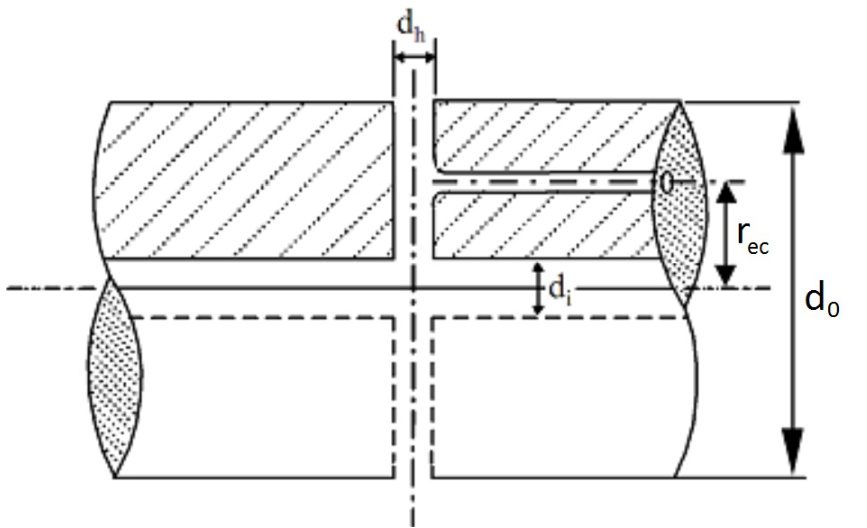  
Figure 1 Intersection between a radial and an eccentric axial bore  

# 2.2.7.6 IACS UR M68.7 Notes  

1) The method has following material limitations IACS M68.3. Shaft diameter IACS UR M68.4 (rule diameter).   
3) Permissible torsional vibration stresses IACS UR M68.5.   
4) Table 7 shows $\mathsf{k}$ and ${\mathsf{C}}_{\mathsf{K}}$ factors for different design features, see [2.2.7.5] IACS UR M68.6.  

5) Notes:  

A. Shafts complying with this method IACS UR M68.7 satisfy the load conditions in [2.2.2].   
a) Low cycle fatigue criterion (typically $<{10}^{4\cdot}$ ), i.e. the primary cycles represented by zero to full load and back to zero, including reversing torque if applicable. This is addressed by the formula in [2.2.7.3].   
b) High cycle fatigue criterion (typically $>>10^{7}.$ ), i.e. torsional vibration stresses permitted for continuous operation as well as reverse bending stresses. For limits for torsional vibration stresses, see [2.2.7.4]. The influence of reverse bending stresses is addressed by the safety margins inherent in the formula in [2.2.7.3].   
c) The accumulated fatigue due to torsional vibration when passing through a barred speed range or any other transient condition with associated stresses beyond those permitted for continuous operation is addressed by the criterion for transient stresses, see [2.2.7.4].  

B. Explanation of $\mathsf{k}$ and ${\mathsf{C}}_{\mathsf{K}}$  

The factors $\mathsf{k}$ (for low cycle fatigue) and ${\mathsf{C}}_{\mathsf{K}}$ (for high cycle fatigue) take into account the influence of:  

— the stress concentration factors (SCF) relative to the stress concentration for a flange with fillet radius of $0.08~{\mathsf d}_{0}$ (geometric stress concentration of approximately 1.45)  

$$
\begin{array}{r}{c_{k}\approx\frac{1.45}{s c f}\mathsf{a n d}k\approx\left(\frac{s c f}{1.45}\right)^{x}}\end{array}
$$  

— where the exponent $\times$ considers low cycle notch sensitivity   
— the notch sensitivity. The chosen values are mainly representative for soft steels $\mathbf{\zeta}^{\prime}(\mathbf{J}_{\mathsf{B}}<600\mathbf{\zeta})$ ), while the influence of steep stress gradients in combination with high strength steels may be underestimated   
— the size factor $\mathsf{C}_{\mathsf{D}}$ being a function of diameter only does not purely represent a statistical size influence, but rather a combination of this statistical influence and the notch sensitivity. The actual values for $\mathsf{k}$ and ${\mathsf{C}}_{\mathsf{K}}$ are rounded off.  

C. Stress concentration factor of slots  

The stress concentration factor (SCF) at the end of slots can be determined by means of the following empirical formulae using the symbols in footnote 6) in Table 7:  

$$
s c f=\alpha_{t(h o l e)}+0.8\left(\frac{\displaystyle\left(l-e\right)/d_{0}}{\displaystyle\sqrt{\left(1-\frac{d_{i}}{d_{0}}\right)\frac{e}{d_{0}}}}\right)
$$  

This formula applies to:  

— slots at $\mathtt{120^{\circ}}$ $180^{\circ}$ or $360^{\circ}$ apart   
— slots with semi-circular ends. A multi-radii slot end can reduce the local stresses, but this is not included in this empirical formula   
— slots with no edge rounding (except chamfering), as any edge rounding increases the SCF slightly.  

$\alpha_{\mathtt{t(h o l e)}}$ represents the stress concentration of radial holes (in this context ${\mathfrak{e}}=$ hole diameter), and can be determined from:  

$$
\begin{array}{r}{\alpha_{t(h o l e)}=2.3-3\frac{e}{d_{0}}+15\bigg(\frac{e}{d_{0}}\bigg)^{2}+10\bigg(\frac{e}{d_{0}}\bigg)^{2}\bigg(\frac{d_{i}}{d_{0}}\bigg)^{2}}\end{array}
$$  

or simplified to: $\alpha_{\mathrm{t(hole)}}=2.3$  

Table $\textbf{7k}$ and $\mathbf{c}_{\mathbf{K}}$ factors for different design features   

<html><body><table><tr><td colspan="5">Intermediateshaftswith</td><td></td><td colspan="2">Thrustshafts externalto engines</td><td colspan="3">Propellershafts</td></tr><tr><td>Integral coupling flange 1) and straight sections</td><td>Shrink fit coupling 2)</td><td>3)4) connection apered Keyway,</td><td>cylindrical 3)4) connection Keyway, </td><td>Radial hole 5)</td><td>6 slot Longitudina</td><td>On both sides of thrust collar 1)</td><td>In way of bearing when a roller bearing is used</td><td>Flange mounted i)or keyless taper fitted propellers (8</td><td>Key fitted propellers 8)</td><td>Between forward end of aft most bearing and forward stern tube seal</td></tr><tr><td>k = 1.0</td><td>1.0</td><td>1.10</td><td>1.10</td><td>1.10</td><td>1.20</td><td>1.10</td><td>1.10</td><td>1.22</td><td>1.26</td><td>1.15</td></tr><tr><td>Ck = 1.0 Footnotes</td><td>1.0</td><td>0.60</td><td>0.45</td><td>0.50</td><td>0.30 7)</td><td>0.85</td><td>0.85</td><td>0.55</td><td>0.55</td><td>0.80</td></tr><tr><td>1) Fillet radius shall not be less than 0.08 do. 2) k and Ck refer to the plain shaft section only.Where shafts may experience vibratory stresses close to the e.g. a diameter increase of 1 to 2% and a blending radius. 3) At adistance of notless than0.2 dofrom the endof thekeyway the shaft diameter maybereduced to the diameter calculated with k = 1.0. 4) Keyways are not to be used in installations with a barred speed range. 5) Diameterofradialborenottoexceed0.3do. The intersection between a radial and an eccentric axial bore (see Figure 1) is not covered by this method. 6) Subject to limitations as slot length(l)/outside diameter < 0.8,and inner diameter (d;)/outside diameter< 0.7 and</td></tr></table></body></html>  

# 2.2.8 Safety factors  

The shaft safety factors for the different applications and criteria detailed in class guideline DNV-CG-0038 shall be, at least, in accordance with Table 8. See also [2.2.5].  

Table 8 Shaft safety factors   

<html><body><table><tr><td>Criteria</td><td>Safetyfactor,S</td></tr><tr><td>Low cycle (Nc < 104 stress cycles)</td><td>1.25</td></tr><tr><td>High cycle (Nc >> 3·10° stress cycles)</td><td>1.6</td></tr><tr><td>Transient vibration when passing through a barred speed range: (104 < Nc < 3·106 stress cycles)</td><td>Linear interpolation (logt-logN diagram) between the lowcycle,peakstressescriterionwithS=1.25and the high cycle criterion with S = 1.5. For propeller shaftsinway of and aftof the aftstern tubebearing, the bending influence is covered by an increase of S by 0.05.</td></tr></table></body></html>  

# 2.3 Flange connections  

# 2.3.1 General  

Some relevant kinds of flange connections for shafts are described with regard to design criteria. Note that $\mathsf{K}_{\mathsf{A}}$ in this context means the highest value of the normal- or misfiring $\mathsf{K}_{\mathsf{A}}$ and ${\mathsf K}_{\mathsf{A P}}$  

In [2.3.2] and [2.3.3] the parameter d is referred to as the required shaft diameter for a plain shaft without inner bore. This means the necessary diameter for fulfilling whichever shaft dimensioning criteria are used, see [2.2.1]. For certain stress based criteria the necessary diameter is not directly readable. In those cases the necessary diameter can be found by iteration, but in practice it is better to apply the parameter d as the actual diameter.  

# 2.3.2 Flanges, torque only  

Flanges (except those with significant bending such as pinion and wheel shafts and propeller- and impeller fitting) shall have a thickness, t at the outside of the transition to the (constant) fillet radius, r, which is not less than:  

$$
t={\frac{d}{4\left(1+2{\frac{r}{d}}\right)^{2}}}
$$  

where:  

$d$ $=$ the required plain, solid shaft diameter, see [2.3.1] $r$ $=$ flange fillet radius.  

For multi-radii fillets the flange thickness shall not be less than 0.2 d.  

In addition, the following applies:  

recesses for bolt holes shall not interfere with the flange fillet, except where the flanges are reinforced correspondingly  

— for flanges with shear bolts or shear pins:  

$$
t\geq\frac{1}{2}\cdot d_{b}\cdot\frac{\sigma_{y,b o l t}}{\sigma_{y,f l a n g e}}
$$  

where:  

$d_{b}$ $=$ diameter of shear bolt or pin $\sigma_{y,b o l t}$ $=$ yield strength of shear bolt or pin σy,flange $=$ yield strength of flange.  

# 2.3.3 Flanges with significant bending  

Flanges with significant bending as pinion and wheel shafts, and propeller and impeller fittings shall have a minimum thickness of:  

$$
t={\frac{d}{3\left(1+2{\frac{r}{d}}\right)^{2}}}
$$  

where:  

$d$ $=$ the required plain, solid shaft diameter, see [2.3.1] $r$ $=$ flange fillet radius.  

For multi-radii fillets the flange thickness shall not be less than 0.25 d. In addition, the following applies:  

— recesses for bolt holes shall not interfere with the flange fillet, except where the flanges are reinforced correspondingly   
— for flanges with shear bolts or shear pins:  

$$
t\geq\frac{1}{2}\cdot d_{b}\cdot\frac{\sigma_{y,b o l t}}{\sigma_{y,f l a n g e}}
$$  

where:  

$d_{b}$ $=$ diameter of shear bolt or pin $\sigma_{y,b o l t}$ $=$ yield strength of shear bolt or pin σy,flange $=$ yield strength of flange.  

# 2.3.4 Torque transmission, friction bolts and shear pins  

Torque transmission based on combinations of shear or guide pins or expansion devices and pre-stressed friction bolts shall fulfil:  

a) The friction torque ${\sf T}_{\sf F}$ shall be at least twice the repetitive vibratory torque ${\mathsf{T}}_{\mathsf{v}},$ i.e.:  

$$
T_{F}=\frac{\mu D F_{b o l t s}}{2000}\geq2T_{v}
$$  

b) Twice the peak torque $\mathsf{T}_{\mathsf{p e a k}}$ minus the friction torque (see a) above) shall not result in shear stresses beyond the shear yield strength $({\frac{\sigma_{y}}{\sqrt{3}}})$ of the n ream fitted pins or expansion devices, i.e.:  

$$
2T_{p e a k}-T_{F}\leq\frac{\pi n D d_{b}^{2}\sigma_{y}}{8\cdot10^{3}\sqrt{3}}\mathrm{(Nm)}
$$  

where:  

Tpeak $=$ higher value of (Nm): $K_{\mathsf{A P}}\mathsf{T}_{0}$ or ${\sf T}+{\sf T}_{\sf v}$ in the entire speed range considering also normal and misfiring transient conditions   
$D$ $=$ bolt pitch circle diameter (PCD) [mm]   
$d_{b}$ $=$ bolt shear diameter [mm].  

# Guidance note:  

${\sf T}_{\sf v}$ in normal transient conditions means with prescribed or programmed way of passing through a barred speed range.  

# 2.3.5 Torque transmission, friction and shear combination bolts  

Torque transmission based on n flange coupling bolts mounted with a slight clearance (e $.9.<0.1\mathrm{mm}$ ) and tightened to a specified pre-stress $\sigma_{\mathsf{p r e}}$ shall fulfil the following requirements:  

— the friction torque shall be at least twice the repetitive vibratory torque (including normal transient conditions), see [2.3.4] a)   
— bolt pre-stress limited as in [2.3.8]   
— the shear stress $\tau$ due to twice the peak torque minus the friction torque combined with the pre-stress $\sigma_{\mathsf{p r e}}$ shall not exceed the yield strength $\sigma_{\lor\prime}$ i.e.:  

$$
\sqrt{\sigma_{p r e}^{2}+3\tau^{2}}\le\sigma_{y}
$$  

where:  

$\tau\qquad=\qquad$ shear stress in bolt, calculated as $\tau=\frac{8\Big(2T_{p e a k}-T_{F}\Big)10^{3}}{D\pi n d_{b}^{2}}$   
σpre = specified bolt pre-stress, calculated as $\sigma_{p r e}=\frac{4F_{b o l t s}}{\pi n d_{b}^{2}}$   
$T_{p e a k}=$ peak torque, see [2.3.4] b).  

# 2.3.6 Torque transmission, fitted bolts  

Torque transmission based on ream fitted bolts only, shall fulfil the following requirements:  

— the bolts shall have a light press fit   
— the bolt shear stress due to two times the peak torque $\mathsf{T}_{\mathsf{p e a k}},$ (see [2.3.4] b) minus the friction torque TF, shall not exceed $0.58~\upsigma_{\upgamma}$   
— the bolt shear stress due to the vibratory torque $T_{\vee},$ for continuous operation shall not exceed $\upsigma_{\upgamma}/8$  

This means that the diameter of the n fitted bolts shall fulfil the following criteria:  

$$
d_{b}\geq66\sqrt{\frac{2T_{p e a k}-T_{F}}{n D\sigma_{y}}}
$$  

and  

$$
d_{b}\geq143\sqrt{\frac{T_{V}}{n D\sigma_{y}}}
$$  

Ream fitted bolts may be replaced by expansion devices provided that the bolt holes in the flanges align properly.  

# Guidance note:  

Ream fitted bolts with a light press fit means that the bolts when having a temperature equal to the flange, cannot be mounted by hand. A light pressing force or cooling should be necessary.  

In order to facilitate later removal of the bolts it is important that the interference between the bolts and corresponding holes are not excessive. It should only be a few $1/100~\mathrm{mm}$ , i.e. just more than the contraction of the diameter due to the pre-tightening. Therefore, direct contact with liquid nitrogen for cooling the bolts is unnecessary and could lead to cracks in the bolts. It is also beneficial to use bolts which are made from somewhat harder material than the shaft flange is made of $(>50{\mathsf{H B}})$  

# 2.3.7 Torque transmission, friction  

Torque transmission based on only friction between mating flange surfaces shall fulfil a minimum friction torque of $2\mathsf{T}_{\mathsf{p e a k}}$ . The coefficient of friction, $\upmu$ shall be 0.15 for steel against steel and steel against bronze, and 0.12 for steel against nodular cast iron. Other values may be considered for especially treated mating surfaces. The bolt pre-stress is limited as given in [2.3.8].  

$$
2T_{p e a k}\leq\left(\frac{\mu D F_{b o l t s}}{2000}(N m)\right)
$$  

$D$ $=$ bolt pitch diameter [mm] Fbolts $=$ the total bolt pre-stress force of all n bolts Tpeak $=$ peak torque, see [2.3.4] b).  

# 2.3.8 Bolt pre-stress  

Bolts may have a pre-stress up to $70\%$ of the yield strength in the smallest section. However, when using 10.9 or 12.9 bolts the thread lubrication procedure shall be especially evaluated, and only tightening by twist angle or better is accepted (e.g. by elongation measurement). If rolled threads, the pre-stress in the threads may be increased up to $90\%$ of the yield strength.  

In corrosive environment the upper acceptable material tensile strength is 1350 MPa.  

In order to maintain the designed bolt pre-stress under all conditions, these percentages are given on the condition that the peak service stresses combined with the pre-stress do not exceed the yield strength. The bolts shall be designed under consideration of the full thrust and bending moments including reversing. For bending moments on water jet impeller flanges, see [6.3] item 2).  

The length of the female threads shall be at least:  

0.8 d $\upsigma_{\upgamma\mathsf{b o l t}}/\upsigma.$ yfemale  

where d is the outside thread diameter and the ratio compensates for the difference in yield strength between the bolt and the female threads.  

This requirement is valid when the above mentioned pre-stress is utilised, otherwise a proportional reduction n required thread length may be applied.  

# 2.4 Shrink fit connections  

# 2.4.1 General requirements  

For all torque transmitting shrink fit connections, including propeller fitting.  

1) The shrink fit connections shall be able to transmit torque and axial forces with safety margins as given in [2.4.2] and [2.4.3]. This shall be obtained by a certain minimum shrinkage amount. If the shrunk-on part is subjected to high speeds (e.g. tip speed $>50~\mathsf{m}/\mathsf{s}$ ), the influence of centrifugal expansion shall be considered.  

The following load conditions shall be considered:  

A. In the upper speed range $(>90\%)$  

— the rated torque $\mathsf{T}_{0}$ including any permitted intermittent overload   
— when combined with the vibratory torque in misfiring condition the rated torque may be reduced proportional with the ratio remaining cylinders/number of cylinders   
— the highest temporary vibratory torque TV0T in the full speed range. This shall consider the worst relevant operating conditions, e.g. such as sudden misfiring (one cylinder with no injection) and cylinder unbalance, see Ch.2 Sec.2. For determination of the vibratory torque in the misfiring condition it is necessary to consider the steady state vibrations in the full speed range regardless of whether the speed range is barred for continuous operation due to torsional vibrations or other operational conditions   
— the axial forces such as propeller thrust Th and/or gear forces. The nut force shall be disregarded   
— for ice class notation the highest axial force $({\mathsf{T h}}_{\mathsf{i c e}})$ in the applicable ice rules   
— the axial force due to shrinkage pressure at a taper.  

B. At a main resonance (applicable to direct coupled diesel engines):  

— the mean torque T at that resonance   
— the steady state vibratory torque TVres regardless if there is a barred speed range   
— by convention the propeller thrust, any thrust due to ice impact, the nut force, and the axial force due to shrinkage pressure at the taper shall be disregarded.  

# Guidance note:  

The peak torques when reversing at main resonance are not used in this context and that condition is assumed covered by the required partial safety factors.  

2) The minimum and maximum shrinkage amounts shall be correlated to the measurement that shall be applied for verification. For elements with constant external diameter, diametrical expansion is preferred. Otherwise the pull up length (wet mounting) or the push up force (dry mounting) shall be specified. The clearance of an intermediate sleeve is also to be considered.   
3) The taper shall not be steeper than 1:20. However, taper of cone as steep as 1:15 is acceptable, provided that a more refined mounting procedure and or a higher safety factor than given in the rules is applied.   
4) For tapered connections steeper than 1:30 and all propeller cone mountings where a slippage may cause a relative axial movement between the two members, the axial movement shall be restricted by a nut secured to the shaft with locking arrangement. Alternatively a split fitted ring with locking arrangement may be used.   
5) Tapered connections shall be made with accuracy suitable to obtain the required contact between both members. Normally the minimum contact on the taper is $70\%$ when a toolmaker’s blue test is specified. Non-contact bands (except oil grooves) extending circumferentially around the hub or over the full length of the hub are not acceptable. At the big end there shall be a full contact band of at least $20\%$ of the taper length.  

6) The coefficient of friction $\upmu$ shall be taken from Table 9, unless other values are documented by tests.  

Table 9 Static coefficients of friction, μ   

<html><body><table><tr><td rowspan="2">Application</td><td colspan="3">Hub material (shaftmaterial=steel)</td></tr><tr><td>Steel</td><td>Cast iron or nodularcastiron</td><td>Bronze</td></tr><tr><td>Oil injection</td><td>0.14</td><td>0.12</td><td>0.13</td></tr><tr><td>Dry fit on taper</td><td>0.15</td><td></td><td>0.15</td></tr><tr><td>Glycerine injection (parts carefully degreased) 1)</td><td>0.18</td><td>0.16</td><td>0.17</td></tr><tr><td>Heated in oil</td><td>0.13</td><td>0.10</td><td></td></tr><tr><td>Dry heated/cooled(parts not degreased or protected vs.oil penetration; nor high shrinkage pressure applied)</td><td>0.15</td><td>0.12</td><td></td></tr><tr><td>Dry heated/cooled(parts degreased and protected vs.oil penetration; or high shrinkage pressure applied)</td><td>0.20</td><td>0.16</td><td></td></tr><tr><td>Specialfrictioncoating</td><td colspan="3">To be specially approved, see DNV-CP-0509.</td></tr><tr><td colspan="4"></td></tr></table></body></html>  

# 2.4.2 Connections other than propeller  

The following is additional to requirements in [2.4.1]:  

1) The friction capacity shall fulfil:  

A. In the full speed range:   
Required torque capacity (kNm):   
${\sf T}_{\sf C1}=1.8\cdot{\sf T}_{0}+1.6\cdot{\sf T}_{\sf V0\top}$   
( $\mathsf{I f}\mathsf{T}_{\mathsf{V0T}}<(\mathsf{K}_{\mathsf{A p}}-\mathsf{1})\cdot\mathsf{T}_{0},$ replace TV0T by $(\mathsf{K}_{\mathsf{A p}}{-}1){\cdot}\mathsf{T}_{0})$   
The minimum value for $\mathsf{T}_{\mathsf{C1}}$ is $2.5\cdot\mathsf{T}_{0}$   
Tangential force (kN) $\mathsf{F}_{\mathsf{T}}=2\cdot\mathsf{T}_{\mathsf{C1}}/\mathsf{D}_{\mathsf{S}}$   
$\mathrm{\bf~D}_{\mathsf{S}}$ is shrinkage diameter $(\mathsf{m})$ , mid-length if tapered.)   
Axial force (kN):   
$\mathsf{F}_{\mathsf{A}}=\mathsf{p}\cdot\mathsf{n}\cdot\mathsf{D}_{\mathsf{S}}\cdot\mathsf{L}\cdot\mathsf{\theta}\cdot10^{3}\pm\mathsf{T h}$   
(replace Th with $\mathsf{T h}_{\mathsf{i c e}}$ if this results in a higher $\mathsf{F}_{\mathsf{A}}$   
(in gearboxes, replace Th with KAP·FAgear)  

Sign convention:  

$^+$ for axial forces pulling off the cone such as propellers with pulling action including thrusters and pods with dual direction of rotation and controllable pitch propeller for axial forces pushing up the cone such as propellers with pushing action   
$p$ $=$ surface pressure (MPa)   
$L\quad=$ effective length $(\mathsf{m})$ of taper in contact in axial direction disregarding (i.e. not subtracting) oil grooves and any part of the hub having a relief groove   
$\theta\quad=$ half taper, e.g. taper $=1/30$ $\theta=1/60^{\cdot}$  

With friction force (kN $)\colon\mathsf{F}_{\mathsf{F R}}=\mathsf{p}{\cdot}\mathsf{\upmu}{\cdot}\mathsf{n}{\cdot}\mathsf{D}_{\mathsf{S}}{\cdot}\mathsf{L}{\cdot}\mathsf{1}0^{3}$ the necessary surface pressure p (MPa) can be determined by:  

$$
p=\frac{\sqrt{F_{T}^{2}\cdot\left(1-\frac{\theta^{2}}{\mu^{2}}\right)+T h^{2}}\pm T h\cdot\frac{\theta}{\mu}}{\mu\cdot\pi\cdot D_{s}\cdot L\cdot10^{3}\cdot\left(1-\frac{\theta^{2}}{\mu^{2}}\right)}
$$  

Sign convention as above.  

B. At a main resonance:  

Torque capacity $(\mathsf{k N m})\colon\mathsf{T}_{\mathsf{C}2}=1.6\cdot(\mathsf{T}+\mathsf{T}_{\mathsf{V r e s}})$ The necessary surface pressure $\mathsf{p}$ (MPa) can be determined by:  

$$
p={\frac{2\cdot T_{C2}}{\pi\cdot\mu\cdot D_{s}^{2}\cdot L\cdot{10}^{3}}}
$$  

The highest value determined by A and B applies.  

Coefficient of friction according to Table 9.  

2) Fretting under the ends of shrink fit connections shall be avoided. However, very light fretting is accounted for by notch factors, see class guideline DNV-CG-0038 Sec.6 [5].  

In particular for a shrinkage connection with a high length to diameter ratio $(>1.5)$ or if it is subjected to a bending moment, special requirements may apply in order to prevent fretting of the shaft under the edge of the outer member. This may be a relief groove or fillet, higher surface pressure, etc.  

# Guidance note:  

If the surface pressure at the torque end times coefficient of friction is higher than the principal stress variation at the surface, $\upsigma<\uprho\upmu_{i}$ , see Sec.2 Figure 2, fretting is not expected. Other surface pressure criteria may also be considered. If such surface pressure or friction cannot be achieved, it may be necessary to use a relief or a groove. The groove may be designed as indicated below:  

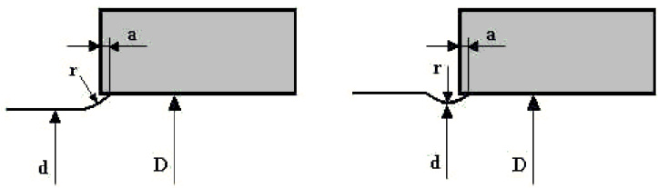  

It is recommended that $\mathsf{D}=1.1$ d and $\digamma=2$ (D − d) and an axial overshoot at near zero but not less than zero. Other ways of preventing fretting under the edge of the hub are a relief groove in the hub or a tapered hub outer diameter. However, these alternatives need to be documented by means of detailed analysis as e.g. finite element method calculations  

3) The permissible stress due to shrinking for the outer member (index o) depends on the nature of the applied load, coupling design and material. For ductile steels the equivalent stress (von Mises) may be in the range $70\%$ to $80\%$ of the yield strength $\upsigma_{\upgamma\circ}$ for de-mountable connections and $100\%$ and even some plastic deformation for permanently fitted connections.  

The stress due to shrinking at the outer diameter of the shaft (i.e. the shaft, index i) or at any other critical section (e.g. axial and radial bore intersection) should not exceed $50\%$ of the yield strength $\upsigma_{\upgamma\mathrm{i}}$ of the shaft.  

# Guidance note:  

The shrinkage stresses at outer diameter for shaft is additional to stresses due to bending and torsional load. The limit of $50\%$ of yield shall be applied for shafts with significant torsional vibratory stresses or bending stresses. Higher shrinkage stresses due to fitting may be accepted for application with low bending stresses and low torsional stresses. Documentation of shaft fatigue for the section considering the additional shrink fit stresses may in case be required.  

4) The shrinkage amounts shall be calculated under consideration of the surface roughness as follows:  

ΔDmin $=$ minimum shrinkage amount due to tolerances or pull-up distance, minus 0.8 (Rzi + Rzo) ≈ 5 $\mathrm{R}_{\mathsf{a i}}+\mathsf{R}_{\mathsf{a o}}$ [mm] ΔDmax $=$ maximum shrinkage amount due to tolerances or pull-up distance, minus  

$$
0.8({\mathsf{R}}_{\mathrm{zi}}+{\mathsf{R}}_{\mathrm{zo}})\approx5({\mathsf{R}}_{\mathsf{a i}}+{\mathsf{R}}_{\mathsf{a o}})[\mathsf{m m}].
$$  

${\sf R}_{z}$ ten point height surface roughness $[\mathsf{m m}]$ as defined in ISO 4287 for shaft and hub, respectively.  

$\mathsf{R}_{\mathsf{a}}$ arithmetical mean surface roughness [mm] as defined in ISO4287/1 for shaft and hub, respectively.  

The lower value shall be used for calculation of the required friction torque. The upper value shall be used for calculation of stresses in the inner and outer members. For tapered connections the shrinkage amounts shall be converted to pull up lengths.  

(Pull-up distance $=\Delta\mathsf{D}/2\mathsf{\Theta}$ , where 2θ is the taper of cone).  

5) The following applies for shrinking within the elastic range and both inner and outer member made of steel. The minimum and maximum shrinkage pressures (MPa) are:  

$$
\begin{array}{r l}&{\mathsf{p}_{\mathsf{m i n}}=\left(\Delta\mathsf{D}_{\mathsf{m i n}}/\mathsf{D}_{\mathsf{S}}\right)\left(\mathsf{E}/\mathsf{K}\right)10^{-3}}\ &{\mathsf{p}_{\mathsf{m a x}}=\left(\Delta\mathsf{D}_{\mathsf{m a x}}/\mathsf{D}_{\mathsf{S}}\right)\left(\mathsf{E}/\mathsf{K}\right)10^{-3}}\end{array}
$$  

The pull-up lengths [mm] are:  

$$
\begin{array}{r}{\delta_{\operatorname*{min}}=p_{\operatorname*{min}}\frac{10^{3}D_{s}}{2\theta}\frac{K}{E}}\ {\delta_{\operatorname*{max}}=p_{\operatorname*{max}}\frac{10^{3}D_{s}}{2\theta}\frac{K}{E}}\end{array}
$$  

The corresponding pull-up force $\mathsf{F}_{\mathsf{p u l l}}$ can be estimated as  

$\mathrm{~\ensuremath~{~-~}~}\mathsf{F}_{\mathsf{p u l l}}=\mathsf{p}{\cdot}\pi\mathsf{D}_{\mathsf{s}}\mathsf{L}\left(\theta+\mathsf{\upmu}_{\mathsf{p u l l}}\right)\mathsf{1}0^{3}\left(\mathsf{k N}\right)$ $-\mathsf{\Pi}\mathsf{\upmu}_{\mathsf{p u l l}}=$ coefficient of friction during pull-up.  

The diametrical expansions are $[\mathsf{m m}]$  

$$
\Delta D_{o\mathrm{max}}=P_{\mathrm{max}}\frac{10^{3}D_{s}}{E}\cdot\frac{2Q_{o}}{1-Q_{o}^{2}}
$$  

$$
\Delta D_{o\mathrm{min}}=P_{\mathrm{min}}\frac{10^{3}D_{s}}{E}\cdot\frac{2Q_{o}}{1-Q_{o}^{2}}
$$  

$E$ = 2.05 · 105 MPa $K$ (1 + Qi2)/(1 −Qi2) + (1 + Qo2)/(1 − Qo2) $Q_{i}$ $=$ inner diameter of inner member/ $^\prime\mathsf{D}_{\mathsf{S}}$ $Q_{o}$ $=$ DS/outer diameter of outer member.  

The minimum shrinkage pressure shall not be less than the necessary pressure p as determined in item 1).  

The equivalent (von Mises) stress in the outer member is (MPa):  

$$
\frac{\sqrt{3+Q_{o}^{4}}P_{\mathrm{max}}}{1-Q_{o}^{2}}
$$  

and shall not exceed the permissible stress as given in 3) above.  

The stress calculation of the inner sleeve shall take any expansion sleeve or compression liner influence into account.  

In the case of several members shrunk on together, and all being within the elastic range, the superposition principle shall be used.  

6) The following applies to shrinking with a certain amount of plastic deformation in the outer member applicable to parts that are not intended to be disassembled. The simplified approach given here is valid for both members being made of steel and solid inner member, and based on modified Tresca criterion. If these conditions are not fulfilled, a more detailed analysis applies.  

As specified in 3) , the stresses in the inner member (shaft) due to shrinking shall not exceed $50\%$ of the yield strength $\upsigma_{\upgamma\mathrm{i}}$ . Thus the shrinkage pressure is limited to:  

${\sf p}_{\mathrm{i}\mathrm{lim}}=\upsigma_{\upgamma\mathrm{i}}/\sqrt{3}$   
In order to keep a safety factor of 1.25 versus full plastic deformation of the outer member the   
shrinkage pressure is limited to:  

$\mathsf{p}_{\mathsf{o l i m}}=1.6~\upsigma_{\upgamma\circ}/\sqrt{3}$ for $Q_{0}<0.368$ $\mathsf{p}_{\mathsf{o l i m}}=-1.6\mathsf{I n}(\mathsf{Q}_{\mathsf{o}})\mathsf{\sigma}_{\mathsf{v o}}/\sqrt{3}\mathsf{f o r}\mathsf{Q}_{\mathsf{o}}>0.368$  

The extent of permissible plastic deformation $\zeta_{\mathsf{p}}$ (i.e. the ratio between the outer diameter of the plastically deformed zone and $\mathsf{D}_{\mathsf{S}}$ ) is limited by 2 criteria:  

1) $2\ln(\zeta_{\mathsf{p}})-\left(\mathsf{Q}_{0}\zeta_{\mathsf{p}}\right)^{2}+1=\sqrt{3\mathsf{p}_{\mathsf{p}}/\upsigma_{\mathsf{v}0}}$ where ${\mathsf{p}}_{\mathsf{p}}$ is the permissible shrinkage pressure and is the smaller value of $\uprho_{0}\mathrm{|im|}$ and $\mathsf{p}_{\mathrm{i}}\mathsf{I i m}$   
2) $\zeta_{\mathsf{p}}={(0.\dot{7}\mathrm{~Q}_{0}^{2}+0.3)}^{1/2}/\mathsf{Q}_{0}$ in order to limit the plastically deformed cross section area to $30\%$ of the full cross section. The actual minimum and maximum extents of plastic deformation are calculated as: ζmin, max = 0.931 (E/σyo)1/2 (ΔDmin, max/DS)1/2 $\zeta_{\mathrm{min}}$ is used to calculate the minimum shrinkage pressure as: $\mathsf{p}_{\mathsf{m i n}}=\upsigma_{\mathsf{v o}}(1+2\mathsf{I n}(\upzeta_{\mathsf{m i n}})-(\mathsf{Q}_{0}\upzeta_{\mathsf{m i n}})^{2})/\sqrt{3}$ $\zeta_{\mathrm{max}}$ shall not exceed the permissible value $\zeta_{\mathsf{p}}$  

# 2.4.3 Propeller to shaft connections  

The following is additional to [2.4.1]:  

The friction capacity shall fulfil the following at a temperature of $35^{\circ}\mathrm{C}$ A. In the full speed range:   
Required torque capacity (kNm)   
${\sf T}_{\sf C1}=2.0\cdot{\sf T}_{0}+1.8\cdot{\sf T}_{\sf V0T}$   
(I $\textsf{f T v o r}<(\mathsf{K}_{\mathsf{A p}}-1){\cdot}\mathsf{T}_{0},$ replace TV0T by $(\mathsf{K}_{\mathsf{A p}}{-}1){\cdot}\mathsf{T}_{0})$   
The minimum value for $\mathsf{T}_{\mathsf{C1}}$ is $2.8\cdot\mathsf{T}_{0}$   
See also [2.4.2] Tangential and Axial forces   
B. At a main resonance:   
Torque capacity $(\mathsf{k N m})\mathsf{T}_{\mathsf{C}2}=1.8{\cdot}(\mathsf{T}+\mathsf{T}_{\mathsf{V r e s}})$   
The necessary surface pressure $\mathsf{p}$ (MPa) can be determined by: $p_{35T}={\frac{2\cdot T_{C2}}{\pi\cdot\mu\cdot D_{s}^{2}\cdot L\cdot10^{3}}}$ The higher value from A and B shall be used.   
Coefficient of friction according to Table 9.  

2) For propeller without intermediate sleeve, corresponding required pull-up length $[\mathsf{m m}]$ at $35^{\circ}\mathrm{C}$ is:  

$$
\delta_{35T}=p_{35T}\cdot\frac{{D_{s}}\cdot{10}^{3}}{2\cdot{\theta}}\cdot\left[\frac{1}{E_{h}}\cdot\left(\frac{1+Q_{o}^{2}}{1-Q_{o}^{2}}+v_{h}\right)+\frac{1}{E_{s}}\cdot\left(\frac{1+Q_{i}^{2}}{1-Q_{i}^{2}}-v_{s}\right)\right]
$$  

where:  

$E_{h}$ $=$ the modulus of elasticity of the propeller hub $E_{S}$ $=$ the modulus of elasticity of shaft.  

Modulus of elasticity to be used:  

For Cu1 (Mn-bronze) and Cu2 (Mn-Ni-bronze): $\mathsf{1.05{\cdot}10}^{\mathsf{5}}$ MPa.  

For Cu3 (Ni-Al-bronze) and Cu4 (Mn-Al-bronze): $\phantom{-}1.15{\cdot}10^{5}$ MPa.  

For steel: $2.05{\cdot}10^{5}$ MPa  

$\nu_{h}$ $=$ the Poisson’s ratio for hub $\nu_{S}$ $=$ the Poisson’s ratio for shaft.  

Poisson’s ratios to be used:  

For bronze: 0.33  

For steel: 0.29  

$Q_{o}$ $=$ the ratio between $\mathsf{D}_{\mathsf{S}}$ and the mean outer diameter of propeller hub at the axial position corresponding to $\mathsf{D}_{\mathsf{S}}$   
$Q_{i}$ $=$ the ratio between the inner diameter of the shaft and $\mathsf{D}_{\mathsf{S}}$  

The minimum pull-up length [mm] at temperature $\mathtt{t},$ $(\mathrm{t}<35^{\circ}\mathrm{C})$  

$$
\delta_{t-T}=\delta_{35T}+\frac{D_{S}\cdot10^{3}}{2\cdot\theta}\cdot\left(\alpha_{b}-\alpha_{S}\right)\cdot(35-t)
$$  

where $\alpha$ is the coefficient of linear expansion.  

For steel:  

$$
\begin{array}{l l}{{\alpha_{5}=12.0{\cdot}10^{-6}}}&{{\qquad1/{}^{\circ}\complement}}\ {{}}&{{}}\ {{\alpha_{\mathsf{b}}=17.5{\cdot}10^{-6}}}&{{\qquad1/{}^{\circ}\complement}}\end{array}
$$  

For all copper-based alloys:  

3) For propeller without intermediate sleeve, the maximum equivalent uniaxial stress in the hub (calculated at the big end) at ${0^{\circ}}{\mathsf{C}}$ based on the von Mises criterion shall not exceed $70\%$ of the yield point or $0.2\%$  

proof stress ( $0.2\%$ offset yield strength) for the propeller material based on the specified value for the test piece.  

Maximum permissible surface pressure (MPa) at ${0^{\circ}}{\mathsf{C}}$  

$$
p_{\operatorname*{max}}=\frac{1-Q_{O B}^{2}}{\sqrt{3+Q_{O B}^{4}}}\cdot\left(0.7\cdot\sigma_{y}\right)
$$  

Corresponding maximum permissible pull-up length $[\mathsf{m m}]$ at ${0^{\circ}}{\mathsf C}$  

$$
\delta_{\mathrm{max}}=\frac{p_{\mathrm{max}}}{p_{35\mathrm{min}}}\cdot\delta_{35\mathrm{min}}
$$  

Corresponding maximum permissible pull-up length $[\mathsf{m m}]$ at temperature $t$  

$$
\delta_{t-\operatorname*{max}}=\delta_{\operatorname*{max}}-\frac{\binom D S^{+L\cdot\theta}\cdot10^{3}}{2\cdot\theta}\cdot\left(\alpha_{b}-\alpha_{s}\right)\cdot t
$$  

QOB $=$ ratio between shaft diameter and outer diameter of the propeller hub at the big end of the cone.  

Note that if the hub has a relief groove at the big end, this criterion applies to the nearest section that is not relieved.  

# 2.5 Keyed connections  

# 2.5.1 Limitations  

Keyed connections are only suitable for unidirectional torque drives with low torque amplitudes and insignificant bending stresses. Conditionally, keyed connections may be used also for dual directional torque drives, see [2.5.3].  

The following items shall be checked:  

— shrinkage pressure to avoid detrimental fretting, see [2.5.2]   
— shear stress in the key, see [2.5.3]   
— surface pressure at shaft keyway side, hub keyway side and key side, see [2.5.3] — fatigue strength of the shaft, see [2.2]   
— strength of hub, see [2.5.4]   
— intersection with other notches, see [2.5.5].  

Tapered connections shall not be steeper than 1:12. However, taper of cone as steep as 1:10 is acceptable, provided that a more refined mounting procedure and/or a higher safety factor than given in the rules are applied.  

Tapered connections steeper than 1:30 as well as any keyed connection with axial forces shall be secured against axial movement.  

# 2.5.2 Fretting  

To avoid detrimental fretting on the shaft under the edge of the hub, there shall be a certain minimum interference fit between shaft and hub. For key connections subjected to bending moments a tight fit is required. The criteria, which also apply to propeller connections, are given in [2.4.2] 2) and class guideline DNV-CG-0038 Sec.6 [5].  

For key connections transmitting torque only, there shall be a minimum interference fit (friction torque) that corresponds to the applicable vibratory torque for continuous operation with a safety factor of 2.0. This means a friction torque (Nm):  

$$
{\sf T}_{\sf F}\geq2.0{\sf T}_{\sf V}
$$  

that may be approximated as the highest value of:  

$\mathrm{~-~}2(\mathsf{K}_{\mathsf{A}}-1)\mathsf{T}_{0}$ for geared plants $\mathrm{~-~}2(\mathsf{K}_{\mathsf{A p}}-1)\mathsf{T}_{0}$ for plants with ice class $-2\mathsf{T}_{\mathsf{v}}$ for direct coupled plants.  

When calculating shrink fit pressures between cylindrical members with one or two keyways, the real pressure is less than the calculated due to relief caused by the keyways. This influence may be approximated by a reduction factor of 0.8. With these assumptions and solid shaft with steel hub the necessary amount of shrinkage Δd [mm] is:  

$$
\Delta\mathrm{d}=\mathsf{T}_{\mathsf{F}}/(128\mathsf{d}\mathsf{L}\mathsf{\Pi}\mu\left(1-\left(\mathsf{d}/\mathsf{D}\right)^{2}\right))
$$  

where:  

Δd $=$ shrinkage amount [mm] estimated as minimum amount due to specified tolerances or distance, minus 0.8 $\left(\mathsf{R}_{\mathsf{Z}-\mathsf{S}\mathsf{h}\mathsf{a}\mathsf{f t}}+\mathsf{R}_{\mathsf{Z}-\mathsf{h}\mathsf{u}\mathsf{b}}\right)\approx5$ $(\mathsf{R}_{\mathsf{a}-\mathsf{S}\mathsf{h}\mathsf{a}\mathsf{f t}}+\mathsf{R}_{\mathsf{a}-\mathsf{h}\mathsf{u}\mathsf{b}})$   
$d$ $=$ shaft diameter [mm]   
$D$ $=$ outer diameter of hub [mm]   
$L$ $=$ hub length [mm]   
$\mu$ $=$ coefficient of friction (0.15 may be used)   
$R_{a},R_{z}=$ surface roughness [mm] for shaft and hub, respectively, see [2.4.2] 4).  

However, smaller interference is acceptable when the shaft is dimensioned to sustain some fretting.  

For tapered connections the minimum friction torque shall be provided by means of either a specified push up force or a specified pull up length. The latter shall be consistent with Dd above. However, if test pull-up is carried out, the subtraction of the surface roughness term may be omitted.  

# 2.5.3 Key  

The key shear stress and the surface pressures in the shaft and hub keyways, respectively are calculated on the basis of the applied repetitive peak torque Tpeak (see [2.3.4] b) ) minus the actual friction torque TF according to [2.5.2]. Furthermore, the uneven distribution of the load along a key with a length beyond $\mathsf{L}_{\mathsf{e f f}}/\mathsf{d}$ $=0.5$ is considered empirically. If $\mathsf{L}_{\mathsf{e f f}}/\mathsf{d}<0.5$ then $\mathsf{L}_{\mathsf{e f f}}/\mathsf{d}=0.5$ shall be used in the formulae below.  

Shear stress in key (MPa):  

τ  

$$
\begin{array}{r l}{=}&{{}(\mathsf{T}_{\mathsf{p e a k}}-\mathsf{T}_{\mathsf{F}}/\mathsf{S})2000(1+0.25(\mathsf{L}_{\mathsf{e f f}}/\mathsf{d}-0.5))/(\mathsf{d}\mathsf{L}_{\mathsf{e f f}}\mathsf{b}\mathsf{i})}\end{array}
$$  

Side pressure (for contact with shaft and hub):  

$$
\begin{array}{r l}{=}&{{}(\mathsf{T}_{\mathsf{p e a k}}{-}\mathsf{T}_{\mathsf{F}}/\mathsf{S})2000(1+0.25(\mathsf{L}_{\mathsf{e f f}}/\mathsf{d}-0.5))/(\mathsf{d}\mathsf{L}_{\mathsf{e f f}}\mathsf{h}_{\mathsf{e f f}}\mathsf{i})}\ {=}&{{}\mathsf{e f f}\mathsf{e c t i v e~b e a r i n g~l e n g t h~o f~t h e~k e y~8m m}]}\ {=}&{{}\mathsf{w i d t h~o f~k e y~}[\mathsf{m m}]}\ {=}&{{}\mathsf{n u m b e r~o f~k e y s,~i f~2~k e y s~u s e~i=1.5}}\ {=}&{{}\mathsf{e f f e c t i v e~h e i g h t~o f~k e y~c o n t a c t~w i t h~s h a f t~a n d~h u b,~r e s p e c t i v e l y~i.e.~k e y~}}\ {}&{{}\mathsf{a n d~k e y w a y~e d g e~r o u n d i n g~c o n s i d e r e d}}\ {=}&{{}2}\end{array}
$$  

S  

Permissible shear stress $\mathbf{\xi}=\mathbf{\xi}0.3\cdot\mathbf{\xi}\mathsf{f}_{\mathsf{d}}$ times the yield strength of the key material in key  

Permissible side $\mathbf{\varepsilon}=\mathbf{\varepsilon}_{1}.\mathbf{\varepsilon}_{\mathsf{f}_{\mathsf{S}}}\cdot\mathbf{\varepsilon}_{\mathsf{f}_{\mathsf{d}}}$ times the respective yield strengths   
pressures   
fd $=$ torque direction factor $\L=\L\perp$ for unidirectional torque $=~2/3$ for dual directional torque with $10^{3}$ to ${10}^{4}$ reversals $=~1/3$ for ${10}^{6}$ or more reversals   
fS $=$ support factor $\L=\L\perp$ for the key $=~1.2$ for the shaft $=1.5$ for the hub.  

For plants with torque reversals the key shall have a tight sideways fit in both shaft and hub.  

# 2.5.4 Hub  

The tangential stresses in the hub when calculated as an ideal cylindrical member with the maximum amount of shrinkage due to tolerances shall not exceed $35\%$ of the yield strength for steel. For bronze or austenitic steel $45\%$ are permitted.  

For tapered connections the dimensions at the upper end shall be used.  

# 2.5.5 Keyway  

If a keyway intersects with another notch such as a diameter step, the semi-circular part of the end should be placed fully into the shaft part with the larger diameter. If the semi-circular end coincides with the fillet in the diameter step, a combination of stress concentrations shall be considered.  

# 2.5.6 Propeller with key  

For propeller fitting the contact between hub and shaft shall be at least $70\%$ with a full contact band at the upper end, when using toolmaker’s blue. This full contact band shall be at least 0.2 d wide (excluding the trace of any hub keyway). This means that there shall be a certain distance between the top of cone and the shaft keyway, minimum 0.2 d.  

For tapered couplings at least a full contact band at the upper end is required.  

# 2.6 Clamp couplings  

# 2.6.1 Key  

Clamp couplings shall be fitted with a key that fulfils the requirements in [2.5]. For couplings transmitting thrust, an axial locking device shall be provided.  

# 2.6.2 Clamping bolts  

The clamp coupling bolts shall be tightened so that the coupling friction torque ${\sf T}_{\sf F}$ as specified in [2.5.2] is obtained. The maximum bolt stress when the peak torque (see [2.3.4]) is applied shall not exceed 2/3 of the bolt yield strength.  

# 2.6.3 Hub  

The hub stress determined in a simplified way as the bolt pre-stress divided by the hub length times minimum hub thickness at the keyway, shall not exceed $40\%$ of the yield strength of the hub material.  

# 2.7 Spline connections  

# 2.7.1 Design  

Spline connections shall be designed with regard to flank surface duration, shear strength and to avoid fretting (unless life time requirements allow for some). [2.7.2] and [2.7.3] only concern the splines; the shaft strength is provided with in [2.2].  

# 2.7.2 Function  

Spline connections shall be fixed, i.e. having no axial movements in service. Working splines (which move axially in service) shall be especially considered. Splines for normal applications shall be flank-centred and without backlash (light press fit). Tip centring and backlash is only acceptable for connections which have no reversed torques in any operation mode.  

# 2.7.3 Calculation  

The following calculation procedure may be used for spline connections provided:  

— Involute half depth splines with $30^{\circ}$ pressure angle where half depth means common tooth height equal one module.   
— Mainly torque transmission, i.e. no significant additional support force. In the case of e.g. an external gear mesh force the outer member shall be supported at each end of the splines and the support shall be a tight fit. Otherwise special considerations shall be taken.   
— The length to diameter ratio of the splines shall be so that torsional deflections or bending (due to external forces) deflections corresponding to a misalignment beyond 1 micron per mm spline length are avoided.   
— Flank alignment tolerance shall be 0.5 micron per mm spline length for each of the male and female members.  

Flank pressure criterion:  

$$
l~\mathsf{d}^{2}>6~000~\mathsf{K}_{\mathsf{A}}\mathsf{T}_{0}/~\mathsf{H V}
$$  

Shear stress criterion:  

$$
l~\mathsf{d}^{2}>10^{4}~\mathsf{K}_{\mathsf{A}}\mathsf{T}_{0}/\upsigma_{\mathsf{Y}}
$$  

where:  

$l$ $=$ the spline length (mm)   
$d$ $=$ the pitch diameter (mm)   
$H V$ $=$ the flank hardness of the softer member   
$\sigma_{y}$ $=$ the yield strength of the core material (minimum of the two members).  

# 2.8 Propeller shaft liners  

# 2.8.1 Bronze liners  

Shall be free from porosities and other defects and shall be designed and produced to withstand a hydraulic pressure of 2 bar without showing cracks or leakage.  

# 2.8.2 Design thickness  

The liner thickness in way of bearings shall not be less than: $\mathsf{t}=(\mathsf{d}+230)/32\mathsf{m m}$ Between bearings the thickness of a continuous liner shall not be less than $0.75~\mathrm{t}$  

# 2.8.3 Continuous liner  

If a continuous liner is made of several lengths, the joining of the pieces shall be made by fusion through the whole thickness of the liner before shrinking. Such liners shall not contain lead.  

# 2.8.4 Liner fitting  

If a liner does not fit the shaft tightly between the bearing portions, the space between the shaft and the liner shall be filled with a plastic insoluble non-corrosive compound.  

# 2.8.5 Assembly  

Liners shall be shrunk upon the shaft by heating or hydraulic pressure, and they shall not be secured by pins.  

# 2.8.6 Shaft protection  

Liners shall be designed to avoid water gaining access to the shaft, between the end of the liner and the propeller hub.  

# 2.9 Shaft bearings, dimensions  

# 2.9.1 General  

Radial fluid bearings shall be designed with bearing pressures and hydrodynamic lubrication thickness suitable for the bearing materials and within manufacturers specified limitations.  

For shaft bearings with significant pressure in plants operating at very low speeds (e.g. electric drives, steam plants or long term running on turning gear), hydrostatic bearings may be required.  

The length of the aft most propeller shaft bearing shall be chosen to provide suitable damping of possible whirling vibration.  

Aft stern tube synthetic bearing materials shall be type approved, see DNV-CP-0081 Synthetic bearing bushing material.  

# 2.9.2 Oil lubricated bearings of white metal  

For the aft most propeller shaft bearing, the nominal bearing pressure (projected area) shall be below 8 bar for all static conditions.  

For other oil lubricated white metal bearings, higher pressures can be accepted within the limits specified by the manufacturer. Compliance with geometrical tolerances and precision of alignment assumed in manufacturer's specification shall be verified in cases that the nominal pressure exceeds 12 bar in static condition.  

The minimum length of the aft most propeller shaft bearing shall not be less than 1.5 times the actual journal diameter.  

Minimum permissible diametrical bearing clearance for the aft most propeller shaft bearing:  

$$
\mathsf{C}\geq0.001\mathsf{d}+0.2
$$  

# where:  

$C$ $=$ diametrical bearing clearance [mm] $\begin{array}{r l}{d}&{{}=}\end{array}$ shaft outer diameter [mm].  

# 2.9.3 Oil lubricated synthetic bearings  

The permissible surface pressures shall be especially considered, but not to exceed those for white metal. For the aft most propeller shaft bearing the nominal surface pressure (projected area) shall be below 6 bar for all static conditions.  

The minimum length of the aft most propeller shaft bearing shall not be less than 1.5 times the actual journa diameter.  

# 2.9.4 Water lubricated synthetic bearings  

The permissible surface pressures shall be especially considered, but not to exceed those for white metal. For the aft most propeller shaft bearing the nominal surface pressure (projected area) shall be below 6 bar for all static conditions.  

The minimum length of the aft most propeller shaft bearing shall not be less than 2.0 times the actual journa diameter.  

# 2.9.5 Separate thrust bearings  

For separate thrust bearings the smallest hydrodynamic oil film thickness, taking into consideration the uneven load distribution between the pads, shall be larger than the sum of the average surface roughness of the thrust collar and pad (Ra_collar $^+$ Ra_pad).  

# 2.9.6 Ball and roller bearings  

Ball and roller bearings shall have a minimum $\mathsf{L}_{10\mathsf{a}}$ (ISO 281) life time that is suitable with regard to the specified overhaul intervals. The influence of the lubrication oil film may be taken into account for L10a, provided that the necessary conditions, in particular cleanliness, are fulfilled.  

# 2.9.7 Aft stern tube grease lubricated bearings  

The length of a grease lubricated bearing shall not be less than 4.0 times the rule diameter of the shaft in way of the bearing.  

# 2.10 Bearing design details  

2.10.1 Stern tube bearings shall be provided with grooves for oil, air and possible accumulation of dirt. Pipes and cocks for supply and draining of oil and air shall be fitted.  

2.10.2 Water lubricated bearings shall be provided with longitudinal grooves for water access.  

# 2.11 Lubrication systems  

2.11.1 These rules are valid for oil lubrication as well as for water lubricated stern tube bearings.  

2.11.2 The lubrication system shall secure that the stern tube and its bearings are kept at an acceptable temperature, that the bearings are lubricated with a lubricant of adequate quality, and that corrosion is avoided in the stern tube and bearing area.  

2.11.3 For sea water lubricated system, the issue of galvanic corrosion shall be specially considered, in light of the materials used and the design water temperatures.  

# Guidance note:  

Proper protection against galvanic corrosion is required but in cases where material combinations give a risk for galvanic corrosion, the anodic material should be that where corrosion damage has the lowest detrimental effect.  

2.11.4 Lubricant pre-treatment arrangement. In systems where the lubricant circulates under pressure, efficient filtering shall be arranged.  

2.11.5 Means shall be provided to facilitate taking representative samples of the lubricant for verification of lubrication condition.  

2.11.6 Monitoring of lubricant are specified in Table 10. Acceptable intervals for the parameters shall be defined.  

2.11.7 For multi shaft propulsion lines where wind milling may be detrimental and considered as a norma working condition, there shall be either:  

— a shaft brake designed to hold (statically) twice the highest expected wind milling torque, or — arrangement to ensure sufficient lubrication of bearings at all times. The chosen version shall be automatically activated within 30 s after shut down.  

# 2.12 Shaft sealing arrangement  

# 2.12.1 Design  

Shaft sealing arrangement is considered on the basis of laboratory tests or alternatively, field experience with sailing vessels or extrapolating data from previous design. Shaft sealing arrangements exposed to deflections and dynamic movement shall be type approved, see DNV-CP-0031.  

# Guidance note:  

Shaft sealing arrangements are considered exposed to significant deflections and dynamic movement when:  

— the propeller shaft arrangement has plain bearings, and/or   
— the propeller shaft arrangement has roller bearings and the seals are located at a distance from outer seal to centre of bearing exceeding the shaft diameter.  

# 3 Inspection and testing  

# 3.1 Assembling in workshop  

3.1.1 For shafts, hubs and liners that are assembled at the manufacturer’s premises, the following shall be verified in the presence of the Society:  

a) liners mounted on the shaft with regard to tightness (hammer test) and that any specified space between shaft and liner is filled with a plastic insoluble non-corrosive compound   
b) shrink fit couplings mounted on the shaft with regard to the approved shrinkage amount (diametrical expansion, pull up length, etc.). For tapered connections the contact between the male and the female part shall be verified as specified and approved   
c) bolted connections with regard to bolt pretension   
d) keyed connections with regard to key fit in shaft and hub.  

3.1.2 Shafts for gas turbine applications, high speed side, shall be dynamically balanced.  

# 4 Workshop testing  

# 4.1 General  

Not required.  

# 5 Control and monitoring  

# 5.1 General  

5.1.1 The requirements in this subsection are specific control and monitoring requirements applicable to shafting. For general requirements to control and monitoring systems, see Ch.9.  

5.1.2 Starting interlock shall be provided, whenever shaft brake, if any, is engaged.  

# 5.2 Indications and alarms  

The shafting shall be fitted with instrumentation and alarms according to Table 10.  

# Table 10 Monitoring of shafting  

<html><body><table><tr><td></td><td>Gr 1 Indication alarmload reduction</td><td>Gr 2 Automatic startof standby pump with alarm</td><td>Gr 3 Shut down with alarm</td><td>Comments</td></tr><tr><td colspan="7">1.0 Shafting</td></tr><tr><td>Excessive time within barred speed range</td><td>A</td><td></td><td></td><td>See Ch.3 Sec.1 Table 10.</td></tr><tr><td>Separate thrust bearings, temperature</td><td>IL or IR, HA</td><td></td><td></td><td>To be provided for shaft power > 5 0oo kW. Sensor to be placed in the bearing metal or for pads, in the oil outlet. Maximum permissible temperature to be marked on the indicators.</td></tr><tr><td>Oil lubricated fluidfilm bearings, temperature</td><td>IL or IR, HA</td><td></td><td></td><td>To be provided for shaft power >5 000 kW. Sensors to be located near the bearing surface at the area of highest load. Maximum permissible temperature to be marked on the indicators.</td></tr><tr><td>Stern tube lubricant tank, level</td><td>LA</td><td></td><td></td><td>When applicable.</td></tr><tr><td>Stern tube lubricant, pressure or flow</td><td>LA</td><td></td><td></td><td>Applicable to forced lubrication.</td></tr></table></body></html>  

Gr 1: Common sensor for indication, alarm, load reduction (common sensor permitted but with different set points and alarm shall be activated before any load reduction).   
Gr 2: Sensor for automatic start of standby pump.   
Gr 3: Sensor for shut down.   
$I L$ $=$ local indication (presentation of values), in vicinity of the monitored component   
IR $=$ remote indication (presentation of values), in engine control room or another centralized control station such as the local platform/manoeuvring console   
A $=$ alarm activated for logical value   
$L A$ $=$ alarm for low value   
$H A$ $=$ alarm for high value   
AS $=$ automatic start of standby pump with corresponding alarm   
$L R$ $=$ load reduction, either manual or automatic, with corresponding alarm, either slow down (r.p.m. reduction) or alternative means of load reduction (e. g. pitch reduction), whichever is relevant   
SH $=$ shut down, either manual or automatic, with corresponding alarm.  

For definitions of load reduction (LR) and shut down (SH), see Ch.1.  

# 6 Arrangement  

# 6.1 Sealing and protection  

6.1.1 A shaft sealing arrangement shall be provided in order to prevent water from gaining access to the nternal spaces of the vessel.  

6.1.2 A sealing arrangement shall be provided to prevent water from gaining access to steel shafts, unless approved corrosion resistant material or approved corrosion protection of the shaft is used. Propeller shaft coating used as the means of shaft protection against exposure to water shall be type approved by the Society in accordance with DNV-CP-0428.  

6.1.3 Inboard shafts (inside the inner stern tube seal) shall be protected against corrosion. Depending on the ambient conditions, this may be provided by oil based coating, paint, or similar.  

6.1.4 The propeller shaft shall be electrical grounded.  

# 6.2 Shafting arrangement  

6.2.1 The machinery and shafting shall be arranged so that neither external nor internal (self generated) forces can cause harmful effects to the performance of the machinery and shafting.  

If shaft brake is fitted, it shall be arranged so that in case of failure in the actuating system, the brake shall not be engaged.  

6.2.2 The shafting system shall be evaluated for the influence of:  

— thermal expansion — shaft alignment forces universal joint forces — tooth coupling reaction forces  

— elastic coupling reaction forces (with particular attention to unbalanced forces from segmented elements)   
— hydrodynamic forces on propellers   
— ice forces on propellers, see Pt.6 Ch.6   
— hydrodynamic forces on rotating shafts: i) outboard inclined propeller shafts or unshielded impeller shafts, see [6.3] 1) ii) mean thrust eccentricity caused by inclined water flow to the propeller, see [6.3] 1) (applicable to HSLC and naval surface crafts)   
— thrust eccentricity in water jet impellers when partially air filled or during cavitation, see [6.3] 2)   
— forces due to movements of resiliently mounted machinery (maximum possible movements to be considered)   
— forces due to distortion or sink-in of flexible pads.  

# 6.3 Shaft bending moments  

The shaft bending moments due to forces from sources as listed in [6.2.2] are either determined by shaft alignment calculations, whirling vibration calculations, or by simple evaluations. However, two of the sources in [6.2.2] need further explanations:  

1) The hydrodynamic force F on an outboard shaft rotating in a general inclined water flow may be determined as $\mathsf{F}=0.87\cdot10^{-4}\eta\nu\mathsf{n}\mathsf{d}^{2}$ sinα (N/m shaft length)  

where:  

$d$ $=$ shaft diameter (mm)   
$n$ $\u=\u\mathfrak{r}/\mathfrak{m}\mathfrak{i}\mathfrak{n}$ of the shaft   
$\nu$ $=$ speed of vessel (knots)   
$\alpha$ $=$ angle (degrees) between shaft and general water flow direction (to be taken as parallel to the bottom of the vessel)   
$\eta$ $=$ efficiency of the circulation around the shaft. Unless substantiated by experience, it shall not be taken less than 0.6.  

In order to determine the bending moments along the shaft line of an outboard shaft (as well as at the front of the hub), the bending moment due to propeller thrust eccentricity shall be determined e.g. as:  

$$
\mathsf{M}_{\mathsf{b}}=0.074\alpha\mathsf{D}\mathsf{T}/\mathsf{H}\left(\mathsf{N m}\right)
$$  

where:  

$D$ $=$ propeller diameter (m)   
$T$ $=$ torque (Nm), which may be taken as the rated torque if low torsional vibration level $H$ $=$ propeller pitch $(\mathsf{m})$ at 0.7 radius.  

The bending moment due to the (horizontal) eccentric thrust should be directed to add to the bending moment due to the hydrodynamic force F in the first bearing span.  

2) The stochastic bending moment due to thrust eccentricity in a water jet impeller during air suction or cavitation is based on the worst possible scenario: $50\%$ of the normal impeller thrust ( $\mathrm{\DeltaF_{TH}}$ in N) applied at the lower half of the impeller, resulting in a bending moment as:  

$$
\mathsf{M}_{\mathsf{b}}=0.1\mathsf{F}_{\mathsf{T H}}\mathsf{D}\left(\mathsf{N m}\right)
$$  

where:  

$\begin{array}{r l}{D~}&{{}=}\end{array}$ the impeller diameter $(\mathsf{m})$  

# 7 Installation inspection  

# 7.1 Application  

These requirements apply to installation of shafts, couplings and bearings in propulsion plants. Regarding compliant couplings, see Sec.4 and Sec.5. Unless otherwise stated, the Society shall attend the testing given in [8].  

# 7.2 Assembly  

7.2.1 Flange connections shall be checked with regard to:  

— ream fitted bolts, light press fit friction bolts, pre-stress by bolt elongation.  

7.2.2 Clamp couplings shall be checked with regard to tightening of the bolts. Unless otherwise approved, this shall be made by measuring elongation (applicable for through bolts).  

7.2.3 Keyed connections shall be checked with regard to:  

— shrinkage amount between hub and shaft (applicable to cylindrical connections)   
— contact between male and female tapered members, (full contact band at upper end required) — push up force or pull up length of tapered connections   
— key tight fit in shaft and hub (applicable to reversing plants).  

7.2.4 For liners mounted at the yard, see [3.1.1].  

7.2.5 Keyless shrink fit connections shall be checked with regard to:  

— circumferential orientation (marking) between the parts (not applicable to sleeve couplings)   
— contact1) between male and female tapered members (not applicable for couplings certified as hub and sleeve together and contact checked at the manufacturer). As a minimum there shall be a full contact band at the big end   
— shrinkage amount, verified by diametrical expansion or pull up length, whichever is approved   
— draining and venting (by air).  

1) For wet mounting, the contact may be improved by light grinding with a soft disc and emery paper in the hub (not the shaft). A test pull up may also be used to improve the contact.  

7.2.6 Bearing clearances (for fluid film bearings) shall be recorded.  

7.2.7 The protection against corrosion of inboard shafts shall be checked, see [6.1.3].  

# 7.2.8 Propeller fitting  

a) For flange mounted propellers, the bolt tightening shall be verified. b) For cone mounted propellers with key, the following shall be verified  

— contact between propeller and shaft (e.g. by means of toolmaker’s blue) to be at least $70\%$ and with full contact band at the upper end, see also [7.2.5], footnote 1)   
— push up force or pull up length, whichever is specified in the approval   
— after final pull-up, the propeller shall be secured by a nut on the propeller shaft. The nut shall be secured to the shaft with the approved locking arrangement. Alternatively, if approved, a split fitted ring with locking arrangement may be used. The ring shall have a tight fit   
— key fit in both shaft and hub.  

c) For keyless cone mounted propellers, the following shall be verified:  

— prior to final pull-up, the contact area 1) between the mating surfaces shall be not less than $70\%$ of the theoretical contact area $(100\%)$ . Non-contact bands (except oil grooves) extending circumferentially around the hub or over the full length of the hub are not acceptable. At the big end there shall be a full contact band of at least $20\%$ of the taper length — after final pull-up, the propeller shall be secured by a nut on the propeller shaft. The nut shall be secured to the shaft with the approved locking arrangement. Alternatively, if approved, a split fitted ring with locking arrangement may be used. The ring shall have a tight fit.  

1) The contact may be improved by light grinding with a soft disc and emery paper in the hub (not the shaft). A test pull up may also be used to improve the contact.  

# 7.2.9 Shaft seal  

ropeller shaft external sealing arrangement shall be examined for tightness, see Pt.7 Ch.1 Sec.5 [1.3.2].  

# 8 Shipboard testing  

# 8.1 Bearings  

During the sea trial, the temperatures in all fluid film bearings (that are equipped with thermometers) shall be checked. In case of high temperature alarm the root cause shall be identified.  

# Guidance note:  

The bearing may have permanent damages after high temperature alarm even though the temperature does not rise on later tests. It may be necessary to remove the shaft unless an overall evaluation of the occurrence, in agreement with the bearing manufacturer, positively demonstrates that permanent damage has not occurred.  

# 8.2 Measurements of vibration  

Measurements of vibration on power take off generators driven from the engine driven reduction gear shall be carried out at $90\%$ $100\%$ and (at least) $105\%$ of rated (generator) speed with unloaded generator and ship service speed under steady state operation. The measurements shall be made near both bearings in the vertical, horizontal and axial directions. Frequency analyses shall be made in the range of 2 to ${\tt100}{\sf H z}$  

Unless otherwise specified by the generator designer and approved by the Society, the vibration velocities shall not exceed the following:  

For long-term continuous operation, i.e. $90\%$ and $100\%$ generator speed:  

$-~4.5~\mathrm{mm/s}$ rms per frequency component for vibration caused by internal sources $-~7.1~\mathrm{mm/s}$ rms per frequency component for vibration caused by external sources.  

For operation in a limited time period, i.e. $105\%$ generator speed:  

$-~7.1~\mathrm{mm/s}$ rms per frequency component for vibration caused by internal or external sources.  

For definitions, see ISO 10816-3.  

Vibration caused by internal sources is defined as those caused by the generator rotor and the shaft couplings between the generator and gearbox. This means the $1^{\mathsf{s t}}$ and $\bar{2}^{\mathsf{n d}}$ order of the generator speed as well as any coupling resonance to torsional and axial vibration.  

# SECTION 2 GEAR TRANSMISSIONS  

# 1 General  

# 1.1 Application  

1.1.1 The rules in this section apply to gear transmissions that shall have compliance documents for the purposes listed in Ch.2 Sec.1 [1]. The applicability is limited to gears with rating equal to or greater than 220 kW for main propulsion, $110~{\mathsf{k W}}$ for auxiliaries for parallel axis gears and $300~\mathsf{k W}$ for bevel gears. The rules apply to the gear transmission, its integrated components, such as coolers and pumps, and the lubrication or hydraulic piping system.  

# Guidance note:  

The limitation of 220/110 kW refers to IACS UR M56.  

1.1.2 The complete gear transmission shall be delivered with a product certificate (PC), see [3].  

# 1.2 Documentation  

1.2.1 The manufacturer shall submit the documentation required by Table 1.  

# Table 1 Documentation requirement  

<html><body><table><tr><td>Object</td><td>Documentationtype</td><td>Additionaldescription</td><td>Info</td></tr><tr><td rowspan="2">Gear</td><td>C020 - Assembly or arrangement drawing</td><td>Arrangement including part list: longitudinal section of the unit transverse section(applicable to gears with more than two (2) shafts).</td><td>AP</td></tr><tr><td>C030 - Detailed drawing</td><td>pinion(s) wheel(s) shafts hub(s) clutch(es) and coupling(s) otherpowertransmittingparts gear casing (unless the wall thickness and bearing indicated on the longitudinal section). The plans shall show clearly all details as fillets, keyways and other stress raisers, shrinkage amounts (also for bearings),</td><td>AP</td></tr><tr><td></td><td>Z110-Data sheet</td><td>pull up on taper, surface roughness, bolt pre-tightening. Data according to Table 2 for each gear stage. The various data are explained in class guideline DNV-CG-0036 and a special sheet,'Data Sheet for Gear Calculations',DNVform 71.10a, has been prepared for this.</td><td>AP</td></tr></table></body></html>  

<html><body><table><tr><td>Object</td><td>Documentationtype</td><td>Additionaldescription</td><td>Info</td></tr><tr><td rowspan="7">Shaft</td><td>C040 - Design analysis</td><td>Forweldedgearsofthinrimdesigncalculationsofcyclic stresses in the weld shall be submitted, see [2.3.2]. Balancing specifications for high speed gears (e.g. turbine driven) and for certain medium speed gears with non-machined surfaces of rotating parts.</td><td>FI, R</td></tr><tr><td>C040 - Design analysis</td><td>Calculation of thermal rating for gas turbine driven gears. For gear stageswhere the approval is dependent upon obtainingacertainfaceloaddistribution,toothcontact pattern specifications at some selected part loads shall be submittedfor approval together with an explanation onhow</td><td>AP,R</td></tr><tr><td>S010 - Piping and instrumentation diagram (P &ID)</td><td>thisleadstothe specifiedfaceloaddistribution atrated load. Schematic lubrication oil system diagram including all instrumentsandcontroldevices. The control and monitoring system, including set-points and delays.</td><td>AP</td></tr><tr><td>M010-Material specification, metals</td><td>Types of material and mechanical properties, cleanliness (if material of high cleanliness is used, see also Pt.2 Ch.2 Sec.6 [1.6.10]) 'All details' means data that are necessary for evaluation according to the relevant criteriain[2].</td><td>AP</td></tr><tr><td>M060 - Welding procedures (WPS)</td><td>For power transmitting components ofwelded construction full details of the joints, welding procedure, filler metal particulars and heat treatment after welding shall be</td><td>FI</td></tr><tr><td>M150 - Non-destructive testing (NDT) plan</td><td>specified. Method, extent and acceptance criteria.</td><td>FI</td></tr><tr><td>C030 - Detailed drawing</td><td>The bearings shall be documented with: type of material, nominal surface pressure and clearance tolerances for fluid film bearings.</td><td>AP</td></tr><tr><td rowspan="2">Bearing</td><td>Z265- Calculation report</td><td>The bearings shall be documented with: calculated life time of rolling bearings (L10a according to</td><td>FI</td></tr><tr><td>Z162 -Installation manual</td><td>ISO 281). For propulsion gears, acceptance criteria for shaft alignment where shaft alignment calculations are required according to</td><td>FI</td></tr><tr><td>Control and monitoring</td><td>1200 - Control and monitoring system</td><td>Ch.2 Sec.4. According to Ch.9.</td><td></td></tr><tr><td>system AP = for approval, FI = for information</td><td>documentation</td><td></td><td>AP</td></tr></table></body></html>

1.2.2 For general requirements for documentation, including definition of the info codes, see DNV-CG-0550 Sec.6. 1.2.3 For a full definition of the documentation types, see DNV-CG-0550 Sec.5.  

1.2.4 Particulars to be submitted for approval:  

a) Data according to Table 2 for each gear stage. The various data are explained in class guideline DNVCG-0036 and a special sheet, 'Data Sheet for Gear Calculations', DNV form 71.10a, has been prepared for this.  

Table 2 Gear data   

<html><body><table><tr><td>Item</td><td>Particulars</td><td>Symbol</td><td>Comments</td></tr><tr><td rowspan="6">Loads1)</td><td>Maximum power (kw) on pinion</td><td>P</td><td rowspan="3">Alternatively, a load-time spectrum may be used. This is typical for gears designed for relativelyshort lifetime(less thanfor example</td></tr><tr><td>r/min of pinion</td><td>no</td></tr><tr><td>Rated pinion torque corresponding to maximum power and r/min</td><td>To a million cycles). See also Ch.2 Sec.3 [1.1.1].</td></tr><tr><td>Application factors</td><td>KA</td><td>Both for normal operation and permissible diesel engine misfiring condition.</td></tr><tr><td>Application factor for non-frequent peak loads</td><td>KAP</td><td>For example start-up of electric motor with star-delta shift or clutching-in shock.</td></tr><tr><td>Application factor for ice condition</td><td>KAice</td><td>For vessels with ice class, see Pt.6 Ch.6.</td></tr><tr><td>Faceload distribution</td><td>Maximumpermissiblefaceload (e (z pei pen ne looey uong</td><td>KHβ</td><td>For bevel gears with ordinary length crowning it is sufficient to specify the minimum</td></tr><tr><td rowspan="8">Dimensions 4 4)</td><td>Number of teeth</td><td>z</td><td>permissible face width contact in %.</td></tr><tr><td>Centre distance</td><td>a</td><td>For gears with parallel axis only.</td></tr><tr><td>Common face width at operating pitch diameter</td><td>b</td><td></td></tr><tr><td>Face widths attoothroots</td><td>b1,2</td><td></td></tr><tr><td>Total face width including gap</td><td>B</td><td>For double helical gears only.</td></tr><tr><td>Tip diameters</td><td>da</td><td></td></tr><tr><td>Addenda</td><td>ha</td><td></td></tr><tr><td>Minimum and maximum backlash</td><td>j</td><td></td></tr><tr><td>Anglebetweenshafts</td><td></td><td>3</td><td>For bevel gears only.</td></tr><tr><td rowspan="7">Tool and gear geometry 4)</td><td>Normal module</td><td>mn</td><td> In mid section for bevel gears (mnm).</td></tr><tr><td>Module of tool</td><td>mo</td><td>For bevel gears only.</td></tr><tr><td>Transversal module at outer end</td><td>mt</td><td>For bevel gears only.</td></tr><tr><td>Pressure angle in normal section at reference cylinder</td><td>αn</td><td></td></tr><tr><td>Helix angle at reference cylinder</td><td>β</td><td></td></tr><tr><td>Helix angle in the midsection</td><td>βm</td><td>For bevel gears only.</td></tr><tr><td>Addendum of tool</td><td>hao</td><td>Referred to mn.</td></tr><tr><td>Radius at tip of tool</td><td>Pao</td><td>Referred to mn.</td><td></td></tr><tr><td>Protuberance</td><td></td><td>pro</td><td>Referred to mn and excluding grinding amount.</td></tr></table></body></html>  

<html><body><table><tr><td>Item</td><td>Particulars</td><td>Symbol</td><td>Comments</td></tr><tr><td rowspan="7"></td><td>Addendum modification coefficient</td><td></td><td>Referred to mn in mid section for bevel gears (Xhm).</td></tr><tr><td>Number ofteethofcutter</td><td>Zc</td><td>If pinion type cutter is used.</td></tr><tr><td>Addendummodification coefficient of cutter</td><td>Xc</td><td>If pinion type cutter is used.</td></tr><tr><td>Angle modification</td><td></td><td>Referred to mn. For Zyclo Palloid bevel gears only.</td></tr><tr><td>Cutter radius</td><td>reo</td><td>For Zyclo Palloid and Gleason bevel gears only.</td></tr><tr><td>Tooth thickness modification coefficient (mid face)</td><td>Xsm</td><td>For bevel gears only. Referred to mn.</td></tr><tr><td>Material specification including heat treatment method</td><td></td><td>See Pt.2 Ch.2 Sec.6[5], (e.g.EN 10084 18CrNiMo7-6, case hardened).</td></tr><tr><td rowspan="6">Material</td><td>Flank surface hardness, maximum and</td><td></td><td></td></tr><tr><td>minimum Mid face tooth root space hardness,</td><td></td><td></td></tr><tr><td>Tooth core hardness, minimum 5)</td><td></td><td></td></tr><tr><td>Core impact energy (KV) of coupon test at 20°℃ 5), 7)</td><td></td><td>If applicable, see [3.2.4].</td></tr><tr><td>Hardness depths after finishing process, applicable to surface hardened gears</td><td>t550, t400 and t300</td><td>Given as depth to550HV, 400HV and 300 HV as applicable, see class guideline DNV-</td></tr><tr><td>Finishing method of flanks</td><td></td><td>CG-0036.</td></tr><tr><td rowspan="8">Finishing process</td><td>Acceptance level for root grinding</td><td></td><td></td></tr><tr><td>notches</td><td></td><td>Minimum radius and maximum depth.</td></tr><tr><td>Shot peening parameters</td><td></td><td>If applicable.</td></tr><tr><td>Surface roughness of flanks</td><td>Rz</td><td>Mean peak-to-valley roughness.</td></tr><tr><td>Surface roughness of tooth root fillet</td><td>Ry</td><td>Maximum height of the profile. Amount and extension.</td></tr><tr><td>Tip and rootrelief</td><td>Ca/Cf</td><td>Heightwise crowning of tool for bevel gears. Amount and extension(end relief, crowning</td></tr><tr><td>Lead modifications Grade of accuracy according to ISO</td><td></td><td>and/or helix correction).</td></tr><tr><td>1328-1 and ISO 1328-2</td><td>Q</td><td></td></tr><tr><td rowspan="3">Lubrication</td><td>Type of cooling</td><td></td><td>Spray, dip, fully submerged, with additional cooling spray, etc.</td></tr><tr><td>Kinematic viscosity (mm2/s)</td><td>V</td><td>At 40°C and 100°C.</td></tr><tr><td>FZG damage level (scuffing)</td><td></td><td>According to ISO 14635-1.</td></tr></table></body></html>  

<html><body><table><tr><td colspan="2">Item</td><td>Particulars</td><td>Symbol</td><td>Comments</td></tr><tr><td></td><td></td><td>Oil inlettemperature</td><td></td><td>At normal operation and for alarm Temperaturesetting.</td></tr><tr><td>1)</td><td colspan="4">For gears that are subjected to negative torques both the negative torque level as well as the frequency of these occurrencesshallbespecified.</td></tr><tr><td>2) 3)</td><td colspan="4">Thenegativetorquelevelshallbegiveninpercentof therated(forward)torque. Wherethenumbersrefertotorquereversals.</td></tr><tr><td>4)</td><td colspan="4"></td></tr><tr><td></td><td colspan="4">thisleadstothespecifiedfaceloaddistributionatratedload.</td></tr><tr><td>5)</td><td colspan="4">to specify both faceload distribution factors.</td></tr><tr><td>6)</td><td colspan="4">The data shall be given for both pinion (index 1) and wheel (index 2),and for an idler or planet gear, where applicable.</td></tr><tr><td>7)</td><td colspan="4">Applicable to case hardened gears only.</td></tr><tr><td></td><td colspan="4"></td></tr></table></body></html>  

# 1.2.5 Documentation - manufacturing verification  

Documents used as verification of the products shall be provided locally to the Society according to Table 3 and Table 4.  

Details regarding the testing of pinion and wheel (toothed parts) in the different heat treatment conditions are stated in [3.2].  

Table 3 Manufacturing verification - shafts and casing   

<html><body><table><tr><td>Object</td><td>Documenttype</td><td>Additionaldescription</td><td>Info</td></tr><tr><td>Welded gearsand casings</td><td>M152-Non- destructive testing (NDT)report</td><td>X-ray, UT, Crack detection. According to specification. Shall be carriedoutafterfinalheattreatment.See[3.3]</td><td>FI, L</td></tr><tr><td>Rotating parts</td><td>Z266-Measurement report</td><td>Balancing rotating parts.See[3.4]</td><td>FI, L</td></tr><tr><td>Shaftsand hubs</td><td>Z266-Measurement report</td><td>Cylindrical and tapered connections. See [3.4]</td><td>FI, L</td></tr><tr><td colspan="4">FI = for information, L= local handling</td></tr></table></body></html>  

Table 4 Manufacturing verification - toothed parts   

<html><body><table><tr><td>Object</td><td>Documenttype</td><td colspan="3">Additionaldescription</td><td>Info</td></tr><tr><td rowspan="4">Pinionand wheel</td><td></td><td>Topic</td><td>Applicable heat treatment</td><td>Rulereference</td><td></td></tr><tr><td>Z266-Measurement report</td><td>Surface structure.</td><td>Case hardening.</td><td>See [3.2.3]</td><td>FI, L</td></tr><tr><td>Z266-Measurement report</td><td>Hardening.</td><td>Case hardening.</td><td>See [3.2.4]</td><td>FI, L</td></tr><tr><td>Z266-Measurement report</td><td>Hardening.</td><td>Nitriding.</td><td>See [3.2.5]</td><td>FI, L</td></tr></table></body></html>  

<html><body><table><tr><td>Object</td><td>Document type</td><td colspan="3">Additionaldescription</td><td>Info</td></tr><tr><td rowspan="7"></td><td>Z266-Measurement report</td><td>Hardening.</td><td>Induction and flame hardening.</td><td>See [3.2.6]</td><td>FI, L</td></tr><tr><td>Z266-Measurement report</td><td>Surface structure.</td><td>Inductionandflame hardening.</td><td>See [3.2.6]</td><td>FI, L</td></tr><tr><td>Z266-Measurement report</td><td>Flank hardness.</td><td>All hardened gear.</td><td>See [3.2.7]</td><td>FI, L</td></tr><tr><td>M152-Non- destructive testing (NDT) report</td><td>Crack detection.</td><td>All gear.</td><td>See [3.2.8]</td><td>FI, L</td></tr><tr><td>M152-Non- destructive testing (NDT) report</td><td>Ultrasonic.</td><td>All gear.</td><td>See [3.2.1]</td><td>FI, L</td></tr><tr><td>Z266-Measurement report</td><td>Grind temper.</td><td>Case hardened.</td><td>See [3.2.9]</td><td>FI, L</td></tr><tr><td>Z266-Measurement report</td><td>Geometry.</td><td>All gear.</td><td>Dimensions/tolerances according to ISO 1328-1. See [3.2.10]</td><td>FI, L</td></tr><tr><td colspan="6">FI = for information, L= local handling</td></tr></table></body></html>  

# 1.3 Compliance documentation  

Components shall be delivered with compliance documentation according to Table 5.  

# Table 5 Compliance documentation for gear transmissions  

<html><body><table><tr><td>Object</td><td>Compliance document type</td><td>Compliance standard 1)</td><td>Additionaldescription</td></tr><tr><td>Gear transmissions</td><td>PC</td><td></td><td></td></tr><tr><td rowspan="2">Pinion and wheel</td><td>PC</td><td></td><td></td></tr><tr><td>MD</td><td></td><td></td></tr><tr><td>Built in clutches, bending compliant and elastic couplings</td><td>PC</td><td>As detailed in Sec.3, Sec.4 and Sec.5</td><td></td></tr><tr><td>Shafts and hubs</td><td>MD</td><td>As detailed in Sec.1</td><td></td></tr><tr><td>Rigid couplings</td><td>PD</td><td>As detailed in Sec.1</td><td></td></tr><tr><td>Welded gears and casings</td><td>MD</td><td></td><td>Including heat treatment.</td></tr><tr><td>Bolts and keys</td><td>PTR MTR</td><td></td><td></td></tr><tr><td>Control andmonitoringsystem</td><td>PC</td><td>Ch.9</td><td></td></tr><tr><td colspan="4">1) Unless otherwise specified the compliance standard is the rules. For general compliance document requirements, see DNV-CG-0550 Sec.4.</td></tr></table></body></html>  

# 2 Design  

# 2.1 General  

# 2.1.1 General  

Gears will be approved on the basis of calculations. The calculation method specified in DNV-CG-0036 shall be applied for the following bevel gears:  

— propulsion thrusters with gear module higher than 9 all thrusters with rated power 2 MW or more.  

For all other gears the following calculation methods may be applied:  

DNV-CG-0036 ISO 6336 (cylindrical gears) ISO 10300 (bevel gears).  

2.1.2 All components in gear transmissions shall be designed for all relevant load conditions such as rated power or overloads, including all driving conditions under which the plant may be operated. Regarding dynamic loads, see Ch.3 Sec.1 [7].  

# 2.1.3 Calculation based on ISO 6336 or ISO 10300  

For cylindrical gears, calculation based on ISO 6336 is acceptable. For bevel gears with power less than 2 MW, calculation according to ISO 10300 is acceptable. Gears dimensioned in compliance with ISO standards shall be designed with the minimum safety factors as given in Table 6.  

Table 6 Safety factors   

<html><body><table><tr><td>Application</td><td>Boundarycondition</td><td>Pitting SH</td><td>Tooth root failure SF</td></tr><tr><td rowspan="3">Gearinginshippropulsion systems, generator drive systemsandDpsystems</td><td>Module mn < 16</td><td>1.3</td><td>1.8</td></tr><tr><td>Module mn > 16</td><td>0.916 + 0.024 × mn</td><td>1.48 + 0.02 × mn</td></tr><tr><td>In case of two mutually independent propulsion systems up to an input torqueof8000Nm</td><td>1.2</td><td>1.55</td></tr><tr><td>Gearsinauxiliarydrive systems which are subjectedtodynamicloads</td><td></td><td>1.2</td><td>1.4</td></tr><tr><td>Gears in auxiliarydrive systems for DYNPOS</td><td></td><td>1.3</td><td>1.8</td></tr><tr><td>Gears in auxiliary drive systems which are subjected to static load</td><td>NL < 104 cycles</td><td>1.0</td><td>1.0</td></tr><tr><td colspan="4">If the fatigue bending stress capacity of the root is increased by use of an approved metal improvement process (i.e. shot peening), for case hardened toothing with module m < 10, the minimum safety margin SF may be reduced by up to 15%afterspecialagreementwiththeSociety.</td></tr></table></body></html>  

In these calculations, material data for quality ${\mathsf{M Q}},$ stated in ISO 6336–5 shall be used. An excerpt of these data, is given in Table 7.  

Table 7 Endurance limits   

<html><body><table><tr><td>Material</td><td>OH lim[N/mm²]</td><td>OFlim[N/mm²]</td></tr><tr><td>Case-hardening steel, case hardened</td><td>1500</td><td>430-460</td></tr><tr><td>Nitriding steel, gas nitrided</td><td>1250</td><td>425</td></tr><tr><td>Alloyed heat treatable steel,bath or gas nitrided</td><td>850-1000</td><td>370</td></tr><tr><td>Alloyed heat treatable steel, induction hardened</td><td>0.7HV10+800</td><td>350</td></tr><tr><td>Alloyedheattreatablesteel</td><td>1.3HV10 + 350</td><td>0.4HV10+200</td></tr><tr><td>Unalloyedheattreatablesteel</td><td>0.9HV10 + 370</td><td>0.3HV10+160</td></tr><tr><td>Structuralsteel</td><td>1.0HB+200</td><td>0.4HB+ 90</td></tr><tr><td>Caststeel,castironwithnodulargraphite</td><td>1.0 HB + 150</td><td>0.4 HB + 70</td></tr></table></body></html>  

For alternating stressed toothing, the values given for sigFlim shall be reduced to:  

— $70\%$ in case of stress reversal at each rotation (e.g. reversing wheels, idlers, planetary gear wheels) — $85\%$ in case of stress reversal after numerous rotations (e.g. lateral thruster with fixed pitch propeller) — No reduction where one direction of rotation is the usual one and reverse rotation occurs rather infrequently, with less operation hours and at reduced power (e.g. output stage of reverse gearbox for ships’ main propulsion).  

Regarding vibratory stresses, see Ch.2 Sec.2.  

# 2.1.4 Calculation based on DNV-CG-0036  

Bevel gears with rated power 2 MW and above, and all bevel gears for propulsion thrusters, shall be dimensioned in compliance with class guideline DNV-CG-0036. Bevel gears, as well as cylindrical gears dimensioned in compliance with class guideline DNV-CG-0036, shall be designed with the minimum safety factors as given in Table 8.  

Table 8 Minimum safety factors   

<html><body><table><tr><td colspan="2"></td><td>Auxiliary</td><td>Propulsion 3)</td></tr><tr><td colspan="2">ToothrootfractureSp</td><td>1.42)</td><td>1.55</td></tr><tr><td colspan="2">Pitting SH</td><td>1.15</td><td>1.20</td></tr><tr><td colspan="2">Subsurface fatigue SHsS</td><td>1.15</td><td>1.20</td></tr><tr><td colspan="2">Scuffing Ss 1)</td><td>1.4</td><td>1.5</td></tr><tr><td>1) 2)</td><td colspan="3">For medium and high speed gears as mentioned above, a minimum difference of 5o°C between scuffing temperature installed,theminimumdifferenceof3o°Cbetweenscuffingtemperatureandactualalarmlevelapplies. If an auxiliary gear stage is arranged as a power take off from a propulsion gearbox, and a tooth fracture of the beasforpropulsion.</td></tr></table></body></html>  

Due to the scatter of the FZG test results, the FZG level used in the calculations shall be one level lower than the specified. Any gear utilising oils with specified FZG level above 12, the test results for the actual oil shall be documented in a test report from a recognised laboratory, and/or oil supplier.  

# 2.1.5 Application factors  

The application factor $\mathsf{K}_{\mathsf{A}}$ takes into account the increase in rated torque caused by superimposed dynamic or impact loads. $\mathsf{K}_{\mathsf{A}}$ may be determined from torsional vibration analyses, from dedicated figures given for the specific application (i.e. thruster, anchor winch), or – in lack of other data - taken from Table 9:  

# Table 9 Application factor  

<html><body><table><tr><td>Systemtype</td><td>KA</td></tr><tr><td>Turbinesandelectricdrives</td><td>1.1</td></tr><tr><td>Dieselenginedrivesystemwithfluidclutchbetweenengineandgears</td><td>1.1</td></tr><tr><td></td><td>1.3</td></tr><tr><td>Dieselenginesystemwithnoflexiblecouplingbetweenengineandgears</td><td>1.5</td></tr><tr><td>Generatordrives</td><td>1.5</td></tr></table></body></html>  

# 2.1.6 Materials  

Materials for gears shall be according to the rules Pt.2.  

Provided non-listed standards other than those given in Pt.2 are proposed used by the manufacturer, a gap analysis shall be presented by the manufacturer and submitted to the Society for evaluation.  

Additional requirements for surface hardened gears are found in Ch.2.  

For case hardened gears designed according to ISO 6336 or ISO 10300, the hardening depth, stated as recommendations in ISO 6336–5 shall be considered mandatory and inserted in the data sheet. Heat treatment workshops shall be approved manufacturer according to DNV-CP-0351.  

# 2.1.7 Type approval  

When considered necessary for completion of a type approval process, type testing is required. Details on this type testing shall be especially considered. For special gear designs a type approval may be pending satisfactory service experience, as e.g. after 1000 to 3000 hours.  

# 2.1.8 Ice notations  

For gear transmissions used for vessels with class notation Ice and PC the criteria throughout this section apply with the use of the application factor KAice (see Pt.6 Ch.6) replacing $\mathsf{K}_{\mathsf{A}}$ and ${\mathsf K}_{\mathsf{A P}}$ provided that $\mathsf{K}_{\mathsf{A i c e}}$ is greater.  

2.1.9 For design requirements for components delivered as integral parts of the lubrication, hydraulic operation and cooling systems of the gearbox the following applies:  

— electric motors, see Ch.8   
— short lengths of flexible hoses or metallic compensators may be used when necessary to admit relative movements between components. The hoses with couplings shall be type approved. Hard piping shall be preferred whenever practically possible.  

2.1.10 Regarding propulsion clutch arrangement for ships with the class notation DYNPOS see Pt.6 Ch.3 Sec.1 [7.3.7] and Pt.6 Ch.3 Sec.2 [7.3.8].  

# 2.2 Gearing  

2.2.1 Gear designs shall take into account all relevant load conditions. If vibration or shock loads result in reversed torques, this influence shall be considered.  

2.2.2 For gears designed for the class notation Ice and PC, calculations as specified in the relevant rules shall be performed, in additional to normal, open sea conditions. The stricter of these criteria is decisive.  

2.2.3 Gears designed according to class guideline DNV-CG-0036, and classed to high grade shall be made by use of approved, clean steel forgings, see Pt.2.  

2.2.4 Pinions and wheels may be made from separate forgings, rolled bars or blanks cut out of a forged bar. Gears made from rolled bars shall have tooth root stresses crosswise to the fibre direction of the material. Therefore, a $10\%$ reduction of the bending fatigue strength compared to gears made from separate forgings shall be assumed. Correspondingly, gears made from blanks cut out of a forged bar are assumed to have a $20\%$ reduction of the bending fatigue strength.  

# 2.3 Welded gear designs  

2.3.1 If a pinion or wheel designed for high cycle $(>10^{8})$ is manufactured by welding, the permissible cyclic stress range (principal stresses) in the welds and heat affected zones (HAZ) is limited to 2/3 of the threshold value for crack propagation. This depends on the quality (i.e. NDT specification) of the weld with regard to external and internal defects.  

As a simplification the following may be used:  

— for full penetration welds which are smooth or machined on all surfaces and $100\%$ tested for surface defects (no linear indication $>1.5\mathrm{mm}$ ) and according to ISO 5817 level B for internal defects, the permissible stress range is 50 MPa   
— as above, but not smooth or machined or ground surfaces, 30 MPa   
— for welds with inaccessible backside, 15 MPa.  

2.3.2 The calculation (usually by FEM) of the actual stress range shall take the full load cycle of the pinion or wheel into account as well as the stress concentration in the weld and HAZ due to fillet radii and or shape of the weld.  

2.3.3 Welded pinions or wheels shall be stress relieved. If the stress relieving is not the final heat treatment process (as e.g. when followed by a case hardening), the permissible values in [2.3.1] shall be reduced by $30\%$  

# 2.4 Shrink fitted pinions and wheels  

2.4.1 Shrunk on pinions or wheels shall be designed to prevent detrimental fretting, macro slippage and micro-movements.  

2.4.2 The criteria for macro slippage and fretting are given in Sec.1 [2.4]. The influence of axial forces and tilting moments shall be considered.  

2.4.3 Shrink fitted rims of diameter ratio ${\mathsf{d}}_{\mathsf{a}}\wedge{\mathsf{d}}_{\mathsf{f}}$ near 1 (see figure below) shall have a minimum safety of 2.0 against micro-movements based on the specified repetitive peak torque. This means that the local shear stress $\tau$ between a toothed rim and the hub shall be less than half the local friction $({\mathsf{p}}+\sigma)\mu$  

$$
(\mathsf{p}+\upsigma)\upmu/\tau>2=\mathsf{F}_{\mathsf{l i m}}/\mathsf{F}
$$  

where:  

$p$ $=$ nominal shrink fit pressure $\sigma$ $=$ local radial stress due to the gear mesh force $\mu$ $=$ coefficient of friction.  

The following method may be used:  

The nominal tangential force per unit face width is:  

$$
\mathsf{F}_{\mathsf{t}}=2000\mathsf{T}/\left(\mathsf{b}\mathsf{d}_{1}\right)
$$  

where:  

$T$ $=$ the pinion torque (Nm) $b$ $=$ the face width of the shrink fit surface (mm) $d_{1}$ $=$ the reference diameter of the pinion $(\mathsf{m m})$  

The force per unit face width to be used in the calculation is:  

$$
\mathsf{F}=\mathsf{F}_{\mathsf{t}}\mathsf{K}_{\mathsf{A}}
$$  

if the movement in the axial tooth force direction is prevented by e.g. a shoulder, or if there is a double helical gear rim made of one body.  

$$
\mathsf{F}=\mathsf{F}_{\mathsf{t}}\mathsf{K}_{\mathsf{A}}/\cos\beta\mathrm{in}\mathsf{a}\|\mathsf{o t h e r c a s e s}.
$$  

The shrinkage pressure p depends on the shrinkage amount, the equivalent rim thickness $\mathsf{s}_{\mathsf{v}}$ and the hub flexibility.  

$\begin{array}{r l r}{S_{V}}&{{}}&{=}&{{\sf s}+{\sf m}_{\sf n}\left(0.85-1.1{\sf m}_{\sf n}/{\sf s}\right)}\end{array}$ $s$ $=$ the rim thickness from tooth root to shrinkage diameter ${\mathsf{d}}_{\mathsf{f}}$ (mm).  

(only valid for $\mathsf{s}>2\mathsf{m}_{\mathsf{n}}$  

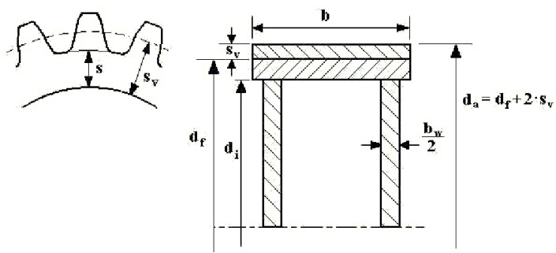  

# Figure 1 Shrink fitted rim  

The load limit per unit face width $\mathsf{F}_{|\mathrm{im}}$ when micro-movement is expected to start is:  

Flim = Fref Fcorr Froll   
Fref $=$ the reference load limit calculated as;   
Fref = 5.65 p μ s (0.7 + 2 μ)   
Fcorr $=$ a correction factor which considers the influence of the hub flexibility (i.e. design and modulus of elasticity $\mathsf{E}_{\mathsf{h u b}})$ . It is unity for a solid steel hub. Otherwise calculated as:   
Fcorr $\begin{array}{r l}{=}&{{}1.586-2.86\cdot10^{-6}\mathsf{E}_{\mathsf{h u b}}+\mathsf{f}(\mathsf{b}/\mathsf{b}_{\mathsf{w}}),}\end{array}$ where $\mathsf{f}(\mathsf{b}/\mathsf{b}_{\mathsf{w}})$ considers the flexibility of a hub with webs. $\mathtt{b}_{\mathsf{w}}$ is the total face width of th webs.   
$f(b/b_{w})$ $\begin{array}{r l r l}{\mathrm{\Lambda}_{w})}&{}&{=}&{0.404\cdot\mathrm{1}0^{-3}\left(\mathrm{b}/\mathrm{b}_{\mathrm{w}}\right)^{3}-0.01\left(\mathrm{b}/\mathrm{b}_{\mathrm{w}}\right)^{2}+0.09\mathrm{b}/\mathrm{b}_{\mathrm{w}}-0.08\mathrm{1}}\ &{}&&{=0,\mathrm{when~b}=\mathrm{b}_{\mathrm{w}}}\end{array}$  

$\mathsf{F}_{\mathsf{r o l l}}$ takes into account the rolling (tangential twist) load of a narrow rim (face width $\mathsf{b}_{\mathsf{h e l i x}}$ due to an axial force component. The rolling moment causes a reduced surface pressure at an end of the face width. This is of particular importance for double helical gears with two separate rims. $\mathsf{F}_{\mathsf{r o l l}}$ applies even if there is an axial shoulder.  

$\mathsf{F}_{\mathsf{r o l l}}$ is the minimum value of unity   
or $(\mathsf{b}_{\mathsf{h e l i x}}/\mathsf{d}_{\mathsf{f}}+0.02)4.8/\mathsf{t a n}\beta$   
or $(\mathsf{b}_{\mathsf{h e l i x}}/(\mathsf{s}+1.3\mathsf{m}_{\mathsf{n}})+0.4)0.2887/\mathsf{t a n}\beta$   
The coefficient of friction $\upmu$ may be taken from Sec.1 Table 9.  

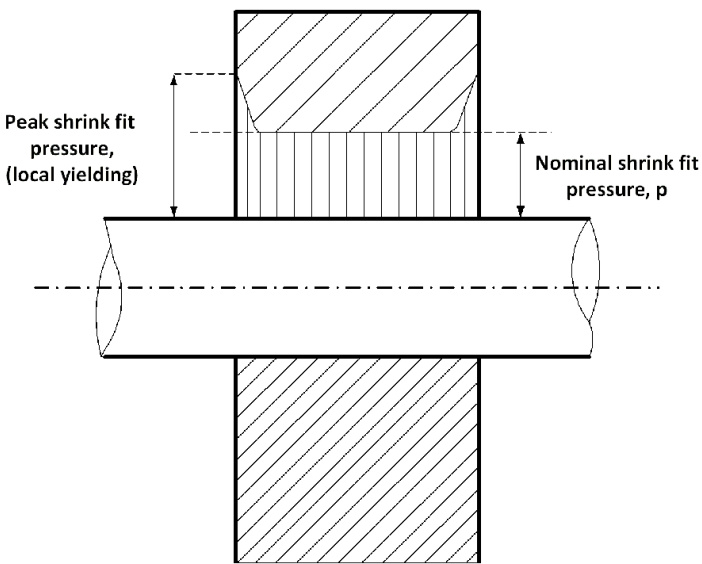  

# Figure 2 Shrink fitted body with especially high surface pressure (only applicable for shafts protruding on each end)  

The safety against micro-movements is:  

$$
\mathsf{S}=\left(\mathsf{p}+\upsigma\right)\upmu/\uptau=\mathsf{F}_{|\mathrm{im}}/\mathsf{F}.
$$  

# 2.5 Bolted wheel bodies  

2.5.1 Bolted wheel bodies (and pinions, if applicable) shall be designed to avoid fatigue failure of the bolts due to pulsating shear stresses when passing the gear mesh zone.  

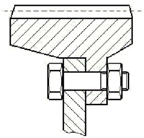  

# Figure 3 Bolted wheel body  

# Guidance note:  

The pulsating bolt forces should be reduced if the wheel body is radially supported without radial clearance.  

2.5.2 For gear rims that are flexible compared to the hub, the stresses in the bolts shall be calculated upon request (usually by means of FEM) for a mesh force corresponding to ${\sf T}_{0}\sf K_{\sf A}$ . The shear stress range shall not exceed $0.25~\upsigma_{\upgamma}$  

2.5.3 Bolts used for flexible rims shall have a tight fit in the holes, i.e. any combination of the tolerances shall not result in a clearance, or the bolts shall be ream fitted with a slight press fit.  

# 2.6 Shafts  

2.6.1 Shafts shall be designed in compliance with the shafting rules Sec.1. When gear transmissions are designed for long life time (i.e. $\mathsf{>}\mathsf{>}10^{\6}$ cycles), the shafts shall be designed to prevent detrimental fretting that may cause fatigue failures, see also Sec.1 [2.4.2]. Unless torsional vibration values are defined, the upper permissible values for dynamics as given in Ch.2 Sec.2 shall be used.  

2.6.2 Shafts may be divided into 2 groups. These are shafts with:  

— significant bending stresses, e.g. pinion and wheel shafts within their bearing spans — no significant bending stresses, e.g. quill shafts and shafts outside the bearing spans of pinions and wheels.  

The major load conditions to be considered are:  

— high cycle fatigue $\mathrm{\Delta}>>{10}^{6}$ cycles) due to rotating bending and torsional vibration, see Sec.1 [2.2.4] B and class guideline DNV-CG-0038 — low cycle fatigue ( ${\mathsf{10}}^{\mathsf{3}}$ to ${10}^{4}$ cycles) due to load variations from zero to full load, clutching in or starting shock loads, reversing torques, etc., see Sec.1 [2.2.4]a) and class guideline DNV-CG-0038 Sec.3.  

Practically, shafts with significant bending stresses such as pinion and wheel shafts are dimensioned with regard to stiffness (gear mesh considerations) and high cycle fatigue, but hardly ever for low cycle fatigue because the two first shall prevail.  

# 2.7 Bearings  

2.7.1 Fluid film bearings shall be designed with bearing pressures that are suitable for the bearing metals. The calculation of bearing pressures shall include the application factor $\mathsf{K}_{\mathsf{A}}$  

2.7.2 Ball and roller bearings shall have a minimum $\mathsf{L}_{10\mathsf{a}}$ (ISO 281) life time that is suitable with regard to the specified overhaul intervals. The influence of the lubrication oil film may be taken into account for L10a, provided that the necessary conditions, in particular cleanliness, are fulfilled.  

# Guidance note:  

If no overhaul intervals are specified, a bearing life time of 40 000 hours may be used for conventional ships and 10 000 hours for yachts or ships and units that are not predominantly used at full load for longer periods.  

# 2.8 Casing  

2.8.1 Inspection openings shall be provided in order to enable inspection of all pinions and wheels (measurements of backlash and application of lacquer for contact pattern verification) as well as for access to clutch emergency bolts (if applicable). For special designs (e.g. some epicyclic gears) where inspection openings cannot be provided without severely affecting the strength of the design, holes for borescope inspections may be accepted as a substitute to openings. Such holes shall be positioned to enable borescope inspection of all gearing elements.  

2.8.2 Easy access to all inspection openings shall be provided. This means that no piping or coolers etc. shall be positioned to prevent access.  

2.8.3 In order to prevent corrosion, the gear casing shall be provided with proper ventilation.  

# 2.9 Lubrication system  

2.9.1 The lubrication system shall be designed to provide all bearings, gear meshes and other parts requiring oil with adequate amount and adequate quality / cleanliness of oil for both lubrication and cooling purposes. This shall be obtained under all environmental conditions as stated in Ch.1.  

2.9.2 The lubrication system shall contain at least:  

— oil pumps to provide circulation — a filter system of suitable fineness for gearing, hydraulics and bearings (see [2.7.2]).  

# Guidance note:  

Specification of a pressure filter for maintaining suitable fluid cleanliness may be 16/14/11 according to ISO 4406 and $\mathsf{B}_{6-7}\left(\mathsf{c}\right)=$ 200 according to ISO 16889.  

if necessary, a cooler to keep the oil temperature within the specified maximum temperature when operating under the worst relevant environmental conditions, see [2.9.1].  

2.9.3 For gear transmissions in single propulsion plants shall be arranged with redundancy for lubrication oil circulation.  

This may be arranged as either of the arrangements below:  

— system with an attached pump and a standby pump with immediate activation   
— system with two electric driven pump of same capacity, one of which is arranged as a standby pump with immediate activation. These two pumps shall be supplied form different switchboards, one of which is the emergency switchboard.  

2.9.4 For gear transmissions in single propulsion plants the filtering system shall be arranged to make it possible to clean the filters without interrupting the supply of filtered oil.  

2.9.5 For gear transmissions for propulsion where windmilling may be detrimental and considered as a normal working condition, there shall be either:  

— a shaft brake designed to hold (statically) twice the highest expected windmilling torque, or — one pump available in wind-milling condition. This pump shall be additional to any standby pump required by other rules.  

The chosen version shall be automatically activated within 30 s after shut down.  

2.9.6 Gear transmissions in single propulsion plant designed for low rotational speeds, where an attached pump cannot provide sufficient oil pressure, shall be arranged with two electric driven lubrication oil pumps as specified in [2.9.3].  

An alternative arrangement with an attached pump as specified in [2.9.3] may be accepted for plants where the system has a combined propeller speed and pitch control with automatic activation of speed limitation to avoid insufficient LO supply in case the electric driven pump is not available.  

2.9.7 For propulsion gears the lubrication system shall be arranged so that the gear transmission can endure a run out of 5 minutes after a black out without jeopardising any bearings or gear teeth.  

This may be provided by e.g.:  

— an attached pump with an additional gravity tank (if necessary) — electric pumps with a gravity tank with sufficient volume and height for 5 minutes supply.  

# 3 Inspection and testing  

# 3.1 General  

3.1.1 Visual inspection shall be carried out of all parts listed in Table 5. Tests and inspections shall be carried out by the manufacturer, and the Society shall be invited for inspection.  

3.1.2  Ancillaries integrated in the gear but not listed in Table 5 and integrated as part of the gear, shall be checked as found relevant by the gear manufacturer.  

3.1.3 Details regarding the testing of pinion and wheel (toothed parts) in the different heat treatment conditions are stated in [3.2]. An overview of these requirements are given in Figure 4.  

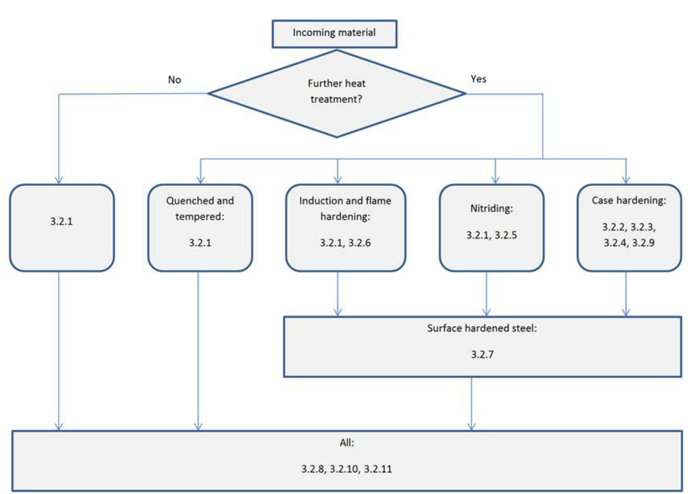  
Figure 4 Flow chart showing the applicable rules  

# 3.2 Testing of toothed parts in different heat treated conditions  

3.2.1 The incoming material shall be documented with a material declaration (MD) to be within the approved specification and the material rules Pt.2 Ch.2. Ultrasonic testing shall be done in machined condition, i.e. after forging and prior to surface hardening.  

For gears classed to high grade, clean steel forgings, see Pt.2 Ch.2, and in addition grain size shall be documented.  

3.2.2 Heat treatment workshops shall be approved manufacturer according to DNV-CP-0351.  

For case hardening the coupon used for qualification to the AOM shall be representative for the quenching rate of the typical gear sizes. The hardness and micro-structure at the centre of the coupon shall then be representative for the core of a typical gear. The coupon shall be of the same type of material as the typical gears. The approximate size is minimum diameter 6 modules and length 12 modules. This module shall be either the module of the actual gear to be certified or from the upper range of the production with that material. The coupon shall follow the entire heat treatment and shot cleaning processes and be quenched together with the pinions and wheels in such a way that its quenching rate is as representative as possible.  

3.2.3 With reference to [3.2.2] the requirements for the surface (i.e. polished depth of less than $0.03\mathrm{~mm}$ micro-structure are:  

a) Reduction of surface hardness in the outer $0.1~\mathrm{mm}$ of the case shall not be more than 40 HV.  

b) Carbide precipitation at surface and at $0.2\mathrm{~mm}$ depth checked at approximately 400 times magnification. Only fine dispersed carbides are permitted, see ISO 6336-5.  

c) Retained austenite at surface and at $0.2\mathrm{~mm}$ depth not to exceed $25\%$ . To be checked by comparison with reference pictures or by a calibrated magneto-elastic method.  

d) Depth of intergranular oxidation (IGO) from unpolished surface shall not exceed $10+6$ t550 (μm). t550 shall be given in mm.  

Requirement for the core in the middle of the coupon:  

— to be martensitic or bainitic with no blocky ferrite — hardness according to approved specification.  

If these requirements are not fulfilled, the permissible values for tooth root stresses and contact stresses and contact temperatures (for scuffing) shall be reduced according to special consideration.  

3.2.4 For case hardening the following applies in addition to the requirements in [3.2.2] and [3.2.3 ach hardening batch and each material type shall be documented regarding:  

a) Hardness profile1) with emphasis on depth to 550 HV and $400~{\mathsf{H V}}.$ For core hardness below 300 HV the depth to $300~\mathsf{H V}$ shall be checked. 1) The case depths shall be checked on a coupon that follows the entire heat treatment process. The coupons shall be made of material from same batch as the actual gears to be certified and may be of a standard size. The correlation between these small coupons and the representative coupons mentioned in [3.2.2] shall be documented by means of comparison measurements and included in a MS (manufacturing survey agreement).  

If small coupons are used, e.g. standard size of ${\varnothing30-35~\mathrm{mm}}$ , and no approved correlation to the actual gear size exists, the following correlation shall be used (applicable for the hardness profile of the flanks with material ISO 6833 - 18CrNiMo7 and EN 10084 - 18CrNiMo7-6):  

For gears with $\mathsf{m}_{\mathsf{n}}>5[\mathsf{m}\mathsf{m}]$  

i) $\begin{array}{r l}{\mathsf{t}_{550}\quad}&{=\quad\quad(1-(\mathsf{m}_{\mathsf{n}^{-}}\mathsf{S})/8\mathsf{S})\cdot\mathsf{m e a s u r e d}\mathsf{d e p t h}\mathsf{t o}550\mathsf{H}\mathsf{V}\left[\mathsf{m m}\right]}\ {\mathsf{t}_{400}\quad}&{=\quad\quad\mathsf{t}_{550^{\cdot}}(1.6-(\mathsf{m}_{\mathsf{n}^{-}}\mathsf{S})/100)[\mathsf{m m}]}\end{array}$ ii) iii) Core hardness $=0.8$ · measured core hardness of coupon (HV) iv) If corrected core hardness $<300~\mathsf{H V}$ then $\mathsf{t}_{300}=1.35\cdot\mathsf{t}_{400}[\mathsf{m m}]$  

The grinding amount shall be subtracted from the depths in i), ii) and iv).  

For gears with $\mathsf{m}_{\mathsf{n}}\leq5[\mathsf{m}\mathsf{m}]$  

The grinding amount shall be subtracted from the measured hardness depths.  

The measured hardness depth shall be in compliance with statements in the approved gear data sheet. b) Core impact energy2) (Charpy V)(MD).  

2) The core impact energy has the objective of detecting unacceptable grain growth and shall be verified by means of at least 2 test pieces taken from the centre of a coupon that has followed the entire heat treatment process. The coupon shall have a diameter of at least 2 modules. The coupon may be taken from any of the positions in Pt.2 Ch.2 Sec.6 Figure 5 to Pt.2 Ch.2 Sec.6 Figure 8.  

The impact energy shall be at least 30 J, unless otherwise approved. If the coupon is taken longitudinally in a body with longitudinal grain flow, the minimum value is 40 J.  

The core impact energy testing may be waived if all of the following conditions are fulfilled:  

— carburising temperature below $940^{\circ}\mathrm{C}$ — maximum specified case depth to $550~\mathsf{H V}$ below $3.0\mathrm{{mm}}$ — chemical composition contains grain growth preventing elements (e.g. Al) — implemented manufacturing survey arrangement for heat treatment.  

Tooth root hardness3) (HV) at mid face of each pinion and wheel.   
3) For modules $10m m$ and above the surface hardness in the tooth root space in the middle of the face width shall be checked. A small spot shall be polished (No grinding. Polishing depth less than $0.03\mathrm{mm}$ ) and the hardness measured by means of a low force tester. Unless otherwise approved, the minimum hardness shall be 58 HRC. The manufacturer may carry out approved procedure tests in order to establish limit sizes for various material types. Below these limit sizes the hardness shall with a high probability turn out to 58 HRC or more, and no such hardness testing is required for the individual gears. The procedure tests shall include various designs and quenching baths.  

3.2.5 Nitride gears shall be documented for each heat treatment batch by means of a coupon following the entire nitriding process with regard to:  

— case depth (to $400~{\sf H V}.$ white layer thickness (to $\mathsf{b e}<0.025\mathsf{m m}.$  

The coupon shall be of the same material as the gears.  

3.2.6 Induction or flame hardened gears shall be documented with regard to:  

— hardness contour   
— hardness depth at pitch diameter   
— hardness depth at tooth root surface structure, random inspection (to be mainly fine -acicular martensite).  

The hardness pattern shall be checked at a representative test piece with the same geometry (profile and root shape) and type of material as the actual gears (except for face width which may be smaller). For batc production this testing shall be made at least before and after each batch.  

The hardness pattern checking applies to both ends and the mid-section of the test piece. All three sections shall have values within the approved minimum to maximum range. Each gear shall be visually inspected at both ends and the contour shall be consistent with the test piece.  

For small gears with spin type hardening (see ISO 6336-5) only the surface structure (random) and external contour shall be checked.  

3.2.7 For all surface hardened teeth the final flank hardness shall be measured and documented. The hardness shall be measured directly on the flanks near both ends and in the middle and at each 90 degrees. Low force testers are preferred provided suitable surface finish. For batch production a less frequent checking may be approved.  

3.2.8 All teeth shall be crack detected, no cracks are accepted. This shall be documented with a NDT report. Gears shall be checked by means of the wet fluorescent magnetic particle method. However, nitrided or not surface hardened gears may be checked by the liquid penetrant method. For batch production a reduced extent of crack detection may be approved. The crack detection shall be made prior to any shot peening process.  

3.2.9 For case hardened gears grind temper inspection shall be carried out randomly and be documented. This inspection may be done by:  

— nital etching per ISO 14104 or ANSI and or AGMA 2007-C00 (grade B temper permitted on $10\%$ of functional area (FB1))   
or   
— a calibrated magneto elastic method (acceptance criteria subject to special consideration).   
3.2.10 The tooth accuracy of pinions and wheels according to ISO 1328 shall be documented as follows:   
— for specified grade 4 or better, all pinions and wheels shall be measured   
— for specified grade $5^{1)}$ at least $50\%$ shall be measured — for specified grade $6^{1)}$ at least $20\%$ shall be measured   
— for specified grade 7 or coarser at least $5\%$ shall be measured.   
1) When a wheel cannot be measured due to its size or weight, at least every mating pinion shall be measured.  

If other standards (e.g. ISO 1328-1 and ISO 1328-2) are specified, measurement program equivalent to the above applies (with respect to pitch, profile and lead errors).  

Bevel gears (that are not covered by ISO 1328-1) shall be measured regarding pitch and profile errors if required in connection with the approval. All bevel gear sets shall be checked for accuracy in a meshing test without load. The unloaded contact pattern shall be consistent with the specified, and documentation thereof shall follow the gear set to the assembly shop.  

3.2.11 Visual inspection of the pinions and wheels shall be done with special attention to:  

— surface roughness of the flanks   
— tooth root fillet radius   
— surface roughness of tooth root fillet area   
— possible grinding notches in the root fillet area. Any grinding (or any other machining) of the root area is not accepted unless this has been especially approved.  

# 3.3 Welded gear designs  

Welded gears shall be documented as follows:  

— chemical composition and mechanical properties of all the materials   
— stress relieving (time-temperature diagram)   
— $100\%$ weld quality control according to ISO 5817. To meet level B for internal defects unless otherwise approved.   
— $100\%$ surface crack detection by MPI or dye penetrant. No linear indication $>1.5\mathrm{mm}$ unless approved.   
— visual inspection with special emphasis on the shape of the outer weld contour (stress concentrations) a the root.  

The 3 last items refer to the gear after the final heat treatment (e.g. after case hardening).  

# 3.4 Assembling  

3.4.1 Balancing of rotating parts and subassemblies of rotors shall be carried out and documented.   
Measurement report shall confirm results to be within the approved specification.  

# Guidance note:  

The permissible residual imbalance U per balancing plane of gears for which static or dynamic balancing is rendered necessary by the method of manufacture and by the operating and loading conditions can be determined by applying the formula  

$$
U={\frac{9.6\cdot Q\cdot G}{z\cdot n}}(\mathrm{kgmm})
$$  

where:  

$G\quad=$ mass of component to be balanced [kg]   
$\begin{array}{r l}{n}&{{}=}\end{array}$ operating speed of component to be balanced [min-1]   
$z=$ number of balancing planes $[-]$   
$Q\:\:=\:$ degree of balance [–] $=$ 6.3 for gear shafts, pinions and coupling members for engine gears $=$ 2.5 for torsion shafts and couplings, pinions and gear wheels belonging to turbine transmissions.  

3.4.2 Cylindrical shrink fitting of pinions, wheels, hubs, clutches, etc. shall be documented with regard to shrinkage amount. The diameters (and therewith the shrinkage amounts) shall be checked at various positions along the length of the shrinkage surface. If conicity or ovality in a connection with length to diameter ratio ${>}1$ results in:  

— a shrinkage amount near the minimum tolerance value at the torque transmission end   
and   
— an amount near the maximum tolerance value at the opposite end,   
the shrinkage specification shall be reconsidered with respect to possible fretting near the torque   
transmission end. (If the non-torque end is subjected to bending stresses, possible fretting shall be   
considered.)  

3.4.3 Tapered shrink fit connections shall be documented with regard to contact area and pull up distance or push up force or diametrical expansion (whichever is the approved specification).  

The contact between the male and female parts shall be checked with a thin layer of contact marking compound (e.g. toolmaker’s blue). There shall be full contact at the end with torque transmission (which is normally the upper end). If this is not obtained, light correction grinding with a soft disc and emery paper may be done in the female part only (if wet mounting). Alternatively a test pull up may deform small irregularities and result in an improved contact.  

3.4.4 Keyed connections shall be checked with regard to:  

— key fit in shaft and hub (for connections where the torque may be reversed the key shall have a tight fit in both shaft and hub)   
— shrinkage amount, see [3.4.2]   
— push up force, see [3.4.3].  

3.4.5 Spline connections shall be checked with regard to:  

— tight fit if of the fixed type lubrication if of working type.  

3.4.6 Bolted connections such as bolted wheel bodies or flange connections shall be checked with regard to: — tightness of fitted bolts or pins   
— pre-stress as specified.  

3.4.7 Access through inspection openings to gearing and clutch emergency bolts (if applicable) shall be verified, see also [2.8.1], [2.8.2] and Sec.3 [2.3.2].  

# 4 Workshop testing  

# 4.1 Gear mesh checking  

4.1.1 The accuracy of the meshing shall be verified for all meshes by means of a thin layer of contact compound (e.g. toolmaker’s blue). This shall be done in the workshop in the presence of the Society.  

When turning through the mesh, the journals shall be in their expected working positions in the bearings. This is particularly important for journals which shall assume a position in the upper part of the bearings (and the bearing clearances are different), and when external weights (such as clutches) may cause a pinion to tilt in its bearings.  

For small and medium gears with ground or skived flanks on both pinion and wheel it is sufficient to check this at one position of the circumference.  

For large gears (wheel diameter ${>}2\mathsf{m}$ ) and for all gears where an inspection after part or full load (in the workshop or onboard) cannot be made, the contact checking shall be made in several (3 or more) positions around the circumference of the wheel.  

For bevel gears the contact marking shall be consistent with the documented contact marking from the production, see [3.2.10].  

For highly loaded gears it may be required to carry out such a mesh contact test under full or high part load by slow turning through a full tooth mesh at 3 or more circumferential positions.  

The result of the contact marking shall be consistent with that which would result in the required faceload distribution at rated load.  

For propulsion gears connected to shafts in excess of $200~\mathrm{mm}$ diameter, and all multi-pinion gears, the contact marking of the final stage shall be documented by tape on paper or photography and shall be forwarded to the builder as a reference for further checking onboard.  

The backlash shall be documented for all gear meshes.  

4.1.2 All gear transmissions shall be spin tested in presence of the Society.  

Prior to the spin test some teeth at different positions around the circumference of all gear meshes shall be painted with an oil resistant but low wear resistant test lacquer. For multi-mesh gears the lacquer shall be applied to the flanks that mesh with only one other member.  

After the spin test the initial contact patterns shall be documented by sketches. The position of the initial contact shall be consistent with that which would result in an acceptable load distribution at rated torque.  

4.1.3 For gears that are workshop tested with a part load sufficient to verify the load distribution at rated torque, the testing in [4.1.1] and [4.1.2] may be waived, except for backlash measurements.  

Such part load testing shall only be representative for the full load condition on board if the in- and out-put shafts are connected to systems that shall not impose significant bending moments or forces. Furthermore, the part load shall be so high ( $40\%$ torque or more) that reliable extrapolation to rated torque can be made. Therefore, this part load testing is subject to approval, see [1.2]. If such part load testing is successfully carried out, the gear transmission product certificate (PC) may have a remark stating that contact pattern testing onboard may be waived.  

4.1.4 During the running test the gearbox shall be inspected for leakage.  

# 4.2 Clutch operation  

For clutches delivered integral with the gear box the clutching-in function shall be tested in the presence of the Society. For oil operated clutches the testing shall be made with the oil at normal service temperature.  

The pressure - time function shall be within the approved specification and the end pressure at the specified level. No pressure peaks beyond the nominal pressure are allowed. The clutch operation pressure shall be measured as closely as possible to the clutch inlet.  

# 4.3 Ancillary systems  

4.3.1 The manufacturer shall demonstrate to the Society that the lubrication oil intake shall be submerged under all environmental operation conditions for the actual type of vessel. Furthermore, it shall be checked that the oil sprays for lubrication and cooling function properly. After the running test the filters shall be inspected.  

4.3.2 All equipment delivered with the gearbox regarding indication, alarm and safety systems shall be function tested.  

4.3.3 Piping for hydraulic and lubrication systems shall subject to pressure / tightness test.  

# 5 Control and monitoring  

# 5.1 Summary  

5.1.1 The requirements in [5] are additional to those given in Ch.9.  

5.1.2 The gear transmissions shall be fitted with instrumentation and alarms according to Table 10.  

5.1.3 If individual local pressure indicators are not fitted, quick connectors for a portable instrument shall be provided in order to do local readings and set point verification of switches. The corresponding portable instrument shall be provided on board.  

5.1.4 Alarms (Gr 1) and start of standby pump shall be without delay, other than those necessary to filter normal parameter fluctuations, if not otherwise approved.  

# Table 10 Monitoring of gear transmissions  

<html><body><table><tr><td></td><td>Gr 1 Indication alarm loadreduction</td><td>Gr 2 Automaticstart of standby pump with alarm 1)</td><td>Gr 3 Shut down withalarm</td><td>Comments</td></tr><tr><td colspan="5">1.0 Gear bearing and lubricating oil</td></tr><tr><td>Oil lubricated fluid film bearings (axial and radial), temperature</td><td>IR, HA</td><td></td><td></td><td>Applicabletogearswith totally transmitted power of 5 Mw or more.</td></tr><tr><td>Thrust bearing,temperature</td><td>IR, HA</td><td></td><td></td><td>Applicable to gears with totally transmitted power of 5 Mwor more. Sensors to be placed in the bearing metal or for pads in the oil outlet.</td></tr><tr><td>Lubricating oil, pressure</td><td>IL, IR, LA</td><td>AS</td><td></td><td>At bearings and spray, if applicable. If equal pressure,one common sensor is sufficient for Gr 1.</td></tr><tr><td>Differential pressure over filter</td><td>IL, HA</td><td></td><td></td><td>Alarm in case of clogged filter.</td></tr><tr><td>Lubricating oil, temperature</td><td>IL, or IR, HA</td><td></td><td></td><td>At inlet to bearings,i.e.after cooler.</td></tr><tr><td>Lubricating oil temperature</td><td>IL or IR</td><td></td><td></td><td>In sump, or before cooler.</td></tr><tr><td>Sump level 2)</td><td>IL or IR</td><td></td><td></td><td></td></tr><tr><td colspan="5">2.0 Integrated clutch activating media</td></tr><tr><td>Hydraulic oil, pressure</td><td>IL, IR, LA</td><td>AS</td><td>HS</td><td>SH means either declutching, engine idle or engine stop.</td></tr></table></body></html>  

<html><body><table><tr><td colspan="2"></td><td>Gr 1 Indication alarm loadreduction</td><td>Gr 2 Automaticstart of standby pump with alarm 1)</td><td>Gr 3 Shutdown withalarm</td><td>Comments</td></tr><tr><td colspan="2">alarm shall be activated before any load reduction).</td><td colspan="4"></td></tr><tr><td colspan="4">Gr 2:Sensor for automatic start of standby pump.</td><td colspan="2"></td></tr><tr><td colspan="8">Gr3:Sensorforshutdown.</td></tr><tr><td>IL</td><td colspan="5"></td></tr><tr><td colspan="5">IR as the local platform/manoeuvring console</td><td colspan="2"></td></tr><tr><td>A</td><td>二</td><td colspan="5">alarm activated for logical value</td></tr><tr><td>LA</td><td>= alarm forlow value</td><td colspan="5"></td></tr><tr><td>HA</td><td>=</td><td colspan="5">alarm for high value</td></tr><tr><td>AS</td><td>=</td><td colspan="5">automaticstartofstandbypumpwithcorresponding alarm</td></tr><tr><td>LR</td><td></td><td colspan="5">=load reduction, either manual or automatic, with corresponding alarm, either slow down (r/min reduction) or</td></tr><tr><td>SH</td><td></td><td colspan="5">alternative means ofloadreduction(e.g.pitchreduction),whicheverisrelevant =shut down, either manual or automatic, with corresponding alarm.</td></tr></table></body></html>  

For definitions of load reduction (LR) and shut down (SH), see Ch.1.  

1) To be provided when standby pump is required, see [2.9] and Ch.1.   
2) For gears with totally transmitted power of 500 kW or less, dipstick inspection is considered adequate.  

# 6 Arrangement  

# 6.1 Installation and foundation  

6.1.1 The gearbox shall be arranged so that appropriate alignment and running conditions are maintained during all operating conditions. For shaft alignment, see Ch.2 Sec.4.  

6.1.2 Gearboxes shall be fastened to the ship structure in compliance with Ch.2 Sec.6.  

6.1.3 Piping, etc., shall not be arranged to obstruct access to inspection openings.  

6.1.4 All pipe connections shall be screened or otherwise protected as far as practicable in order to avoid oil spray or oil leakage into machinery air intakes or onto potentially hot surfaces.  

# 7 Vibration  

# 7.1 General  

Regarding torsional vibration, see Ch.2 Sec.2.  

The vibration of the gearbox foundation (except when flexibly mounted) shall not contain gear alien frequency components with amplitudes exceeding $10\mathrm{mm/s}$ . Alien frequencies are those that are not rotational frequencies of any gear internal parts.  

Higher amplitudes may be accepted if considered in the gear design.  

# 8 Installation inspection  

# 8.1 Application  

This subsection applies to inspections in connection with installation of complete gearboxes. Regarding external couplings and shafts, and internal clutches, see respective sections. Unless otherwise stated, the Society shall attend the inspections given in this subsection and [9].  

# 8.2 Inspections  

8.2.1 The following inspections shall be carried out:  

— shaft alignment, see Ch.2 Sec.4   
— fastening of propulsion gearboxes (stoppers and bolt tightening) (see Ch.2 Sec.6)   
— flushing, applicable if the system is opened during installation. Preferably with the foreseen gear oil. If flushing oil is used, residual flushing oil shall be avoided   
— lubrication oil shall be as specified (viscosity and FZG class) on maker’s list   
— pressure tests to nominal pressure (for leakage) where cooler, filters or piping is mounted onboard — clutch operation, see Sec.3 [8]   
— tooth contact pattern, see [8.2.2].  

8.2.2 A tooth contact pattern inspection as described in [4.1.1] shall be made for gears where the installation on board can alter the initial tooth contact pattern. This means e.g. all gear transmissions with more than one pinion driving the output gear wheel and propulsion gears connected to shafts in excess of about $200~\mathrm{mm}$ diameter. The result of the contact pattern check shall be consistent with the result from the workshop.  

# 9 Shipboard testing  

# 9.1 Gear teeth inspections  

9.1.1 To prevent initial damage on the tooth flanks (scuffing) and bearings, the gear shall be carefully run in, according to the gear manufacturer’s specification.  

9.1.2 All inboard gears shall be checked with regard to contact pattern under load.  

Exceptions are accepted when:  

— this is mentioned in the design approval (due to low stress levels)   
— the design makes an inspection impossible without dis-assembling such as certain epicyclic gears (this does not exempt ordinary gears from having suitable inspection openings)   
— the contact pattern under load is accepted in the workshop test, see [4.1.3].  

9.1.3 The contact patterns (all gear stages) shall be checked by a suitable lacquer applied to some teeth (normally 2 each 120 degrees) prior to the checking under load. The lacquer shall be applied to flanks that have only one mesh (in order to avoid accumulated patterns). When part load contact pattern checking applies, the lacquer shall be of a kind that quickly shows the final pattern.  

9.1.4 The gear shall be operated at the specified load level(s) without exceeding that particular level(s). After each specified level the contact patterns shall be checked in the presence of the Society. The results, in both height and length directions, shall be within the approved specification.  

9.1.5 After the full load test, or after the sea trial, all teeth shall be checked for possible failures as scuffing, scratches, grey staining, pits, etc. Shrunk-on rims shall be checked for possible movements relative to the hub.  

# 9.2 Gear noise detection  

9.2.1 Gears shall be checked for noise in the full speed range (high frequencies as gear mesh frequencies) and in the lower speed range (gear hammer).  

9.2.2 If the high frequent noise is higher than expected, measurements may be required.  

9.2.3 Gear hammer shall be detected in the lower speed range and also during diesel engine misfiring tests (see Ch.2 Sec.2 [3.2]). Speed ranges or operating conditions resulting in gear hammer shall be restricted for continuous operation.  

# 9.3 Bearings and lubrication  

9.3.1 Lubricating oil and bearing temperatures (as far as indication is provided) shall be checked during the full load test. All temperatures shall reach stable values (no slow gradual increase) without exceeding the approved maximum values.  

9.3.2 After the sea trial all oil filters shall be checked for particles.  

# SECTION 3 CLUTCHES  

# 1 General  

# 1.1 Application  

1.1.1 This section applies to clutches, both for use in shaft-lines and in gearboxes that shall have compliance documents, see Ch.2 Sec.1 [1.1].  

1.1.2 Clutches of standard design shall be type approved, see DNV-CP-0149. Standard design is components which a manufacturer has in their standard product description and manufactured continuously or in batches in order to deliver for general marked supply. Case by case approval may be accepted upon application and shall be subject to special consideration.  

# 1.2 Documentation  

1.2.1 The builder shall submit the documentation required by Table 1.  

# Table 1 Documentation requirements  

<html><body><table><tr><td>Object</td><td>Documentation type</td><td>Additionaldescription</td><td>Info</td></tr><tr><td rowspan="5">Clutch</td><td>C010 -Design criteria</td><td>applied loads, static and dynamic rating.</td><td>FI</td></tr><tr><td>C020 -Assembly or arrangement drawing</td><td>connection to externalshafts mechanical properties heat treatment of splines,etc. stress raisers activation system.</td><td>AP</td></tr><tr><td>C040 - Design analysis</td><td>static friction torque (with corresponding working pressure) dynamic friction torque (with corresponding working pressure) maximum working pressure minimum working pressure pressure for compressing return springs permissible heat development and flash power when clutching-in (upon request when case-by-case approval) for each application the clutching-in characteristics with tolerances (pressure as function of time) including max. engaging speed.</td><td>ApTA)</td></tr><tr><td></td><td>Documentation(simulation calculation) of the engaging process.</td><td>FI, R</td></tr><tr><td>M010-Material specification, metal</td><td>Power transmitting parts.Chemical and mechanical properties.</td><td>AP</td></tr><tr><td>M060 - Welding procedures (WPS)</td><td>If applicable.</td><td>FI</td></tr></table></body></html>  

<html><body><table><tr><td>Object</td><td>Documentationtype</td><td>Additionaldescription</td><td>Info</td></tr><tr><td></td><td>M150-Non-destructive testing (NDT) plan</td><td>Methodextentandacceptancecriteria.</td><td>FI</td></tr><tr><td colspan="4">AP=for approval,FI =for information ACO ）= as carried out, L = local handling,R = on request, TA = covered by type approval, VS = vessel specific</td></tr></table></body></html>  

1.2.2 For general requirements for documentation, including definition of the info codes, see DNV-CG-0550 Sec.6.  

1.2.3 For a full definition of the documentation types, see DNV-CG-0550 Sec.5.  

# 1.3 Compliance documentation  

# Table 2 Compliance documents  

<html><body><table><tr><td>Object</td><td>Compliance documenttype</td><td>Compliance standard 1)</td><td>Additionaldescription</td></tr><tr><td>Clutches</td><td>PC</td><td></td><td>Not applicablefor auxiliarymachinery installation withpowerratingsbelow5ookWandratedtorque lessthan5kNm.</td></tr><tr><td>Clutches</td><td>MD</td><td></td><td>Torquetransmittingparts.</td></tr><tr><td>Clutches</td><td>TAC</td><td></td><td>Clutchesshallbetypeapproved,seeDNV-CP-0149.</td></tr><tr><td colspan="4">1)Unlessotherwisespecifiedthecompliancestandardistherules. For general compliance documentation requirements, see DNV-CG-0550 Sec.4. For a definition of the compliance document types, see DNV-CG-0550 Sec.3.</td></tr></table></body></html>  

# 2 Design  

# 2.1 Torque capacities  

2.1.1 The torque capacities of clutches for auxiliary purposes as well as propulsion shall be: — static friction torque at least 1.8 T0 and preferably not above 2.5 T01) dynamic friction torque at least $1.3\mathrm{~T}_{0}$ Both requirements referring to nominal operating pressure and no ice class notation.  

1) When above $2.5\mathrm{~T}_{0}$ the documentation requested in Table 1 is obligatory.  

2.1.2  Plants with class notation Ice and PC shall comply with requirements in Pt.6 Ch.6.  

2.1.3 For clutches used in plants with high vibratory torques (beyond $0.4\mathrm{~T}_{0.}$ ) or intermittent overloads, the torque capacity requirements shall be especially considered.  

# 2.2 Strength and wear resistance  

2.2.1 The relevant parts such as flange connections, shrink fits, splines, key connections, etc., shall meet the requirements given in Sec.1 [2.3] to Sec.1 [2.7].  

2.2.2 If a disc clutch is arranged so that radial movements occur under load, the possible wear of the teeth and splines shall be considered. This may be relevant for clutches in gearboxes where a radial reaction force may act on the discs. Such radial forces may occur due to bearing clearances in either an integrated pinion and clutch design or shafts that are moved off centre due to tooth forces.  

2.2.3 Trolling clutches are subject to special consideration.  

# 2.3 Emergency operation  

# 2.3.1 Capacity of clutch in emergency operation  

Clutches for single propulsion plants shall be of a design that enables sufficient torque transmission to be arranged in the event of loss of hydraulic or pneumatic pressure. This means at least half of the rated engine torque shall be transmitted.  

Emergency engagement of clutch shall take less than one hour. Procedure for emergency engagement shall be presented in the operational manual.  

# 2.3.2 Bolted arrangement  

If the requirement in [2.3.1] is fulfilled by means of bolts, easy access to all bolts shall be provided. For built-in clutches, this means that all the bolts shall be on the part of the clutch that is connected to the engine. This in order to gain access to all bolts by using the engine turning gear. The bolts for emergency engagement of clutch shall be pre-installed and secured to the clutch.  

# 2.3.3 Alternative arrangement  

Arrangements alternative to [2.3.2] are subject to special consideration and shall consider the following damage scenarios:  

— loss of pressure at pump outlets — failure of control valves — failure of relief valves or filters — leakage in piping outside the gearbox casing.  

# 2.4 Type testing  

Type testing is required in order to verify friction torques as specified in [2.1.1].  

# 2.5 Hydraulic/pneumatic system  

Clutches in single propulsion plants shall have a standby pump with immediate activation.  

# 3 Inspection and testing  

# 3.1 Ancillaries  

Ancillaries integrated in clutch but not listed in Table 2 shall be checked as found relevant by the clutch manufacturer.  

# 4 Workshop testing  

# 4.1 Function testing  

4.1.1 The clutch shall be function tested before certification.  

4.1.2 If the clutch is delivered with the activation control, the pressure-time function for clutching-in shall be verified in the presence of the Society. If the clutch is oil operated this shall be made with a representative oil viscosity.  

# 5 Control, alarm and safety functions and indication  

# 5.1 Summary  

5.1.1 The clutches shall be fitted with instrumentation and alarms according to Table 3.  

5.1.2 If individual local pressure indicators are not fitted, quick connectors for a portable instrument shall be provided in order to do local readings and set point verification of switches. The corresponding portable instrument shall be provided on board.  

# Table 3 Monitoring of clutches  

<html><body><table><tr><td></td><td>Gr 1 Indication alarm loadreduction</td><td>Gr 2 Automaticstart ofstandby pumpwith alarm 1)</td><td>Gr 3 Shutdown withalarm</td><td>Comments</td></tr><tr><td colspan="5">1.0 Clutch activating media</td></tr><tr><td>Hydraulic/pneumaticair, pressure</td><td>IL, IR, LA</td><td>AS</td><td>SH</td><td>SH meanseitherdeclutching,engine idleorenginestop.</td></tr></table></body></html>  

Gr 1: Common sensor for indication, alarm, load reduction (common sensor permitted but with different set points and alarm shall be activated before any load reduction).   
Gr 2: Sensor for automatic start of standby pump.   
Gr 3: Sensor for shut down.   
$I L$ $=$ local indication (presentation of values), in vicinity of the monitored component   
IR $=$ remote indication (presentation of values), in engine control room or another centralized control station such as the local platform/manoeuvring console   
A $=$ alarm activated for logical value   
$L A$ $=$ alarm for low value   
$H A$ $=$ alarm for high value   
AS $=$ automatic start of standby pump with corresponding alarm   
LR $=$ load reduction, either manual or automatic, with corresponding alarm, either slow down (r/min reduction) or alternative means of load reduction (e. g. pitch reduction), whichever is relevant   
SH $=$ shut down, either manual or automatic, with corresponding alarm.  

For definitions of load reduction (LR) and shut down (SH), see Ch.1.  

1) To be provided when standby pump is required, see [2.5].  

# 6 Arrangement  

# 6.1 Clutch arrangement  

6.1.1 Clutches shall be arranged to minimise radial support forces, see [2.2.2].  

6.1.2 Easy access to the emergency operation device shall be provided, see [2.3].  

# 7 Vibration  

# 7.1 Engaging operation  

The calculation of the engaging process shall be based on the particulars specified in [1.2.1]. The calculation shall result in torque, flash power and heat development as functions of time, and shall not exceed the permissible values for the clutch or any other element in the system. See also Ch.2 Sec.2 [3.4] and Ch.2 Sec.2 [2.4.3].  

# 8 Installation inspection  

# 8.1 Alignment  

Clutches not integrated in a gearbox or thruster, shall be checked for axial and radial alignment in the presence of the Society.  

# 9 Shipboard testing  

# 9.1 Operating of clutches  

9.1.1 The following shall be checked in the presence of the Society:  

— when engaged, the operating pressure shall be within the approved tolerance   
— access to the emergency operation device (see [2.3]), if applicable   
— during engaging, the operating pressure as a function of time shall be according to the approved characteristics.  

9.1.2 The clutch engaging as mentioned above, shall be made at the maximum permissible engaging speed. The pressure indication shall be representative for the operating pressure, i.e. measured close to the rotating seal and without throttling between the instrument and operating pressure pipe. No pressure peaks beyond the specified maximum pressure are accepted.  

# SECTION 4 BENDING COMPLIANT COUPLINGS  

# 1 General  

# 1.1 Application  

1.1.1 This section applies to couplings used in machinery that shall have compliance documents, see Ch.2 Sec.1 [1.1].  

Bending compliant couplings are membrane couplings, tooth couplings, link couplings, universal shafts, etc., i.e. all couplings that have a low bending rigidity, but high torsional rigidity. Couplings combining both low bending and low torsional rigidity shall fulfil the requirements in both Sec.4 and Sec.5.  

1.1.2 Couplings of standard design shall be type approved. Standard design is components which a manufacturer has in their standard product description and manufactured continuously or in batches in order to deliver for general marked supply. Case by case approval may be accepted upon application and shall be subject to special consideration.  

# 1.2 Documentation  

1.2.1 The builder shall submit the documentation required by Table 1.  

# Table 1 Documentation requirements  

<html><body><table><tr><td>Object</td><td>Documentation type</td><td>Additionaldescription</td><td>Info</td></tr><tr><td rowspan="3">Coupling, bending compliant</td><td>C010 - Design criteria</td><td>applied loads, static and dynamic rating. surface hardening (if applicable)</td><td>FI</td></tr><tr><td>C020-Assembly or arrangement drawing</td><td>shot peening (if applicable) design details as keyways, bolt connections, or any other stress concentration ls ( o)    no  o specified couplings in longitudinal section (for link couplings also transverse section). permissible mean torque</td><td>ApTA)</td></tr><tr><td>C040 - Design analysis</td><td>permissible maximum torque (impact torque) permissible vibratory torque for continuous operation permissible angular tilt for continuous operation permissible radial misalignment or reaction force (if applicable) for continuous operation permissible axial misalignment for continuous operation angular (tilt), radial and axial stiffness (as far as applicable) maximum permissible r.p.m.</td><td>ApTA)</td></tr></table></body></html>  

<html><body><table><tr><td>Object</td><td>Documentation type</td><td>Additionaldescription</td><td>Info</td></tr><tr><td rowspan="5"></td><td rowspan="3"></td><td>for membrane, link or disc couplings the safety against fatigue shall be documented all relevant combinations of permissible loads shall be considered</td><td>ApTA)</td></tr><tr><td>the calculations may be combined with results from material fatigue tests testing of the complete coupling. If so, the load and the kindofloading(orcombinationsthereof)shallbeselected to document the safety when all permissible loads are combined.</td><td></td></tr><tr><td>Forhighspeedcouplings(for connection togas turbines)the maximum residual unbalance shall be specified. Power transmitting parts. Chemical and mechanical properties.</td><td>FI</td></tr><tr><td>M010- Material specification, metals</td><td>Material specification including surface modification(surface hardening, shot peening).</td><td>AP</td></tr><tr><td>M060 - Welding procedures (WPS)</td><td>For power transmitting welds a NDT specification (method, extent and acceptance criteria) shall be submitted.</td><td>FI</td></tr><tr><td>M150-Non-destructive testing (NDT) plan M152-Non-destructive</td><td>Method extent and acceptance criteria.</td><td>FI</td></tr><tr><td colspan="3">FI, L testing (NDT) report AP = for approval,FI = for information</td></tr></table></body></html>  

1.2.2 For general requirements for documentation, including definition of the info codes, see DNV-CG-0550 Sec.6.  

1.2.3 For a full definition of the documentation types, see DNV-CG-0550 Sec.5.  

1.2.4 Calculations to substantiate the relevant particulars requested in Table 1 shall be submitted upon request.  

# 1.3 Compliance documentation  

Components shall be delivered with compliance documentation according to Table 2.  

# Table 2 Compliance documentation  

<html><body><table><tr><td>Object</td><td>Compliance documenttype</td><td>Compliancestandard 1</td><td>Additionaldescription</td></tr><tr><td>Bending compliant couplings</td><td>PC</td><td></td><td>Not applicable for auxiliary machinery installationwithpowerratingsbelow500 kWandratedtorqueless than5kNm.</td></tr><tr><td>Bending compliant couplings</td><td>MD</td><td></td><td>Torque transmitting parts.</td></tr><tr><td>Bending compliantcouplings</td><td>TAC</td><td></td><td>Couplingsshallbetypeapproved.</td></tr></table></body></html>  

1) Unless otherwise specified the compliance standard is the rules.   
For general compliance documentation requirements, see DNV-CG-0550 Sec.4.   
For a definition of the compliance document types, see DNV-CG-0550 Sec.3.  

# 2 Design  

# 2.1 General  

2.1.1 For design principles, see Ch.2 Sec.1 [2].  

2.1.2 Couplings for turbine machinery (high speed side) containing high energy rotating parts that may be ejected in the event of a remote failure shall have special guards or design precautions.  

# 2.2 Criteria for dimensioning  

2.2.1 The couplings shall be designed with suitable safety factors against fatigue (suitable safety factors shall depend on the method applied, but will typically be $\sim$ 1.5).  

2.2.2 For connections as flanges, shrink fits, splines, key connections, etc., see the requirements in Sec.1 [2.3] to Sec.1 [2.7] respectively.  

2.2.3 For membrane, link or disc couplings the safety against fatigue shall be documented:  

— all relevant combinations of permissible loads, see Table 1, shall be considered   
— the calculations may be combined with results from material fatigue tests   
— the safety against fatigue may also be documented by fatigue testing of the complete coupling. If so, the load and the kind of loading (or combinations thereof) shall be selected to document the safety when all permissible loads are combined.  

2.2.4 Tooth couplings shall be designed to prevent tooth fracture, flank pitting and abrasive wear. The maximum permissible radial reaction force, the permissible mean and vibratory torque, the angular misalignment and the lubrication conditions shall be combined in the calculations.  

2.2.5 Universal shafts with power transmitting welds shall be designed for a high safety against fatigue in the weld. The calculation shall consider the maximum permissible loads and the specified weld quality.  

# 2.3 Type testing  

Scope and extent of type testing will be project specific, depending on coupling type and design.  

# 3 Inspection and testing  

Ancillaries not covered by Table 2 shall be tested and inspected as found relevant by the manufacturer.  

# 4 Workshop testing  

# 4.1 Balancing  

4.1.1 The couplings shall be balanced in accordance with the approved specification.  

# 4.2 Stiffness verification  

4.2.1 For membrane, link and disc couplings verification of the specified stiffness in angular and axial directions shall be carried out by means of static measurements in the presence of the Society. This applies to:  

— one coupling of a series for which type approval is requested every case by case approved non-standard coupling.  

# 5 Control, alarm, safety functions and indication  

# 5.1 General  

Control, alarm, safety functions and indication are not required.  

# 6 Arrangement  

# 6.1 Coupling arrangement  

Couplings shall be arranged in compliance with the limits defined, see Table 1. Furthermore, the reaction forces from couplings on the adjacent elements shall be taken into account. All permissible operating conditions shall be considered.  

# 7 Vibration  

# 7.1 General  

Intentionally left blank.  

# 8 Installation inspection  

# 8.1 Alignment  

8.1.1 The coupling alignment (axial, radial and angular) shall be checked in the presence of the Society. The alignment shall be within the approved tolerances for the coupling as well as any other limitation specified in the shafting arrangement drawings (in particular for the high speed side of gas turbine plants).  

8.1.2 The alignment shall be made under consideration of all adjacent machinery such as resiliently mounted engines.  

# 9 Shipboard testing  

# 9.1 General  

Intentionally left blank.  

# SECTION 5 TORSIONALLY ELASTIC COUPLINGS  

# 1 General  

# 1.1 Application  

1.1.1 This section applies to couplings used in machinery that shall have compliance documents, see Ch.2 Sec.1 [1.1].  

Torsional elastic couplings mean steel, rubber and silicone couplings designed for a low torsional rigidity. Couplings combining both low torsional rigidity and bending flexible elements as membranes or links shall fulfil the requirements in both Sec.4 and Sec.5.  

1.1.2 Couplings of standard design shall be type approved, see DNV-CP-0147. Standard design is components which a manufacturer has in their standard product description and manufactured continuously or in batches in order to deliver for general marked supply.  

# 1.2 Documentation  

1.2.1 Documentation shall be submitted as required by Table 1.   
hese particulars shall be documented by means of relevant tests and calculations. See [2.1] and [2.2].  

# Table 1 Documentation requirements  

<html><body><table><tr><td>Object</td><td>Documentationtype</td><td>Additionaldescription</td><td>Info</td></tr><tr><td></td><td>C010-Designcriteria</td><td>appliedloads，staticanddynamic ratingwithrespecttopower,temperature.</td><td>FI</td></tr><tr><td rowspan="2">Coupling, elastic</td><td>C020-Assemblyor arrangement drawing</td><td>A drawing showing how the parts of a mechanical assembly are arrangedtogether.Longitudinalsectionshallbesubmitted.For elementsthatarenon-symmetricalaroundtheaxisofrotation,</td><td>APTA)</td></tr><tr><td>C030-Detaileddrawing</td><td>atransversesectionisalsoneeded. design details as keyways, splines or any other stress concentration.</td><td>ApTA)</td></tr></table></body></html>  

<html><body><table><tr><td rowspan="2"></td><td rowspan="2">C040-Design analysis</td><td>permissible mean torque Tkn with the corresponding highestnominal shear stress in the elastomer and the bonding stress permissible maximum torque Tkmax1 for repetitive loads as transient vibration, typically during clutching in etc., see Figure 1 permissible maximum torque range △Tmax for repetitive loads as transient vibration, typically as passing through a major resonance during start and stop, etc., see Figure 2 permissible maximum torque Tkmax2 for rare occasional peak loads, e.g. short circuits in generators permissible vibratory torque1) for continuous operation Tkv, see Figure 3 permissible power loss1) (heat dissipation) Pkv permissible angular tilt, radial and axial misalignment for continuous operation angular (tilt), radial and axial stiffness1) permissible permanent twist of rubber element (applicable to progressive couplings) maximum permissible r.p.m.</td><td>ApTA)</td></tr><tr><td>strength of emergency claw quasi-static torsional stiffness1) dynamic torsional stiffness1) including production tolerance damping characteristics1) including production tolerance. 1) as a function of the main parameters For power transmitting parts as hubs, sleeves, shaft tubes,</td><td></td></tr><tr><td></td><td>M010 - Material specification, metals 一</td><td>flanges. Regarding chemical composition of the material, mechanicalpropertiesandsurfacehardness. For rubber shore hardness H shall be specified. type of material and mechanical properties surface hardening (if applicable) shot peening (if applicable).</td><td>AP</td></tr><tr><td></td><td>M150-Non-destructive testing (NDT) plan</td><td>Forpowertransmittingwelds.Method，extentandacceptance criteria.</td><td>FI</td></tr><tr><td></td><td>M152-Non-destructive testing (NDT) report</td><td></td><td>FI, L</td></tr><tr><td colspan="4">AP = for approval, FI = for information ACO = as carried out, L = local handling, R = on request, TA = covered by type approval, VS = vessel specific</td></tr></table></body></html>  

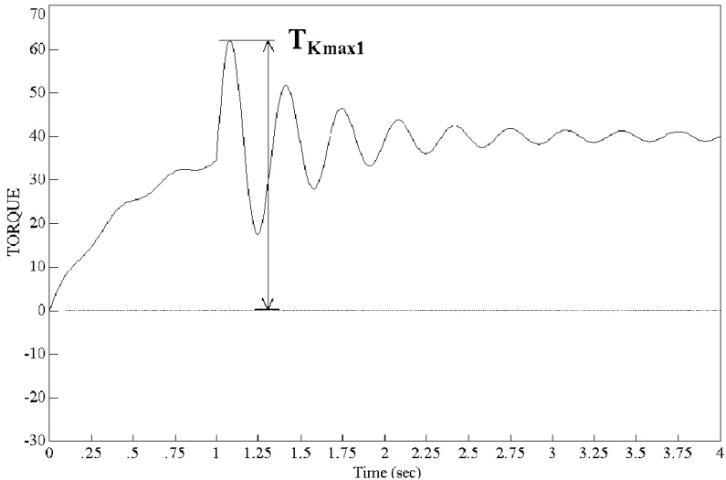  
Figure 1 $\mathbf{\tilde{\Gamma}}_{\mathbf{Kmax1}}$ at transient vibration  

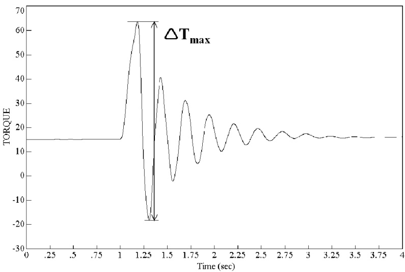  
Figure 2 $\mathbf{A}\mathbf{T_{max}}$ at transient vibration  

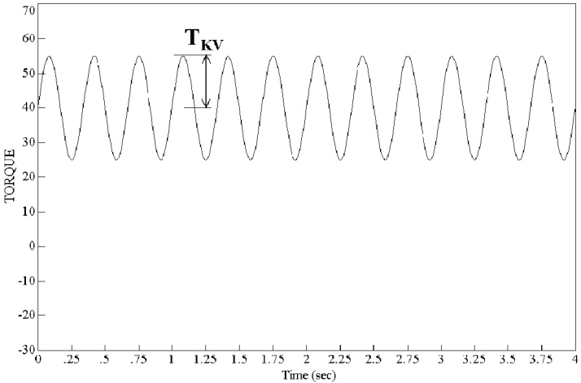  
Figure 3 $\mathbf{T}_{\mathbf{KV}}$ at continuous operation  

1.2.2 For general requirements for documentation, including definition of the info codes, see DNV-CG-0550 Sec.6.  

1.2.3 For a full definition of the documentation types, see DNV-CG-0550 Sec.5.  

1.2.4 Definitions of stiffness and damping are: a) For linear couplings  

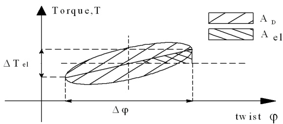  

# Figure 4 Linear couplings  

The stiffness $K=\frac{\Delta T_{e1}}{\Delta_{\varphi}}$ is the gradient of a line drawn between the extreme points of the twist as indicated in  

For hysteresis plots that deviate from the ellipse (pure viscous damping) the line that determines K shall be drawn through points determined as midpoints between the upper and lower part of the hysteresis curve, see Figure 5.  

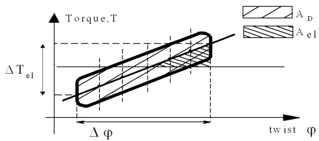  

# Figure 5 Hysteresis curve  

The damping is the ratio between the area described by the hysteresis loop $\mathsf{A}_{\mathsf{D}}$ and the elastic work $\mathsf{A}_{\mathsf{e l}},$  

$$
\psi=\frac{A_{D}}{A_{e1}}
$$  

For couplings with typical elliptical hysteresis curves, other definitions may be considered. b) For non-linear couplings  

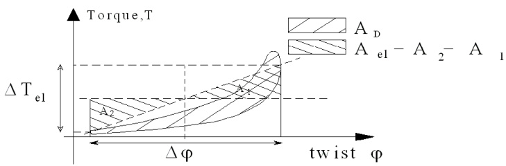  

# Figure 6 Non-linear couplings  

Plants with non-linear couplings may be calculated by either simulation (numeric time integration) in the time domain or in the frequency domain by linear differential equations.  

In the first case the torque – twist plots can be used directly.  

In the second case (more common method) representative linearized coupling properties shall be used in the calculation. For this purpose the following applies.  

The (linearized) stiffness K is the gradient between the extreme points of the twist as indicated above.  

For determination of the damping $\psi$ the elastic work $\mathsf{A}_{\mathsf{e l}}$ shall be determined so that the above indicated areas of $\mathsf{A}_{\mathsf{e l}}$ are equal $(\mathsf{A}_{1}=\mathsf{A}_{2})$ . Then the same definition as for linear couplings applies.  

1.2.5 The control and monitoring system, including set-points and delays, if required in [5], shall be approved by the Society.  

For requirements to documentation, see Ch.9.  

# 1.3 Compliance documentation  

Components shall be delivered with compliance documentation according to Table 2.  

# Table 2 Compliance documentationtorsionally elastic couplings  

<html><body><table><tr><td>Object</td><td>Compliance document type</td><td>Compliance standard (1)</td><td>Additionaldescription</td></tr></table></body></html>  

<html><body><table><tr><td>Torsionallyelastic couplings</td><td>PC</td><td></td><td>Notapplicableforauxiliarymachineryinstallationwithpower ratingsbelow500kwandratedtorquelessthan5kNm.</td></tr><tr><td>Torsionallyelastic couplings</td><td>MD</td><td></td><td>Torquetransmittingparts.</td></tr><tr><td>Torsionallyelastic couplings</td><td>TAC</td><td></td><td></td></tr><tr><td colspan="4">1)Unlessotherwisespecifiedthecompliancestandardistherules. For general compliance documentation requirements, see DNV-CG-0550 Sec.4. Foradefinitionof thecompliancedocumenttypes,seeDNV-CG-0550Sec.3.</td></tr></table></body></html>  

# 2 Design  

# 2.1 General  

2.1.1 For design principles, see Ch.2 Sec.1 [2].  

2.1.2 See [5.1.1] and [2.2.10] for emergency claw devices.  

# 2.2 Criteria for dimensioning  

2.2.1 The couplings shall be designed with suitable safety factors (depending on the method applied, see [2.3]) against fatigue and overheating (rubber).  

2.2.2 For connections such as flanges, shrink fits, splines, key connections, etc., see the requirements in Sec.1 [2.3] to Sec.1 [2.7] respectively.  

2.2.3 For steel spring couplings the safety against fatigue shall be documented. All relevant combinations of permissible loads specified in accordance with Table 1 shall be considered. The calculations may be combined with results from material fatigue tests. The safety against fatigue may also be documented by fatigue testing of the complete coupling. If so, the load and the kind of loading (or combinations thereof) shall be selected to document the safety when all permissible loads are combined.  

The design shall be so as to prevent fretting on vital elements.  

2.2.4 Couplings shall not have rigid torsional deflection limiters (buffers) within the permissible $\mathsf{T}_{\mathsf{K m a x}2}$ Furthermore, $\mathsf{T}_{\mathsf{K m a x}2}$ shall not be less than $1.4\top_{\mathsf{K N}}$  

2.2.5 The couplings shall be designed so that:  

1) $\mathsf{T}_{\mathsf{K m a x1}}\geq\mathsf{T}_{0}\mathsf{K}_{\mathsf{A P}}$   
2) $\mathsf{T}_{\mathsf{K N}}\geq0.5\mathsf{T}_{0}(\mathsf{K}_{\mathsf{A P}}+1)$  

3) As long as the natural frequency of the "propeller versus engine"-mode is much lower than the propeller blade passing frequency (ratio $\textless50\%$  

$$
\mathsf{T}_{\mathsf{K V}}\geq0.5\mathsf{T}_{0}\left(\mathsf{K}_{\mathsf{A P}}-1\right)
$$  

otherwise:  

$$
\mathsf{T}_{\mathsf{K V}}>\mathsf{T}_{0}\left(\mathsf{K}_{\mathsf{A P}}-1\right)
$$  

where:  

$K_{A P}$ $=$ application factor for peak load.  

Alternatively to the above criteria, the ice impact loads on the elastic coupling may be documented by simulation of the transient dynamic response in the time domain. For branched systems, such simulation is recommended.  

2.2.6 For elements that are not designed to avoid local strain concentrations, stricter values for the criteria given in [2.2.7] and [2.2.8] may apply.   
For silicone couplings special considerations apply.  

2.2.7 For rubber couplings with shear loaded rubber elements the shear stress (MPa) due to $\mathsf{T}_{\mathsf{K N}}$ shall not exceed the smaller value of:  

$-1\%$ of the shore hardness value   
or   
— 0.65 MPa  

The corresponding shear stress in the steel-rubber bonding surfaces shall not exceed 0.45 MPa.  

For coupling designs where centrifugal action can be of significance, the shear stresses in the rubber element as well as in the bonding surface shall be considered. The evaluation shall take into account the influences o $\mathsf{T}_{\mathsf{K N}}$ and $\mathsf{r p m}_{\mathsf{m a x}}$ separately as well as combined. The permissible stress levels are specially considered.  

The shear stress due to the permissible vibratory torque for continuous operation shall not exceed $0.25\%$ of the shore hardness. This shear stress is superimposed to the shear stress due to $\mathsf{T}_{\mathsf{K N}}$ . The corresponding peak value is not limited by $\mathsf{T}_{\mathsf{K m a x1}}$ in [2.2.8]  

2.2.8 When not substantiated by means of an approved fatigue testing combined with FE analyses, the following applies:  

Permissible torque $\Delta\mathsf{T}_{\mathsf{m a x}}$ and $\mathsf{T}_{\mathsf{K m a x1}}$ for transient operation (50 000 cycles) are limited to:  

a) A nominal shear stress $\Delta\tau_{\mathsf{m a x}}$ not to exceed $\Delta\tau_{\mathsf{m a x}}<0.24\cdot10^{-3}\mathsf{H}^{2}$   
b) A nominal shear stress $\tau_{\mathsf{m a x1}}$ not to exceed in any direction $\tau_{\mathsf{m a x}1}<0.2\cdot10^{-3}\mathsf{H}^{2}$ and limited to $\mathsf{T}_{\mathsf{K m a x1}}\leq$ 1.5 TKN  

Note that $\mathsf{T}_{\mathsf{K m a x1}}$ is not limiting the shear stress due to $T_{\mathsf{K N}}+\mathsf{T}_{\mathsf{K V}}$  

2.2.9 For couplings having elements that are loaded in compression, $\mathsf{T}_{\mathsf{K m a x1}}$ shall be specially considered.  

2.2.10 The strength of the emergency claw device (if required, see [2.1.2]) shall be documented by calculations. This device shall be designed for a minimum lifetime of 24 hours and combined with all permissible misalignments.  

2.2.11 Couplings of natural rubber shall not be subjected to ambient temperatures above $70^{\circ}\mathsf{C}$ . The limit for silicone couplings is $100^{\circ}\mathsf{C}$  

# 2.3 Type testing  

2.3.1 Type testing applies to all rubber and silicone couplings, but also for special kinds of steel spring couplings.  

2.3.2 Steel spring couplings that are designed such that the damping properties are essentially non-viscous (e.g. mainly friction damping), shall be dynamically tested in order to establish the dynamic characteristics (stiffness and damping) as functions of their main parameters.  

2.3.3 Rubber and silicone couplings shall be documented with regard to compatibility with the characteristics and permissible loads given in [1.2.1]. This shall be made with both calculation and testing:  

— As a minimum the dynamic torsional stiffness and the damping shall be verified by testing, see [2.3.4]. A reduced extent may apply for couplings that are approved for very restricted applications as e.g. in electric motor driven thrusters.   
— Couplings used in plants with reciprocating machinery shall be tested for determination of permissible power loss. Exemptions may only be made if the value for $\mathsf{P}_{\mathsf{K V}}$ is assessed very much to the safe side.   
— The necessity for test documentation of the angular (tilt), radial and axial stiffness depends on the corresponding values for permissible misalignment.   
— For case by case approval of a non-standard coupling the documentation (i.e. testing) applies to the necessity for the actual coupling application.   
— For type approval of a coupling series where the coupling sizes only differ by a scale factor, the documentation testing for stiffness and damping shall comprise at least one size for each rubber type. However, if power loss testing applies, this testing shall be made with at least two different coupling siz in order to extrapolate for inclusion of the whole series.   
— Quasi-static tests such as described in [4.2] shall be made with the same elements as used for the dynamic testing, and prior to it. The purpose shall establish reference values for certification testing.  

2.3.4 The testing of stiffness and damping shall establish the relations between the quasi-static tests mentioned above and the dynamic behaviour of the coupling. Furthermore, the type testing shall establish the dynamic torsional stiffness and damping (for the relevant rubber qualities of relevant element sizes) as functions of the main parameters such as:  

— Mean torque ${\mathsf{T}}_{\mathsf{M}},$ at steps as — Vibratory torque ${\mathsf{T}}_{\mathsf{V}},$ at steps as  

<html><body><table><tr><td></td><td>0</td><td>0.25</td><td>0.50</td><td>0.753)</td><td>1</td></tr><tr><td>Tm/TkN =</td><td></td><td></td><td></td><td></td><td></td></tr></table></body></html>  

<html><body><table><tr><td>Tv/Tkv=</td><td>0.50</td><td>1.03)</td><td>2.01)</td></tr></table></body></html>  

1)for the purpose of transient vibration — Vibration frequency, at steps as  

<html><body><table><tr><td>2 Hz</td><td>10 Hz 3)</td><td>20 Hz</td></tr></table></body></html>  

For elements loaded in compression, also $40\ H z$  

— Temperature of the element. This is for the purpose of establishing representative stiffness and damping values under various ambient temperatures as well as under high power losses, at:  

— reference condition3), e.g. $30^{\circ}\mathrm{C}$ $25\%$ of permissible $\mathsf{P}_{\mathsf{K V}}$ 2) $-~100\%$ of permissible $\mathsf{P}_{\mathsf{K V}}$ 2).  

For couplings not to be used in diesel engine plants the tests at reference condition may be sufficient.   
2) $\mathsf{P}_{\mathsf{K V}}$ as for rotating or non-rotating coupling, whichever is relevant for the laboratory.   
3) Reference condition.  

It is not required to test all the possible combinations of the conditions mentioned above. Reference conditions as e.g. the parameters marked with   above, are kept constant when one parameter dependency is tested. However, for typically progressive couplings (stiffness increasing with torque) all permissible combinations of mean and vibratory torques shall be tested.  

The test results shall be presented as torque-twist plots, together with the details of the evaluation method.  

2.3.5 The testing of the permissible power loss shall be made by means of at least one temperature sensor in the rubber core at the expected (calculated) position of maximum temperature (position to be approved prior to the testing).  

The core temperature during pulsating of the element shall be plotted as a function of time until the end temperature is stabilised. The maximum permissible core temperature is $110^{\circ}\mathsf{C}$ for natural rubber and $150^{\circ}\mathsf{C}$ for silicone.  

The permissible power loss $\mathsf{P}_{\mathsf{K V}}$ is defined as the power loss that results in the maximum permissible core temperature. $\mathsf{P}_{\mathsf{K V}}$ shall be tested at an ambient temperature of $_{20^{\circ}\mathsf{C}}$ and shall be linearly interpolated to zero at maximum permissible core temperature as a function of operating ambient temperature. For coupling series where the sizes only differ by a scale factor, interpolation and extrapolation may be done by the following formula:  

$$
\mathsf{P}_{\mathsf{K V}}=\mathsf{a}\mathsf{T}_{\mathsf{K N}}^{\mathsf{b}}
$$  

where the constants a and b can be determined by testing two or more different sizes of couplings in a series.  

The power loss shall be measured by means of torque-twist plots and applied frequency. Alternative methods may be considered if their relevance can be documented and the results are estimated to the safe side.  

When a steady state condition is reached, e.g. not more than $1^{\circ}\mathsf{C}$ increase per hour, the actual power loss is determined from a torque-twist plot as $\mathsf{P}_{\mathsf{K V t e s t}}=\mathsf{A}_{\mathsf{D}}\cdot\mathsf{f}\left(\mathsf{H}z\right)$  

If the core temperature during this test $\vartheta_{\mathrm{test}}$ is different from the permissible value $\vartheta_{\mathsf{p}},$ the $\mathsf{P}_{\mathsf{K V}}$ is  

determined as:  

$$
P_{K V}=P_{K V t e s t}\cdot\frac{\vartheta_{p}-\vartheta_{A r e f}}{\vartheta_{t e s t}-\vartheta_{A}}
$$  

where:  

ϑ A $=$ ambient temperature during test $\vartheta_{A r e f}$ $=$ reference temperature in catalogue.  

Alternative methods to torque-twist pulsating may only be accepted if the evaluation of $\mathsf{P}_{\mathsf{K V}}$ is made conservatively (to the safe side). If rotating with radial or angular misalignment is used, the assessment of the actual power loss in the elements shall consider all possible increase of other losses (e.g. in bearings).  

Further, the different temperature field versus the real one in torque-twist shall be taken into consideration by e.g. finite element analyses or preferably by comparison measurements in order to arrive at a correlation factor between the applied method and the real torque-twist condition.  

# 3 Inspection and testing  

# 3.1 Required compliance documentation  

Regarding certification schemes, short terms, manufacturing survey arrangement and important conditions, see Ch.2 Sec.2.  

# 3.2 Inspection and testing  

Ancillaries integrated in coupling but not listed in Table 2 shall be checked as found relevant by the manufacturer.  

# 4 Workshop testing  

# 4.1 Stiffness verification  

4.1.1 Each rubber or silicone coupling or elastic element shall be verified with regard to quasi-static torsional stiffness in the presence of the Society. This shall be done by twisting the coupling or by subjecting the elastic elements to a load which is equivalent to the coupling twist. The test torque shall be at least $1.5\top_{\mathsf{K N}}$ The resulting deflection shall be within the approved tolerance and the deviation shall be specified in the certificate.  

4.1.2 For couplings that are not approved for use in plants with reciprocating machinery a reduced extent of testing may be accepted.  

4.1.3 For segmented couplings the assembling of a coupling with segments from different charges (possibly different stiffness) shall be within the approved tolerance range for segment differences.  

# 4.2 Bonding tests  

4.2.1 For couplings with bonded rubber or silicone elements the bonding shall be checked in the presence of the Society. The coupling or elastic element shall be loaded in at least one direction to the $1.5\top_{\mathsf{K N}}$ . At this load the element shall be inspected for any signs of slippage in the bonding surface. Additionally the corresponding torque-deflection curve shall be smooth and show no signs of slippage in the bonding.  

4.2.2 The bonding may also be documented by alternative tests as e.g. tension where the tensile stress shal be at least as high as the shear stress under $1.5\top_{\mathsf{K N}}$  

4.2.3 For couplings that have a limitation of the permanent twist (all progressive couplings) shall be marked so that the actual permanent twist and the limit twist are legible during service inspections.  

# 4.3 Balancing  

Couplings for PTO/PTI branches shall be single plane balanced when:  

— tip speed $>30~\mathsf{m}/\mathsf{s}$ un-machined surfaces and tip speed $>10~\mathsf{m}/\mathsf{s}$  

# 5 Control, alarm, safety functions and indication  

# 5.1 General  

5.1.1 The elastic couplings for propulsion of single diesel engine plants shall be fitted with instrumentation and alarms according to Table 3.  

5.1.2 For couplings where twist amplitude alarm is chosen for monitoring of torsional vibration, see Ch.2 Sec.2 [2.5], Ch.3 Sec.1 [5.4.1] and Ch.3 Sec.1 [5.5.1], the alarm levels and time delays are subject to special consideration.  

Table 3 Monitoring of elastic couplings for single diesel engine propulsion plants  

<html><body><table><tr><td></td><td>Gr1 Indication alarm loadreduction</td><td>Gr2 Automatic startof standbypump withalarm</td><td>Gr3 Shutdown withalarm</td><td>Comments</td></tr><tr><td colspan="5">1.0 Twist of elastic couplings</td></tr><tr><td>Angulartwistamplitudes</td><td>IR, HA</td><td></td><td>SH</td><td>Applicablewhenfailureoftheelastic</td></tr><tr><td>Meantwistangle</td><td>IR, HA</td><td></td><td></td><td>elementleadstolossoftorque transmission 1)</td></tr></table></body></html>  

<html><body><table><tr><td colspan="2"></td><td>Gr 1 Indication alarm loadreduction</td><td>Gr 2 Automatic startof standbypump withalarm</td><td>Gr3 Shut down withalarm</td><td>Comments</td></tr><tr><td colspan="8">alarm shall be activated before any load reduction). Gr 2: Sensor for automatic start of standby pump.</td></tr><tr><td colspan="8">Gr 3: Sensor for shut down.</td></tr><tr><td colspan="8">IL  = local indication (presentation of values), in vicinity of the monitored component</td></tr><tr><td colspan="8">IR</td></tr><tr><td colspan="8">as the local platform/manoeuvring console</td></tr><tr><td colspan="8">A =alarm activated for logical value</td></tr><tr><td colspan="8">LA =alarm for low value</td></tr><tr><td colspan="8">HA =alarm for high value</td></tr><tr><td colspan="8">AS = ：automatic start of standby pump with corresponding alarm LR</td></tr><tr><td colspan="8">alternative means of load reduction(e.g.pitch reduction),whichever is relevant</td></tr><tr><td colspan="8">SH  = shut down, either manual or automatic, with corresponding alarm. For definitions of load reduction (LR) and shut down (SH), see Ch.1.</td></tr><tr><td colspan="8">(so-called PTH or PTI). Exemption may also be accepted for couplings that are of a design that enables the full torque to be transmitted in the eventoffailure of the elasticelements.Suchemergencyclawdevices are notgettinghome devices,</td></tr></table></body></html>  

# 6 Arrangement  

# 6.1 Coupling arrangement  

Couplings shall be arranged in compliance with the limits defined, see [1.2.1]. Furthermore, the reaction forces from couplings on the adjacent elements shall be taken into account. All permissible operating conditions shall be considered.  

# 7 Vibration  

# 7.1 General  

7.1.1 Torsional vibration is covered by the relevant section for the prime mover, e.g. diesel engines in Ch.2 Sec.2. Lateral vibration is covered by Ch.2 Sec.3.  

7.1.2 Lateral vibration calculations of arrangements with segmented couplings may be required. The calculations shall consider the rotating forces due to possible unbalanced tangential forces (1.0 order) at full torque as well as corresponding forces due to torsional vibration. Stiffness variations, in accordance with the approved tolerance for the segmented coupling, shall be assumed.  

7.1.3 The coupling data as stiffness and damping used for torsional vibration analysis shall be representative for the actual ambient temperature as well as the temperature rise due to power loss. Further, the specified production tolerances shall be considered.  

# Guidance note:  

Typical ambient temperature are:  

— bell housing (with ventilation openings) $70^{\circ}\mathsf{C}$ free standing at flywheel of diesel engine up to $50^{\circ}\mathrm{C}$ free standing PTO branch from a gearbox $30^{\circ}\mathrm{C}$ outside main engine room, special consideration.  

---e-n-d---o-f---g-u-i-d-a-n-c-e---n-o-t-e---  

# 8 Installation inspection  

# 8.1 Alignment  

8.1.1 The coupling alignment (axial, radial and angular) shall be checked in the presence of the Society. The alignment shall be within the approved tolerances for the coupling as well as any other limitation specified in the shafting arrangement drawings.  

8.1.2 The alignment shall be made under consideration of all adjacent machinery such as resiliently mounted engines, etc.  

# 9 Shipboard testing  

# 9.1 Elastic elements  

After the sea trial all rubber elements in propulsion plants and power take off branches shall be visually checked by a surveyor. No cracks or deterioration are acceptable.  

# CHANGES – HISTORIC  

# July 2021 edition  

# Changes July 2021, entering into force 1 January 2022  

<html><body><table><tr><td>Topic</td><td>Reference</td><td>Description</td></tr><tr><td>Correctionofformulaefor stressconcentrationfactor</td><td>Sec.1 [2.2.7.5]</td><td>Errorintheformulaehasbeencorrected.</td></tr><tr><td>Compliancedocument requirementforsterntube sealing rings</td><td>Sec.1 Table8</td><td>The required material test report(MTR) was erroneously removedintheOctober2020amendmentoftheJuly2020 edition.Nowre-introduced.</td></tr><tr><td>RebrandingtoDNV</td><td>All</td><td>This document has beenrevised due to the rebranding of DNV GL to DNv. The following have been updated: the company name, material and certificate designations, and references to otherdocumentsintheDNVportfolio.Someofthedocuments referred to may not yet have been rebranded. If so, please see therelevantDNVGLdocument.</td></tr></table></body></html>  

# July 2020 edition  

# Amendments October 2020, entering into force 1 January 2021  

<html><body><table><tr><td>Topic</td><td>Reference</td><td>Description</td></tr><tr><td>Compliancedocument requirementsforpropulsion shaftsisdependingontorque</td><td>Sec.1Table8</td><td>Requirementstocompliancedocumentsarelessstringentfor shaftswithtorque≤1o0kNm.</td></tr></table></body></html>  

# Changes July 2020, entering into force 1 January 2021  

<html><body><table><tr><td>Topic</td><td>Reference</td><td>Description</td></tr><tr><td rowspan="2">Aftsterntubesynthetic bearing materials-alignment withIACSURM52</td><td>Sec.1[1.3.1],Sec.1 [2.9.1]</td><td>Syntheticbearingmaterialforoilandwaterlubricatedaftstern tubebearing shall be type approved according to DNV GL class programme.</td></tr><tr><td>Sec.1[2.9.7]</td><td>Introducing requirements for grease lubricated bearings, where thebearinglengthshall beminimumfour times theshaft diameter.</td></tr><tr><td>Typeapprovedcoatingfor propellershaft</td><td>Sec.1 [6.1.2]</td><td>PropellershaftcoatingshallbetypeapprovedaccordingtoDNV GLclassprogramme.</td></tr></table></body></html>  

# Changes July 2019, entering into force 1 January 2020  

<html><body><table><tr><td>Topic</td><td>Reference</td><td>Description</td></tr><tr><td rowspan="2">Requirementsforfoundation movedtoCh.2Sec.6</td><td>Sec.2 [6.1.2]</td><td>Re-phrasedtoreflectthatrequirementsforfoundationarenow movedtoCh.2Sec.6.</td></tr><tr><td>Sec.2[8.2.1]</td><td>ReferencetoCh.2Sec.6isaddedforsurvey.</td></tr></table></body></html>  

# July 2018 edition  

# Changes July 2018, entering into force 1 January 2019  

<html><body><table><tr><td>Topic</td><td>Reference</td><td>Description</td></tr><tr><td>Barred speed range and fatigue ofmainshafting</td><td>Sec.1 Table 10</td><td>Added row with new monitoring and alarm requirement. See Ch.2 Sec.2 [2.5.3].</td></tr><tr><td rowspan="5">Implementcertification requirementformachinery shaftingcomponents</td><td>Sec.1 [1.2.4]</td><td>Modified heading and text.</td></tr><tr><td>Sec.1 [2.12]</td><td>Added new paragraph and heading, moved from Sec.1 [2.11.1].Modified text.</td></tr><tr><td>Sec.1 [7.2.9]</td><td>Added extra paragraph and heading.Itemforinspection,with referencetoinitialbottomsurvey.</td></tr><tr><td>Sec.1 Table 1</td><td>Modifiedtext,addedreferencetoapplicableclassprogramme DNVGL-CP-0031.</td></tr><tr><td>Sec.1 Table 8</td><td>Add certificationrequirement testreport(TR)forstern tube shaft sealing rings.</td></tr></table></body></html>  

# January 2017 edition  

# Amendments January 2018  

• Editorial corrections only  

# Amendments July 2017  

• Sec.1 Shafting — Editorial correction to formula in Sec.1 [2.4.2] and Sec.1 [2.4.3].  

# Main changes January 2017, entering into force 1 July 2017  

• Sec.1 Shafting  

— Sec.1 Table 8: Clarification of the certification required for shafts in gears and thrusters.  

• Sec.2 Gear transmissions — Sec.2 [3.1]: General editorial update, the subsection is renumbered. — Sec.2 [3.1.2]: Ancillaries can be handled by manufacturer as relevant.  

• Sec.3 Clutches — Sec.3 [3.2.1]: Ancillaries can be handled by manufacturer as relevant.  

# July 2016 edition  

# Main changes July 2016, entering into force 1 January 2017  

• Sec.1 Shafting — Sec.1 [6.1.2]: Sealing is not required for shafting with approved corrosion protection.  

• Sec.2 Gear transmissions  

— Sec.2 [1.1]: Rule applications corrected in order to be in line with IACS UR M56.1.2.   
— Sec.2 [2.1]: Reformulated, and accept ISO calculation method also for propulsion thrusters with gear module up to 9   
— Sec.2 [1.1.1]: Guidance note added.  

• Sec.3 Clutches  

— Sec.3 Table 2: Requirement for product certification (PC) is not applicable for auxiliary machinery installation with power ratings up to $500~\mathsf{k W}$ and rated torque less than 5 kNm.   
— Sec.3 [2.1.2]:The requirement for torque capacity to be increased according to ice class application factor KAice has been removed, as the ice class rules have been changed.  

• Sec.4 Bending compliant couplings  

— Sec.4 Table 2: Requirement for product certification (PC) is not applicable for auxiliary machinery installation with power ratings up to $500~\mathsf{k W}$ and rated torque less than 5 kNm.  

• Sec.5 Torsionally elastic couplings  

— Sec.5 Table 2: Requirement for product certification (PC) is not applicable for auxiliary machinery installation with power ratings up to $500~\mathsf{k W}$ and rated torque less than 5 kNm.  

# January 2016 edition  

This document supersedes the October 2015 edition.  

# Amendments January 2016  

• Sec.1 Shafting  

— [2.2.8] item 4): Exceeding 5 seconds for passing barred speed range may require extended documentation of fatigue capacity. Guidance Note is updated.  

# October 2015 edition  

This is a new document.   
The rules enter into force 1 January 2016.  

# About DNV  

DNV is the independent expert in risk management and assurance, operating in more than 100 countries. Through its broad experience and deep expertise DNV advances safety and sustainable performance, sets industry benchmarks, and inspires and invents solutions.  

Whether assessing a new ship design, optimizing the performance of a wind farm, analyzing sensor data from a gas pipeline or certifying a food company’s supply chain, DNV enables its customers and their stakeholders to make critical decisions with confidence.  

Driven by its purpose, to safeguard life, property, and the environment, DNV helps tackle the challenges and global transformations facing its customers and the world today and is a trusted voice for many of the world’s most successful and forward-thinking companies.  